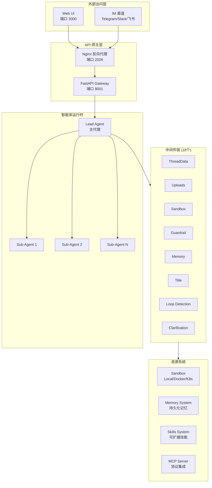

DeerFlow（**D**eep **E**xploration and **E**fficient **R**esearch **Flow**）是一个开源的 **Super Agent Harness**（超级智能体框架）。它通过编排 **子代理（Sub-Agents）**、**记忆系统（Memory）** 和 **沙箱环境（Sandbox）**，再配合可扩展的 **技能（Skills）**，让 AI Agent 能够完成复杂的综合任务。项目由字节跳动开发并维护，基于 LangGraph 和 LangChain 构建，于 2026 年 2 月 28 日登上 GitHub Trending 第一名。

Sources: [README.md](README.md#L1-L20), [README_zh.md](README_zh.md#L1-L30)

## 系统架构概览

DeerFlow 采用前后端分离的全栈架构，通过 Nginx 反向代理统一对外提供服务入口。以下是系统的核心组件及其交互关系：



如架构图所示，用户可以通过 Web 界面或即时通讯渠道发起请求，请求经 Nginx 路由到 FastAPI Gateway 后，由 Lead Agent 协调各个子系统完成任务执行。中间件链负责处理线程数据、上传文件、沙箱管理、安全护栏、记忆更新等横切关注点。

Sources: [CLAUDE.md](CLAUDE.md#L1-L50), [backend/CLAUDE.md](backend/CLAUDE.md#L1-L80)

## 核心技术栈

DeerFlow 的技术选型兼顾了开发效率和运行时稳定性：

| 层级 | 技术选型 | 说明 |
|------|---------|------|
| **后端框架** | Python 3.12+ / FastAPI | 高性能异步 API 服务 |
| **智能体框架** | LangGraph / LangChain | 图结构工作流编排 |
| **前端框架** | Next.js 16 / React 19 | 现代 App Router 架构 |
| **UI 组件** | Tailwind CSS 4 / Shadcn UI | 响应式设计系统 |
| **沙箱执行** | Local / Docker / Kubernetes | 隔离安全执行环境 |
| **通讯协议** | MCP (Model Context Protocol) | 标准化工具集成 |

Sources: [CLAUDE.md](CLAUDE.md#L8-L18), [frontend/CLAUDE.md](frontend/CLAUDE.md#L5-L15)

## 核心组件介绍

### Lead Agent（主代理）

Lead Agent 是整个系统的核心入口点，由 `make_lead_agent()` 工厂函数创建，定义在 `backend/langgraph.json` 中注册为图结构的入口。它通过 18 个中间件组件链式处理请求，包括线程数据管理、文件上传、沙箱获取、安全护栏、记忆更新、标题生成等。这种设计使得每个关注点都可以独立配置和扩展，而不影响其他组件。

Sources: [backend/CLAUDE.md](backend/CLAUDE.md#L60-L100), [backend/langgraph.json](backend/langgraph.json#L1-L18)

### Sub-Agents（子代理系统）

子代理用于将复杂任务委托给后台 Agent 并发执行。系统支持最多 3 个并发子代理，单个任务超时时间为 15 分钟。子代理通过 SSE 事件流返回执行结果，前端可以实时展示进度。这使得复杂任务可以被分解为多个并行的子任务，显著提升整体处理效率。

Sources: [CLAUDE.md](CLAUDE.md#L55-L60), [backend/CLAUDE.md](backend/CLAUDE.md#L60-L80)

### Sandbox（沙箱系统）

沙箱为每个线程提供隔离的执行环境，确保代码执行不会影响宿主机安全。系统支持三种模式：**Local**（本地文件系统直接访问）、**Docker**（容器隔离）、**Kubernetes**（通过 provisioner 动态创建 Pod）。虚拟路径映射为 `/mnt/user-data/{workspace,uploads,outputs}`，与宿主机路径隔离。

Sources: [CLAUDE.md](CLAUDE.md#L55-L60), [backend/packages/harness/deerflow/sandbox/sandbox.py](backend/packages/harness/deerflow/sandbox/sandbox.py#L1-L30)

### Skills（技能系统）

技能是基于 Markdown + YAML frontmatter 的结构化能力模块，定义 Agent 在特定场景下应该使用哪些工具和提示词。系统内置了 18 个公共技能，涵盖深度研究、数据分析、图表可视化、PPT 生成、视频生成等场景。技能按需加载，不影响基础运行时性能。

Sources: [CLAUDE.md](CLAUDE.md#L60-L65), [skills/public](skills/public)

### Memory（记忆系统）

持久化记忆系统跨会话存储用户上下文、事实和历史记录。数据存储在 `backend/.deer-flow/users/{user_id}/memory.json`，支持用户隔离。每个用户的记忆独立管理，确保隐私安全。

Sources: [CLAUDE.md](CLAUDE.md#L55-L60), [backend/CLAUDE.md](backend/CLAUDE.md#L60-L80)

## 项目目录结构

```
deer-flow/
├── backend/                         # Python 后端服务
│   ├── app/
│   │   ├── gateway/                # FastAPI REST API (端口 8001)
│   │   └── channels/               # IM 平台集成
│   ├── packages/harness/           # 核心智能体框架
│   │   └── deerflow/
│   │       ├── agents/             # Lead Agent + 中间件链
│   │       ├── sandbox/            # 沙箱执行系统
│   │       ├── subagents/          # 子代理委托
│   │       ├── tools/              # 内置工具集
│   │       ├── memory/             # 持久化记忆系统
│   │       ├── skills/             # 技能加载器
│   │       └── mcp/                # MCP 协议集成
│   ├── langgraph.json              # LangGraph 图配置
│   └── tests/                      # 完整测试套件
├── frontend/                        # Next.js 前端应用
│   └── src/
│       ├── app/                    # 页面路由
│       ├── components/             # React 组件
│       └── core/                   # 业务逻辑核心
├── skills/                          # 技能模块
│   ├── public/                     # 内置公共技能
│   └── custom/                     # 自定义技能 (gitignore)
├── config.yaml                     # 主配置文件
├── extensions_config.json          # MCP 和技能扩展配置
└── .env                            # 环境变量 (API keys)
```

这种分层架构确保了关键模块的可复用性：`packages/harness/deerflow/` 被打包为可发布的 Python 包 `deerflow-harness`，而 `app/` 目录包含 FastAPI 网关和 IM 集成等应用层代码。

Sources: [CLAUDE.md](CLAUDE.md#L20-L90), [backend/CLAUDE.md](backend/CLAUDE.md#L20-L60), [frontend/CLAUDE.md](frontend/CLAUDE.md#L15-L50)

## 快速安装配置

DeerFlow 提供交互式配置向导简化初始设置：

```bash
# 克隆并进入项目目录
git clone https://github.com/bytedance/deer-flow.git
cd deer-flow

# 运行交互式安装向导
make setup

# 启动开发环境
make dev
```

向导会引导你选择 LLM 提供商、配置 Web 搜索、设置沙箱模式和文件写入权限等选项，全程约需 2 分钟。完成配置后访问 http://localhost:2026 即可开始使用。

Sources: [README_zh.md](README_zh.md#L60-L90), [CLAUDE.md](CLAUDE.md#L95-L105)

## 后续阅读路径

完成本概述后，建议按以下路径深入学习：

- **[环境安装](2-huan-jing-an-zhuang)** → 配置开发环境依赖
- **[配置指南](3-pei-zhi-zhi-nan)** → 理解 config.yaml 完整配置项
- **[整体架构](4-zheng-ti-jia-gou)** → 深入理解系统架构细节
- **[Lead Agent 主代理](5-lead-agent-zhu-dai-li)** → 了解主代理工作机制