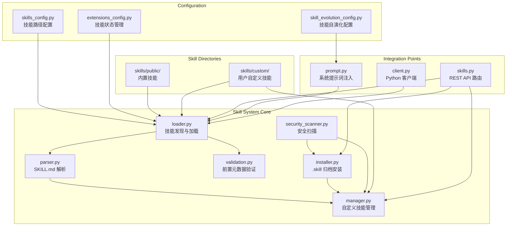
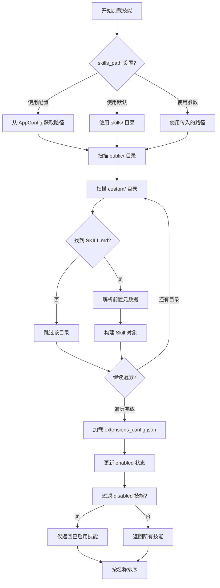
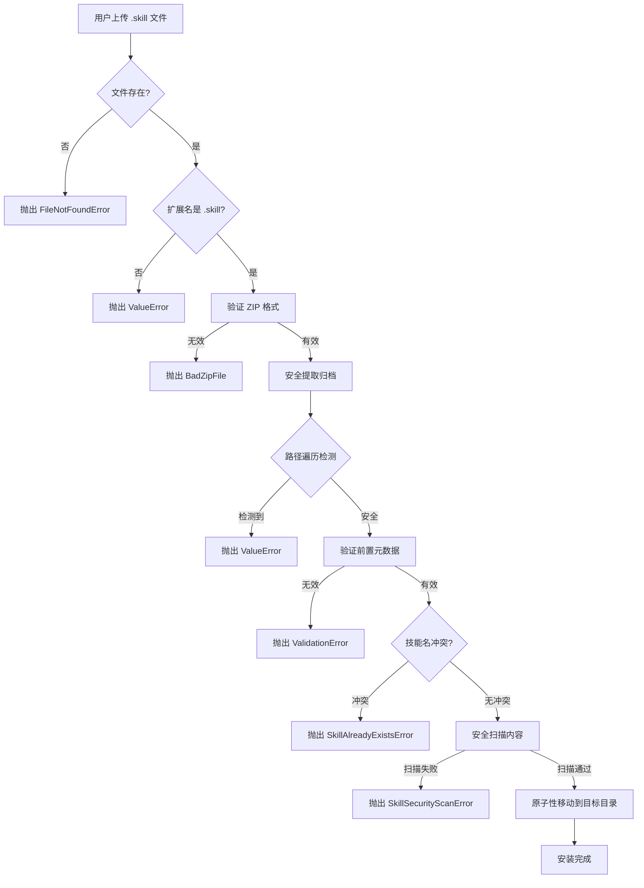

技能系统是 DeerFlow 中用于扩展 Agent 能力的关键模块。它通过结构化的 SKILL.md 文件定义特定领域的最佳实践和工作流程，使 AI Agent 能够针对复杂任务加载经过优化的指令集。本章节将详细阐述技能系统的架构设计、核心组件、数据模型以及 API 接口。

## 系统架构

DeerFlow 的技能系统采用模块化设计，将技能发现、解析、验证、安装和管理分离为独立的职责单元。整个系统由以下几个核心模块构成：



技能系统的工作流程分为三个主要阶段：**发现与加载**、**验证与解析**、**运行时注入**。在发现阶段，`loader.py` 递归扫描 `skills/public/` 和 `skills/custom/` 目录，对每个包含 `SKILL.md` 文件的目录进行解析和验证。在运行时阶段，通过 `prompt.py` 将已启用的技能以结构化方式注入到 Agent 的系统提示词中。

Sources: [loader.py](../backend/packages/harness/deerflow/skills/loader.py#L1-L106)
Sources: [prompt.py](../backend/packages/harness/deerflow/agents/lead_agent/prompt.py#L566-L623)

## 数据模型

技能系统的核心数据模型定义在 `types.py` 中，采用 Python dataclass 实现。`Skill` 类封装了技能的所有元数据和路径信息：

```python
@dataclass
class Skill:
    name: str                      # 技能唯一标识符
    description: str               # 技能描述，用于触发判断
    license: str | None            # 开源许可证
    skill_dir: Path               # 技能目录本地路径
    skill_file: Path              # SKILL.md 文件路径
    relative_path: Path           # 相对于分类根目录的路径
    category: str                  # 'public' 或 'custom'
    enabled: bool = False         # 是否启用
```

`Skill` 类提供了容器路径映射方法，这对于沙箱环境中的技能加载至关重要：

| 方法 | 用途 | 返回值示例 |
|------|------|-----------|
| `get_container_path()` | 获取容器中技能目录的完整路径 | `/mnt/skills/public/deep-research` |
| `get_container_file_path()` | 获取容器中 SKILL.md 的完整路径 | `/mnt/skills/public/deep-research/SKILL.md` |

在实际运行时，Agent 通过 `read_file` 工具加载技能内容，路径即为容器中的映射路径。`skill_path` 属性返回相对于分类根目录的路径字符串，用于在提示词中标识技能位置。

Sources: [types.py](../backend/packages/harness/deerflow/skills/types.py#L1-L54)

## 技能目录结构

DeerFlow 的技能存储在项目根目录的 `skills/` 目录下，采用两级分类结构：

```
skills/
├── public/                    # 内置技能（只读）
│   ├── deep-research/        # 深度研究技能
│   │   └── SKILL.md
│   ├── bootstrap/            # 初始化引导技能
│   │   ├── SKILL.md
│   │   ├── references/
│   │   └── templates/
│   ├── chart-visualization/  # 图表可视化技能
│   │   ├── SKILL.md
│   │   ├── references/
│   │   └── scripts/
│   └── skill-creator/        # 技能创建工具
│       ├── SKILL.md
│       ├── agents/
│       ├── eval-viewer/
│       ├── references/
│       └── scripts/
└── custom/                   # 用户自定义技能（可编辑）
    └── .history/             # 历史变更记录
        └── *.jsonl
```

每个技能目录下至少包含 `SKILL.md` 文件，这是技能的入口点和核心指令来源。可选的子目录包括：

| 子目录 | 用途 | 说明 |
|--------|------|------|
| `references/` | 参考文档 | 渐进式加载的辅助文档，如技术规范、最佳实践 |
| `templates/` | 输出模板 | 标准化的输出格式模板 |
| `scripts/` | 可执行脚本 | Node.js 或 Python 脚本，用于自动化任务 |
| `assets/` | 静态资源 | 图片、字体等输出资源 |

目录遍历采用确定性排序（字母顺序），并自动过滤以点号开头的隐藏目录。这意味着 `.hidden/` 和 `.DS_Store` 等 macOS 元数据会被自动忽略。

Sources: [loader.py](../backend/packages/harness/deerflow/skills/loader.py#L58-L70)
Sources: [manager.py](../backend/packages/harness/deerflow/skills/manager.py#L1-L30)

## SKILL.md 文件格式

每个技能的核心是 `SKILL.md` 文件，它采用 YAML 前置元数据（frontmatter）加 Markdown 本体的双层结构：

```markdown
---
name: deep-research
description: >-
  当用户需要进行网络研究时使用此技能，而不是直接使用 WebSearch。
  触发词包括：what is X, explain X, compare X and Y, research X。
  提供系统性多角度研究方法，而非简单的单次搜索。
license: MIT
---

# Deep Research Skill

## Overview

技能的核心功能说明...

## Workflow

详细的工作流程步骤...

## References

渐进式加载的参考资源...
```

### 前置元数据字段

前置元数据使用 YAML 格式，必须包含 `name` 和 `description` 两个必填字段，可选字段包括 `license`、`allowed-tools`、`metadata`、`compatibility`、`version` 和 `author`。

| 字段 | 类型 | 必填 | 说明 |
|------|------|------|------|
| `name` | string | ✅ | 技能唯一标识符，必须符合 hyphen-case（小写字母、数字、连字符） |
| `description` | string | ✅ | 技能描述，这是 Agent 判断何时加载技能的主要依据 |
| `license` | string | ❌ | 开源许可证，如 MIT、Apache-2.0 |
| `compatibility` | object | ❌ | 依赖的工具或环境要求 |
| `version` | string | ❌ | 技能版本号 |
| `author` | string | ❌ | 技能作者 |

### 前置元数据验证规则

`validation.py` 模块实现了严格的前置元数据验证，确保技能定义的规范性：

1. **名称格式**：必须匹配正则表达式 `^[a-z0-9-]+$`，即纯小写字母、数字和连字符；不能以连字符开头或结尾；不能包含连续连字符；最长 64 字符。

2. **描述格式**：不能包含尖括号 `<` 或 `>`；最长 1024 字符。

3. **字段白名单**：只允许预定义的可选字段，防止意外的错误字段导致解析问题。

4. **YAML 解析一致性**：使用 `yaml.safe_load` 解析前置元数据，确保与 `parser.py` 的解析逻辑完全一致。

Sources: [validation.py](../backend/packages/harness/deerflow/skills/validation.py#L1-L86)
Sources: [parser.py](../backend/packages/harness/deerflow/skills/parser.py#L1-L81)

## 技能发现与加载机制

技能加载的核心逻辑封装在 `loader.py` 的 `load_skills()` 函数中。该函数执行以下步骤：



关键特性包括：

1. **配置驱动路径解析**：技能路径优先从 `AppConfig.skills.path` 获取，如未设置则回退到默认路径 `../skills`（相对于 backend 目录）。

2. **扩展配置状态同步**：使用 `ExtensionsConfig.from_file()` 每次从磁盘读取最新配置，确保 Gateway 进程修改的配置能立即反映到 LangGraph Server。

3. **缓存机制**：`prompt.py` 实现了线程安全的技能缓存系统，包含版本号机制支持缓存失效和异步刷新。

4. **自定义技能优先**：同名技能存在时，自定义技能优先于内置技能。

Sources: [loader.py](../backend/packages/harness/deerflow/skills/loader.py#L33-L106)
Sources: [prompt.py](../backend/packages/harness/deerflow/agents/lead_agent/prompt.py#L20-L94)

## 技能状态管理

技能启用状态通过 `extensions_config.json` 文件管理，该文件位于 backend 目录或项目根目录。配置结构如下：

```json
{
  "mcpServers": { ... },
  "skills": {
    "deep-research": { "enabled": true },
    "bootstrap": { "enabled": false },
    "my-custom-skill": { "enabled": true }
  }
}
```

`ExtensionsConfig` 类提供了技能状态查询接口：

| 方法 | 说明 |
|------|------|
| `is_skill_enabled(skill_name, skill_category)` | 检查技能是否启用，默认 public 和 custom 类别为启用状态 |
| `get_enabled_mcp_servers()` | 获取已启用的 MCP 服务器列表 |
| `resolve_config_path()` | 解析配置文件路径，支持环境变量 `DEER_FLOW_EXTENSIONS_CONFIG_PATH` |

技能状态管理的 API 端点定义在 `routers/skills.py` 中：

- `PUT /api/skills/{skill_name}`：更新技能启用状态，修改 `extensions_config.json` 并触发缓存刷新

Sources: [extensions_config.py](../backend/packages/harness/deerflow/config/extensions_config.py#L1-L200)
Sources: [skills.py](../backend/packages/harness/deerflow/routers/skills.py#L324-L373)

## 自定义技能管理

自定义技能存储在 `skills/custom/` 目录下，支持完整的 CRUD 操作和历史变更追踪。`manager.py` 模块封装了所有管理功能：

### 目录管理函数

```python
def get_custom_skills_dir() -> Path       # 获取 skills/custom/ 路径
def get_custom_skill_dir(name: str) -> Path  # 获取特定技能目录
def get_custom_skill_file(name: str) -> Path # 获取 SKILL.md 路径
def get_skill_history_file(name: str) -> Path # 获取历史记录文件
def custom_skill_exists(name: str) -> bool    # 检查技能是否存在
```

### 验证与安全

自定义技能编辑需要经过多重验证：

1. **名称验证**：使用正则表达式 `^[a-z0-9]+(?:-[a-z0-9]+)*$` 确保名称符合规范。

2. **前置元数据验证**：编辑后的内容必须通过 `validate_skill_markdown_content()` 验证，包括名称匹配、字段有效性等。

3. **安全扫描**：编辑内容通过 AI 驱动的安全扫描器检查，阻止提示词注入、系统角色覆盖、权限提升等攻击。

4. **原子写入**：使用 `atomic_write()` 函数确保文件写入的原子性，防止部分写入导致的损坏。

### 历史记录

每次编辑都会生成历史快照，存储在 `.history/*.jsonl` 文件中。每条记录包含：

```json
{
  "ts": "2026-04-01T12:00:00.000000+00:00",
  "action": "human_edit",
  "author": "human",
  "thread_id": null,
  "file_path": "SKILL.md",
  "prev_content": "原内容...",
  "new_content": "新内容...",
  "scanner": {"decision": "allow", "reason": "No security concerns"}
}
```

支持的操作类型包括：`human_edit`（人工编辑）、`rollback`（回滚操作）、`human_delete`（删除操作）。通过 `rollback_custom_skill` API 端点可以将技能恢复到历史版本。

Sources: [manager.py](../backend/packages/harness/deerflow/skills/manager.py#L1-L162)
Sources: [security_scanner.py](../backend/packages/harness/deerflow/skills/security_scanner.py#L1-L70)

## 技能归档安装

DeerFlow 支持通过 `.skill` 归档文件（ZIP 格式）分发和安装技能。安装流程包括以下安全检查：



### 安全机制

1. **路径遍历防护**：拒绝包含绝对路径或 `..` 序列的 ZIP 条目。

2. **符号链接检测**：跳过 ZIP 中的符号链接条目，防止符号链接攻击。

3. **压缩炸弹防护**：限制解压后的总大小为 512MB，防止解压攻击。

4. **内容扫描**：使用配置指定或默认的 AI 模型对 SKILL.md 和支持文件进行安全扫描。

5. **渐进式扫描**：仅对 `scripts/` 目录下的可执行文件和 `references/`、`templates/` 目录下的文本文件进行扫描。

Sources: [installer.py](../backend/packages/harness/deerflow/skills/installer.py#L1-L291)

## 技能安全扫描

`security_scanner.py` 实现了基于 AI 模型的内容安全扫描，通过 `scan_skill_content()` 函数对技能内容进行分类：

```python
@dataclass(slots=True)
class ScanResult:
    decision: str   # allow, warn, block
    reason: str     # 决策原因说明
```

扫描器审查以下安全风险类别：

| 风险类别 | 说明 | 决策 |
|----------|------|------|
| 提示词注入 | 试图通过用户输入操纵 Agent 行为 | block |
| 系统角色覆盖 | 试图修改系统提示词中的角色定义 | block |
| 权限提升 | 试图获取超出设计范围的系统权限 | block |
| 数据外泄 | 试图收集或传输敏感信息 | block |
| 不安全代码 | 可执行脚本中包含恶意代码 | block |
| 外部 API 引用 | 存在潜在风险的外部依赖 | warn |

如果 AI 模型调用失败，对于可执行内容默认返回 `block`，对于非可执行内容也返回 `block`，确保安全优先。

Sources: [security_scanner.py](../backend/packages/harness/deerflow/skills/security_scanner.py#L1-L70)

## 系统提示词注入

技能系统在 Agent 运行时通过 `prompt.py` 动态生成技能相关的提示词片段。该片段包含技能列表和渐进式加载指引：

```xml
<skill_system>
You have access to skills that provide optimized workflows for specific tasks. Each skill contains best practices, frameworks, and references to additional resources.

**Progressive Loading Pattern:**
1. When a user query matches a skill's use case, immediately call `read_file` on the skill's main file using the path attribute provided in the skill tag below
2. Read and understand the skill's workflow and instructions
3. The skill file contains references to external resources under the same folder
4. Load referenced resources only when needed during execution
5. Follow the skill's instructions precisely

**Skills are located at:** /mnt/skills

<available_skills>
    <skill>
        <name>deep-research</name>
        <description>Use this skill instead of WebSearch... [built-in]</description>
        <location>/mnt/skills/public/deep-research/SKILL.md</location>
    </skill>
</available_skills>

</skill_system>
```

技能自我演化功能通过 `_build_skill_evolution_section()` 生成，引导 Agent 在完成复杂任务后考虑创建或更新技能：

```markdown
## Skill Self-Evolution
After completing a task, consider creating or updating a skill when:
- The task required 5+ tool calls to resolve
- You overcame non-obvious errors or pitfalls
- The user corrected your approach and the corrected version worked
- You discovered a non-trivial, recurring workflow
```

此功能通过 `config.skill_evolution.enabled` 配置开关控制，默认关闭。

Sources: [prompt.py](../backend/packages/harness/deerflow/agents/lead_agent/prompt.py#L145-L158)
Sources: [prompt.py](../backend/packages/harness/deerflow/agents/lead_agent/prompt.py#L566-L595)

## REST API 接口

技能系统的 REST API 定义在 `app/gateway/routers/skills.py` 中，提供完整的技能管理接口：

### 列表接口

| 方法 | 端点 | 说明 |
|------|------|------|
| GET | `/api/skills` | 获取所有技能列表 |
| GET | `/api/skills/custom` | 仅获取自定义技能 |
| GET | `/api/skills/{skill_name}` | 获取特定技能详情 |

### 管理接口

| 方法 | 端点 | 说明 |
|------|------|------|
| PUT | `/api/skills/{skill_name}` | 更新技能启用状态 |
| PUT | `/api/skills/custom/{skill_name}` | 编辑自定义技能内容 |
| DELETE | `/api/skills/custom/{skill_name}` | 删除自定义技能 |

### 历史与回滚

| 方法 | 端点 | 说明 |
|------|------|------|
| GET | `/api/skills/custom/{skill_name}/history` | 获取技能变更历史 |
| POST | `/api/skills/custom/{skill_name}/rollback` | 回滚到历史版本 |

### 安装接口

| 方法 | 端点 | 说明 |
|------|------|------|
| POST | `/api/skills/install` | 从 `.skill` 归档文件安装技能 |

所有 API 响应均遵循标准的数据传输格式，例如 `SkillsListResponse`：

```python
class SkillsListResponse(BaseModel):
    skills: list[SkillResponse]

class SkillResponse(BaseModel):
    name: str
    description: str
    license: str | None
    category: str  # 'public' 或 'custom'
    enabled: bool
```

Sources: [skills.py](../backend/app/gateway/routers/skills.py#L1-L373)

## Python 客户端集成

DeerFlow Python 客户端 (`client.py`) 提供了便捷的技能管理接口：

```python
from deerflow import DeerFlowClient

client = DeerFlowClient()

# 列出所有技能
skills = client.list_skills(enabled_only=False)

# 获取特定技能
skill = client.get_skill("deep-research")

# 启用/禁用技能
client.set_skill_enabled("deep-research", enabled=True)
```

客户端方法直接调用底层的 `load_skills()` 函数和 `ExtensionsConfig` 管理接口，确保与 Gateway API 的行为一致。

Sources: [client.py](../backend/packages/harness/deerflow/client.py#L745-L930)

## 配置参考

技能系统相关的配置项分布在多个配置文件中：

### skills_config.py

```python
class SkillsConfig(BaseModel):
    path: str | None = None           # 技能目录路径，None 使用默认
    container_path: str = "/mnt/skills"  # 容器中的挂载路径
```

### extensions_config.json

```json
{
  "skills": {
    "skill-name": { "enabled": true }
  }
}
```

### skill_evolution_config.py

```python
class SkillEvolutionConfig(BaseModel):
    enabled: bool = False           # 是否允许 Agent 自演化技能
    moderation_model_name: str | None = None  # 安全审查模型
```

Sources: [skills_config.py](../backend/packages/harness/deerflow/config/skills_config.py#L1-L55)
Sources: [skill_evolution_config.py](../backend/packages/harness/deerflow/config/skill_evolution_config.py#L1-L15)

## 内置技能一览

DeerFlow 提供了以下内置技能：

| 技能名称 | 用途 | 触发场景 |
|----------|------|----------|
| `deep-research` | 深度网络研究 | 需要多角度研究、报告生成前的信息收集 |
| `bootstrap` | Agent 个性化初始化 | 用户希望创建或更新 SOUL.md |
| `chart-visualization` | 数据图表生成 | 用户需要将数据可视化 |
| `skill-creator` | 技能创建与优化 | 用户需要创建新技能或优化现有技能 |
| `find-skills` | 技能搜索 | 用户需要查找可用的技能 |

这些技能展示了技能系统的典型用法，包括参考文件渐进加载、脚本执行、以及评估与迭代优化机制。

Sources: [skills/public/deep-research/SKILL.md](../skills/public/deep-research/SKILL.md#L1-L199)
Sources: [skills/public/skill-creator/SKILL.md](../skills/public/skill-creator/SKILL.md#L1-L200)

---

**相关章节**：
- [Lead Agent 主代理](5-lead-agent-zhu-dai-li) — 了解技能如何与 Agent 系统提示词集成
- [MCP 集成](11-mcp-ji-cheng) — 技能系统与 MCP 工具的协同工作
- [沙箱系统](7-sha-xiang-xi-tong) — 技能在容器环境中的执行机制