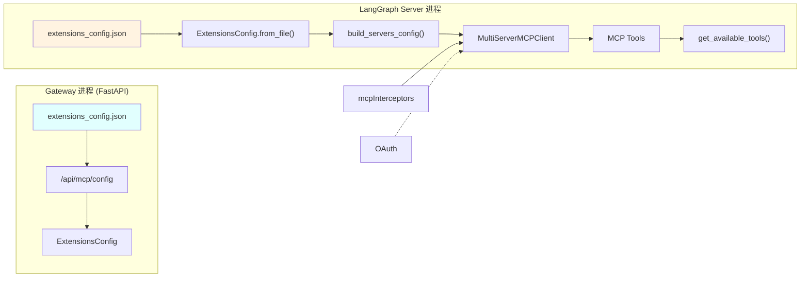
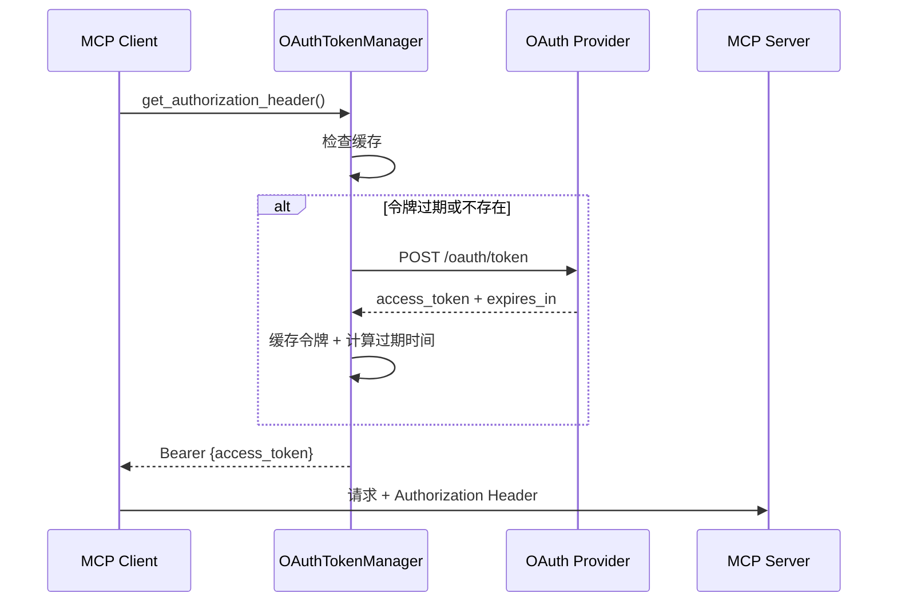
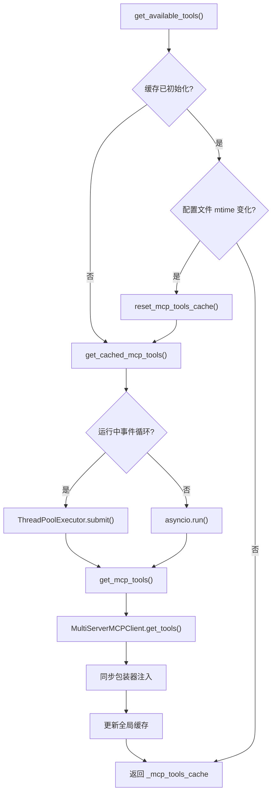

MCP（Model Context Protocol）集成是 DeerFlow 扩展其核心能力的核心机制。通过声明式配置文件，开发者可以将任意 MCP 服务器暴露的工具无缝接入 DeerFlow 的 Agent 工具链中，无需修改核心代码。本章节覆盖从基础配置到高级拦截器定制的完整技术细节。

## 架构概览

DeerFlow 的 MCP 集成基于 `langchain-mcp-adapters` 库构建，采用双进程架构实现配置热更新与工具动态加载的解耦。



配置文件通过 Gateway API 修改后，Gateway 进程会更新 JSON 文件，而 LangGraph Server 进程通过文件修改时间（mtime）检测机制自动重新加载工具缓存。这种设计确保了两进程间的状态同步，同时保持了各自进程的独立性和容错性。

Sources: [backend/packages/harness/deerflow/mcp/client.py](backend/packages/harness/deerflow/mcp/client.py#L1-L69)
Sources: [backend/packages/harness/deerflow/mcp/cache.py](backend/packages/harness/deerflow/mcp/cache.py#L1-L143)
Sources: [backend/app/gateway/routers/mcp.py](backend/app/gateway/routers/mcp.py#L1-L170)

## 配置管理

MCP 服务器配置通过 `extensions_config.json` 文件集中管理。系统支持三种传输类型，针对不同的部署场景提供差异化支持。

| 传输类型 | 适用场景 | 必需参数 | 环境变量支持 |
|---------|---------|---------|-------------|
| `stdio` | 本地进程通信 | `command`, `args` | ✅ `env` 字段 |
| `sse` | Server-Sent Events | `url` | ✅ `headers` 字段 |
| `http` | REST API 调用 | `url` | ✅ `headers` 字段 |

配置路径搜索遵循优先级链：`DEERFLOW_EXTENSIONS_CONFIG_PATH` 环境变量 → `backend/extensions_config.json` → 项目根目录。为向后兼容，系统同时支持已废弃的 `mcp_config.json` 文件名。

Sources: [backend/packages/harness/deerflow/config/extensions_config.py](backend/packages/harness/deerflow/config/extensions_config.py#L1-L200)
Sources: [extensions_config.example.json](extensions_config.example.json#L1-L45)

### 基础配置示例

```json
{
  "mcpServers": {
    "filesystem": {
      "enabled": true,
      "type": "stdio",
      "command": "npx",
      "args": ["-y", "@modelcontextprotocol/server-filesystem", "/allowed/path"],
      "env": {},
      "description": "文件系统访问（限定目录范围）"
    },
    "github": {
      "enabled": true,
      "type": "stdio",
      "command": "npx",
      "args": ["-y", "@modelcontextprotocol/server-github"],
      "env": {
        "GITHUB_TOKEN": "$GITHUB_TOKEN"
      },
      "description": "GitHub 仓库操作"
    }
  }
}
```

环境变量占位符以 `$` 前缀标记，系统在加载配置时自动替换为实际值。未设置的环境变量会被替换为空字符串传递给 MCP 服务器，而非保留占位符原文。

Sources: [backend/packages/harness/deerflow/config/extensions_config.py](backend/packages/harness/deerflow/config/extensions_config.py#L170-L175)

## OAuth 认证支持

对于 HTTP/SSE 传输类型的 MCP 服务器，DeerFlow 内置 OAuth 令牌生命周期管理，支持 `client_credentials` 和 `refresh_token` 两种授权授予类型。



`OAuthTokenManager` 采用异步锁机制防止高并发场景下的令牌竞态获取，并在令牌到期前 `refresh_skew_seconds` 秒主动刷新，确保请求不会因令牌过期而失败。

Sources: [backend/packages/harness/deerflow/mcp/oauth.py](backend/packages/harness/deerflow/mcp/oauth.py#L1-L151)

### OAuth 配置字段说明

| 字段 | 默认值 | 说明 |
|-----|-------|------|
| `grant_type` | `client_credentials` | 授权类型：`client_credentials` 或 `refresh_token` |
| `client_id` | - | OAuth 客户端 ID（从环境变量解析） |
| `client_secret` | - | OAuth 客户端密钥（从环境变量解析） |
| `refresh_token` | - | 刷新令牌（仅 `refresh_token` 授权类型需要） |
| `refresh_skew_seconds` | `60` | 令牌刷新提前量（秒） |
| `token_field` | `access_token` | 令牌响应字段名 |
| `expires_in_field` | `expires_in` | 过期时间响应字段名 |

```json
{
  "mcpServers": {
    "secure-api": {
      "enabled": true,
      "type": "http",
      "url": "https://api.example.com/mcp",
      "oauth": {
        "enabled": true,
        "token_url": "https://auth.example.com/oauth/token",
        "grant_type": "client_credentials",
        "client_id": "$MCP_OAUTH_CLIENT_ID",
        "client_secret": "$MCP_OAUTH_CLIENT_SECRET",
        "scope": "mcp.read mcp.write",
        "refresh_skew_seconds": 120
      }
    }
  }
}
```

## 自定义拦截器

通过 `mcpInterceptors` 配置项，开发者可以注册任意数量的拦截器，在每次 MCP 工具调用前执行自定义逻辑。典型应用场景包括：注入用户认证令牌、添加请求日志、采集性能指标、修改请求参数等。

拦截器声明格式为 `module:function` 的 Python 导入路径，系统会调用该函数获取拦截器实例。函数必须返回异步可调用对象，签名形如 `async def interceptor(request, handler) -> Any`。

```python
# my_package/mcp/auth.py
def build_auth_interceptor():
    """构建认证拦截器，从 LangGraph 元数据注入用户令牌"""
    async def interceptor(request, handler):
        from langgraph.config import get_config
        metadata = get_config().get("metadata", {})
        
        headers = dict(request.headers or {})
        if token := metadata.get("auth_token"):
            headers["X-Auth-Token"] = token
        
        return await handler(request.override(headers=headers))
    
    return interceptor
```

```json
{
  "mcpInterceptors": [
    "my_package.mcp.auth:build_auth_interceptor",
    "my_package.mcp.metrics:build_metrics_interceptor"
  ],
  "mcpServers": { ... }
}
```

拦截器按声明顺序执行，OAuth 拦截器优先级最高始终排在首位。解析失败时系统仅记录警告日志，不会阻塞其他拦截器或工具加载流程。

Sources: [backend/packages/harness/deerflow/mcp/tools.py](backend/packages/harness/deerflow/mcp/tools.py#L70-L100)

## 工具加载与缓存

MCP 工具的加载采用多级缓存策略，兼顾初始化性能和配置变更感知的灵活性。



LangGraph Studio 等在事件循环已运行的环境中，缓存初始化通过线程池执行器完成，避免嵌套事件循环冲突。对于异步原生的工具，系统自动注入同步包装器，使其可被同步调用链正确调用。

Sources: [backend/packages/harness/deerflow/mcp/tools.py](backend/packages/harness/deerflow/mcp/tools.py#L30-L70)
Sources: [backend/packages/harness/deerflow/mcp/cache.py](backend/packages/harness/deerflow/mcp/cache.py#L56-L120)

## REST API 接口

Gateway 提供 MCP 配置的读写 API，支持前端界面动态管理 MCP 服务器。

| 端点 | 方法 | 功能 |
|------|------|------|
| `/api/mcp/config` | GET | 获取当前所有 MCP 服务器配置 |
| `/api/mcp/config` | PUT | 批量更新 MCP 服务器配置并持久化 |

GET 响应示例：

```json
{
  "mcp_servers": {
    "github": {
      "enabled": true,
      "type": "stdio",
      "command": "npx",
      "args": ["-y", "@modelcontextprotocol/server-github"],
      "env": {"GITHUB_TOKEN": "ghp_xxx"},
      "description": "GitHub MCP server for repository operations"
    }
  }
}
```

PUT 请求会更新 `extensions_config.json` 文件，LangGraph Server 进程通过 mtime 检测自动重新初始化工具缓存，无需手动重启服务。

Sources: [backend/app/gateway/routers/mcp.py](backend/app/gateway/routers/mcp.py#L1-L170)

## 安全沙箱集成

MCP 文件系统服务器的允许路径会与 DeerFlow 沙箱安全策略联动。系统自动提取配置中的路径限制，用于验证 `bash_tool` 等宿主 bash 工具的访问边界。

```python
allowed_paths = _get_mcp_allowed_paths()  # 从 extensions_config 提取
security_policy.add_path_allowed(allowed_paths)
```

Sources: [backend/packages/harness/deerflow/sandbox/tools.py](backend/packages/harness/deerflow/sandbox/tools.py#L313-L340)

## 故障排查

MCP 工具加载失败时，可按以下步骤排查：

| 症状 | 可能原因 | 解决方案 |
|------|---------|---------|
| `langchain-mcp-adapters not installed` | 依赖未安装 | `pip install langchain-mcp-adapters` |
| 工具数量为 0 | 所有服务器 `enabled: false` | 检查 `extensions_config.json` 配置 |
| OAuth 令牌获取失败 | 环境变量未设置 | 验证 `$MCP_OAUTH_CLIENT_SECRET` 等变量 |
| 配置变更未生效 | 进程缓存未刷新 | 等待 mtime 检测或手动调用 `reset_mcp_tools_cache()` |
| 拦截器加载失败 | 导入路径错误 | 检查 `module:function` 格式及函数签名 |

## 下一步

- 深入了解 [安全护栏](12-an-quan-hu-lan) 机制如何与 MCP 工具联动
- 参考 [沙箱系统](7-sha-xiang-xi-tong) 了解文件系统访问控制实现
- 查看 [技能系统](10-ji-neng-xi-tong) 了解 MCP 工具与技能的协同工作方式