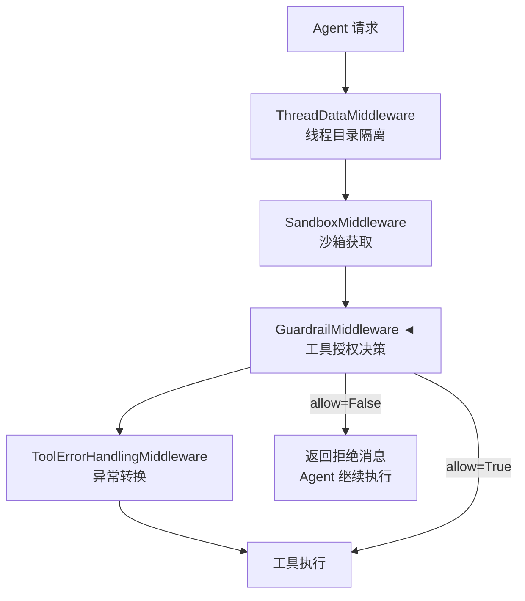
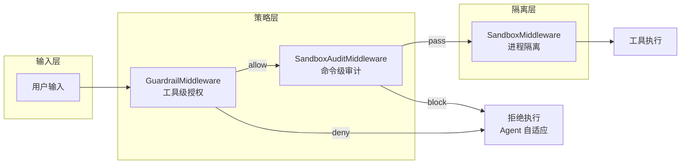

Deer-Flow 的安全护栏系统是一套**策略驱动的工具调用授权框架**，在代理执行任意工具前进行确定性检查，防止未经授权的操作执行。该系统独立于沙箱隔离机制运行，专注于**语义层面的权限控制**——即便在沙箱内部，一个被允许执行 `bash` 的工具仍然可以通过 `curl` 将数据外传，而护栏可以在此层面进行阻断。

## 为什么需要安全护栏

Deer-Flow 提供了两层互补的安全机制：

| 机制 | 作用层级 | 特性 |
|------|----------|------|
| **沙箱隔离** | 进程隔离 | Docker 容器限制文件系统、网络、进程资源 |
| **安全护栏** | 语义授权 | 策略驱动决定特定工具/命令是否可执行 |

传统的安全方案各有局限：沙箱提供进程隔离但无法进行语义授权；人工审批（`ask_clarification`）需要人工全程参与，不适合自主工作流。护栏系统填补了这一空白——在无人工干预的前提下，实现**确定性、策略驱动的授权决策**。

Sources: [backend/docs/GUARDRAILS.md](backend/docs/GUARDRAILS.md#L1-L50)

## 架构设计

### 中间件链中的位置

护栏中间件（GuardrailMiddleware）位于中间件链的核心决策节点，在工具调用执行前进行拦截：



护栏中间件实现了 `AgentMiddleware` 协议的 `wrap_tool_call` / `awrap_tool_call` 方法，这是 LangChain agent 中间件的标准扩展点。决策流程如下：

1. 构建 `GuardrailRequest`，携带工具名、参数、护照引用
2. 调用 `provider.evaluate(request)` 获取决策
3. 若**拒绝**：返回错误 `ToolMessage`，代理可见拒绝原因并自适应调整
4. 若**允许**：传递给实际工具处理器
5. 若**提供者异常**且 `fail_closed=true`（默认）：阻断调用
6. `GraphBubbleUp` 异常（LangGraph 控制信号）始终透传，不被捕获

Sources: [backend/packages/harness/deerflow/guardrails/middleware.py](backend/packages/harness/deerflow/guardrails/middleware.py#L1-L99)
Sources: [backend/packages/harness/deerflow/agents/middlewares/tool_error_handling_middleware.py](backend/packages/harness/deerflow/agents/middlewares/tool_error_handling_middleware.py#L65-L120)

### 核心数据模型

```python
# GuardrailRequest - 传递给提供者的上下文
@dataclass
class GuardrailRequest:
    tool_name: str           # 工具名，如 "bash", "write_file"
    tool_input: dict         # 工具参数
    agent_id: str | None     # 护照引用（文件路径或托管 ID）
    thread_id: str | None    # 线程 ID
    is_subagent: bool        # 是否为子代理调用
    timestamp: str           # ISO 时间戳

# GuardrailDecision - 提供者的授权裁决
@dataclass
class GuardrailDecision:
    allow: bool                              # 是否允许
    reasons: list[GuardrailReason]           # 裁决原因列表
    policy_id: str | None                     # 策略标识符
    metadata: dict                            # 额外元数据

# GuardrailReason - 结构化原因对象（遵循 OAP 标准）
@dataclass
class GuardrailReason:
    code: str     # OAP 标准代码，如 "oap.tool_not_allowed"
    message: str  # 人类可读原因描述
```

Sources: [backend/packages/harness/deerflow/guardrails/provider.py](backend/packages/harness/deerflow/guardrails/provider.py#L1-L57)

## 内置提供者：AllowlistProvider

`AllowlistProvider` 是 Deer-Flow 内置的零依赖提供者，通过简单的白名单/黑名单机制控制工具访问。

### 工作原理

```python
class AllowlistProvider:
    name = "allowlist"

    def __init__(self, *, allowed_tools: list[str] | None = None, 
                 denied_tools: list[str] | None = None):
        self._allowed = set(allowed_tools) if allowed_tools else None
        self._denied = set(denied_tools) if denied_tools else set()

    def evaluate(self, request: GuardrailRequest) -> GuardrailDecision:
        # 白名单模式：仅允许列表中的工具
        if self._allowed is not None and request.tool_name not in self._allowed:
            return GuardrailDecision(
                allow=False, 
                reasons=[GuardrailReason(code="oap.tool_not_allowed", 
                              message=f"tool '{request.tool_name}' not in allowlist")]
            )
        # 黑名单模式：禁止列表中的工具
        if request.tool_name in self._denied:
            return GuardrailDecision(
                allow=False, 
                reasons=[GuardrailReason(code="oap.tool_not_allowed", 
                              message=f"tool '{request.tool_name}' is denied")]
            )
        return GuardrailDecision(allow=True, 
                                 reasons=[GuardrailReason(code="oap.allowed")])
```

**决策优先级**：当工具同时出现在白名单和黑名单中时，黑名单优先生效。

Sources: [backend/packages/harness/deerflow/guardrails/builtin.py](backend/packages/harness/deerflow/guardrails/builtin.py#L1-L24)

### 完整配置文件示例

```yaml
guardrails:
  enabled: true
  fail_closed: true                    # 提供者异常时阻断（默认开启）
  passport: null                       # 护照路径或托管 ID
  provider:
    use: deerflow.guardrails.builtin:AllowlistProvider
    config:
      denied_tools: ["bash", "write_file"]  # 黑名单模式
      # allowed_tools: ["web_search", "read_file"]  # 白名单模式
```

Sources: [config.example.yaml](config.example.yaml#L984-L1010)

## OAP 护照提供者

### Open Agent Passport 标准

OAP（Open Agent Passport）是一个开放标准，定义了代理身份宣告知书（passport）的格式和授权决策代码。任何遵循 OAP 的提供者都能与 Deer-Flow 无缝集成。

```json
{
  "spec_version": "oap/1.0",
  "status": "active",  // 激活/暂停/撤销
  "capabilities": [
    {"id": "system.command.execute"},
    {"id": "data.file.read"},
    {"id": "data.file.write"},
    {"id": "web.fetch"}
  ],
  "limits": {
    "system.command.execute": {
      "allowed_commands": ["git", "npm", "node", "ls"],
      "blocked_patterns": ["rm -rf", "sudo", "chmod 777"]
    }
  }
}
```

| 护照字段 | 功能 | 示例 |
|----------|------|------|
| `capabilities[].id` | 允许的工具类别 | `system.command.execute` |
| `limits.*.allowed_commands` | 白名单命令 | `["git", "npm", "node"]` |
| `limits.*.blocked_patterns` | 黑名单模式 | `["rm -rf", "sudo"]` |
| `status` | 总开关 | `active`, `suspended`, `revoked` |

### APort 参考实现

[APort Agent Guardrails](https://github.com/aporthq/aport-agent-guardrails) 是 OAP 提供者的开源实现：

```bash
pip install aport-agent-guardrails
aport setup --framework deerflow
```

这将创建：
- `~/.aport/deerflow/config.yaml` — 评估器配置（本地或 API 模式）
- `~/.aport/deerflow/aport/passport.json` — OAP 护照文件

```yaml
guardrails:
  enabled: true
  provider:
    use: aport_guardrails.providers.generic:OAPGuardrailProvider
```

Sources: [backend/docs/GUARDRAILS.md](backend/docs/GUARDRAILS.md#L60-L130)

## 自定义提供者

任何实现 `GuardrailProvider` 结构协议的 Python 类都可用作提供者，无需继承特定基类：

```python
# my_guardrail.py
from deerflow.guardrails.provider import GuardrailDecision, GuardrailReason, GuardrailRequest

class MyGuardrailProvider:
    name = "my-company"

    def evaluate(self, request: GuardrailRequest) -> GuardrailDecision:
        # 示例：阻止包含 "delete" 的 bash 命令
        if request.tool_name == "bash" and "delete" in str(request.tool_input):
            return GuardrailDecision(
                allow=False,
                reasons=[GuardrailReason(
                    code="custom.blocked", 
                    message="delete not allowed"
                )],
                policy_id="custom.v1",
            )
        return GuardrailDecision(allow=True, 
                                 reasons=[GuardrailReason(code="oap.allowed")])

    async def aevaluate(self, request: GuardrailRequest) -> GuardrailDecision:
        return self.evaluate(request)
```

**提供者加载机制**：Deer-Flow 通过 `resolve_variable()` 加载提供者，与模型、工具、沙箱提供者使用相同机制。`use:` 字段格式为 `package.module:ClassName`。

```yaml
guardrails:
  enabled: true
  provider:
    use: my_guardrail:MyGuardrailProvider
    config:
      key: value  # 传递给 __init__ 的参数
```

### OAP 标准决策代码

| 代码 | 含义 |
|------|------|
| `oap.allowed` | 工具调用已授权 |
| `oap.tool_not_allowed` | 工具不在白名单中 |
| `oap.command_not_allowed` | 命令不在允许列表中 |
| `oap.blocked_pattern` | 命令匹配黑名单模式 |
| `oap.limit_exceeded` | 操作超出限制 |
| `oap.passport_suspended` | 护照状态为暂停/撤销 |
| `oap.evaluator_error` | 提供者异常（fail-closed） |

Sources: [backend/docs/GUARDRAILS.md](backend/docs/GUARDRAILS.md#L200-L280)

## DeerFlow 工具名称参考

代理调用的工具名称（`request.tool_name`）：

| 工具 | 功能 |
|------|------|
| `bash` | Shell 命令执行 |
| `write_file` | 创建/覆写文件 |
| `str_replace` | 文件编辑（查找替换） |
| `read_file` | 读取文件内容 |
| `ls` | 列出目录 |
| `web_search` | 网络搜索 |
| `web_fetch` | 获取 URL 内容 |
| `image_search` | 图片搜索 |
| `present_files` | 向用户展示文件 |
| `view_image` | 显示图片 |
| `ask_clarification` | 向用户提问 |
| `task` | 委托给子代理 |
| `mcp__*` | MCP 工具（动态命名） |

Sources: [backend/docs/GUARDRAILS.md](backend/docs/GUARDRAILS.md#L240-L260)

## 配置参考

```yaml
guardrails:
  enabled: true                    # 启用护栏中间件（默认: false）
  fail_closed: true               # 提供者异常时阻断（默认: true）
  passport: null                  # 护照引用（文件路径或托管 ID）
  provider:
    use: deerflow.guardrails.builtin:AllowlistProvider
    config:                       # 传递给提供者的 kwargs
      denied_tools: ["bash"]
```

**配置加载流程**：

1. `load_guardrails_config_from_dict()` 从 `AppConfig.guardrails` 加载配置
2. 若 `guardrails.enabled=true` 且 `provider` 已配置：
   - 通过 `resolve_variable()` 解析 `use:` 类路径
   - 注入 `framework="deerflow"` 参数（若提供者接受）
   - 实例化提供者并传递给 `GuardrailMiddleware`

Sources: [backend/packages/harness/deerflow/config/guardrails_config.py](backend/packages/harness/deerflow/config/guardrails_config.py#L1-L49)
Sources: [backend/packages/harness/deerflow/agents/middlewares/tool_error_handling_middleware.py](backend/packages/harness/deerflow/agents/middlewares/tool_error_handling_middleware.py#L70-L105)

## 补充安全组件：沙箱审计中间件

除了策略驱动的护栏系统，Deer-Flow 还提供了**命令级别的安全审计**——`SandboxAuditMiddleware` 对每个 `bash` 调用进行分类和风险评估。

### 风险分类策略

```python
# 高风险模式（直接阻断）
_HIGH_RISK_PATTERNS = [
    r"rm\s+-[^\s]*r[^\s]*\s+(/\*?|~/?\*?|/home\b|/root\b)",
    r"dd\s+if=",
    r"mkfs",
    r"cat\s+/etc/shadow",
    r"\|\s*(ba)?sh\b",                    # 管道到 shell
    r"[`$]\(?\s*(curl|wget|bash|sh|python)",  # 命令替换
    r"base64\s+.*-d.*\|",                 # base64 解码执行
    r"\b(LD_PRELOAD|LD_LIBRARY_PATH)\s*=", # 动态链接器劫持
    r"/dev/tcp/",                         # bash 内建网络
    r":\(\)\s*\{[^}]*\|\s*\S+\s*&",      # fork 炸弹
]

# 中等风险模式（警告但执行）
_MEDIUM_RISK_PATTERNS = [
    r"chmod\s+777",
    r"pip3?\s+install",
    r"apt(-get)?\s+install",
    r"\b(sudo|su)\b",
]
```

| 风险级别 | 行为 | 示例 |
|----------|------|------|
| **高风险 (block)** | 阻断执行，返回错误消息 | `rm -rf /`, `curl url \| bash` |
| **中风险 (warn)** | 正常执行，追加警告 | `chmod 777`, `pip install` |
| **低风险 (pass)** | 正常执行 | `ls`, `git status` |

### 复合命令分析

审计中间件支持分析复合命令（如 `safe_cmd && dangerous_cmd`），采用两阶段策略：

1. **全命令扫描**：检测跨语句结构攻击（如 fork 炸弹）
2. **子命令独立分析**：拆分后分别评估，取最严重结果

```python
def _classify_command(command: str) -> str:
    # Pass 1: 全命令高风险扫描
    for pattern in _HIGH_RISK_PATTERNS:
        if pattern.search(normalized):
            return "block"
    
    # Pass 2: 拆分后子命令评估
    sub_commands = _split_compound_command(command)
    for sub in sub_commands:
        verdict = _classify_single_command(sub)
        if verdict == "block":
            return "block"
    return worst
```

Sources: [backend/packages/harness/deerflow/agents/middlewares/sandbox_audit_middleware.py](backend/packages/harness/deerflow/agents/middlewares/sandbox_audit_middleware.py#L1-L200)

## 测试覆盖

护栏系统拥有完整的测试覆盖：

```bash
cd backend
uv run python -m pytest tests/test_guardrail_middleware.py -v
```

测试覆盖范围：

| 测试类别 | 覆盖内容 |
|----------|----------|
| AllowlistProvider | 无限制放行、黑名单、白名单、混合模式、异步 |
| GuardrailMiddleware | 放行、拒绝、fail-closed、fail-open、护照转发、空原因回退 |
| 异步路径 | `awrap_tool_call` 的 allow/deny/fail-closed/fail-open |
| LangGraph 控制信号 | `GraphBubbleUp` 异常透传 |
| 配置 | 默认值、字典加载、单例管理 |

```python
# 测试示例：fail-closed 行为
def test_fail_closed_on_provider_error(self):
    mw = GuardrailMiddleware(_ExplodingProvider(), fail_closed=True)
    req = _make_tool_call_request("bash")
    handler = MagicMock()
    result = mw.wrap_tool_call(req, handler)
    handler.assert_not_called()  # 处理器未被调用
    assert result.status == "error"
    assert "oap.evaluator_error" in result.content
```

Sources: [backend/tests/test_guardrail_middleware.py](backend/tests/test_guardrail_middleware.py#L1-L345)

## 文件结构

```
backend/packages/harness/deerflow/guardrails/
    __init__.py              # 公共导出
    provider.py             # GuardrailProvider 协议、数据模型
    middleware.py            # GuardrailMiddleware 实现
    builtin.py               # AllowlistProvider 内置提供者

backend/packages/harness/deerflow/config/
    guardrails_config.py     # GuardrailsConfig Pydantic 模型

backend/packages/harness/deerflow/agents/middlewares/
    tool_error_handling_middleware.py  # 中间件链注册
    sandbox_audit_middleware.py        # Bash 命令审计

tests/
    test_guardrail_middleware.py      # 25 个护栏测试
    test_sandbox_audit_middleware.py   # 沙箱审计测试

docs/
    GUARDRAILS.md             # 完整护栏文档
```

Sources: [backend/docs/GUARDRAILS.md](backend/docs/GUARDRAILS.md#L370-L386)

## 与其他系统的关系

Deer-Flow 的安全体系采用**纵深防御**策略：



| 层级 | 组件 | 防御目标 |
|------|------|----------|
| 策略层 | GuardrailMiddleware | 工具级访问控制 |
| 策略层 | SandboxAuditMiddleware | 危险命令检测 |
| 隔离层 | SandboxMiddleware | 进程/文件系统隔离 |
| 隔离层 | UploadsMiddleware | 用户上传追踪 |

Sources: [backend/docs/middleware-execution-flow.md](backend/docs/middleware-execution-flow.md#L1-L50)

## 下一步

- 深入了解 [沙箱系统](7-sha-xiang-xi-tong) 的隔离机制
- 探索 [子代理系统](8-zi-dai-li-xi-tong) 的并发限制
- 查看 [中间件链](6-zhong-jian-jian-lian) 的完整执行流程