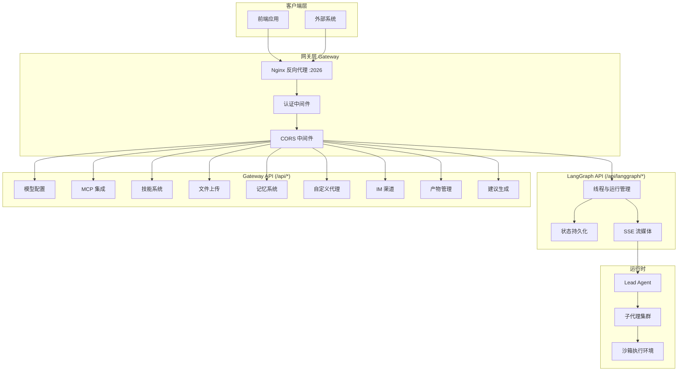

DeerFlow 后端 API 分为两个独立体系，分别处理不同的核心功能：LangGraph API 负责对话线程管理和 Agent 执行流，Gateway API 则提供模型配置、技能管理、文件上传等扩展能力。所有 API 均通过 Nginx 反向代理暴露在 2026 端口，前端通过统一的 `/api` 前缀进行调用。

Sources: [API.md](backend/docs/API.md#L1-L30)

## API 架构概览

DeerFlow 的后端架构围绕两条独立的通信路径构建：LangGraph Platform 兼容层负责 Agent 运行时状态管理，而 Gateway 自研层则承担配置管理、文件操作和 IM 渠道集成等差异化能力。这种分层设计使核心 Agent 逻辑保持与 LangGraph SDK 的兼容性，同时允许通过 RESTful 接口灵活扩展业务功能。



Sources: [app.py](backend/app/gateway/app.py#L1-L40), [threads.py](backend/app/gateway/routers/threads.py#L1-L50)

## 端点总览

Gateway API 的所有路由均以 `/api` 为前缀，按功能域划分为多个路由器模块。以下表格按功能分类列出主要端点及其用途：

| 功能域 | 路由前缀 | 主要端点 | 用途 |
|--------|----------|----------|------|
| **线程管理** | `/api/threads` | GET/POST /threads, GET/DELETE /threads/{id} | 创建、查询、删除对话线程 |
| **运行管理** | `/api/threads/{id}/runs` | POST /runs/stream, /runs/wait, /runs/cancel | 触发 Agent 执行、流式响应、取消运行 |
| **消息历史** | `/api/threads/{id}/messages` | GET /messages, GET /runs/{id}/messages | 分页获取对话消息和运行事件 |
| **文件上传** | `/api/threads/{id}/uploads` | POST /uploads, GET /uploads/list, DELETE /uploads/{name} | 上传、列出、删除线程文件 |
| **产物访问** | `/api/threads/{id}/artifacts` | GET /artifacts/{path} | 下载 Agent 生成的产物文件 |
| **模型配置** | `/api/models` | GET /models, GET /models/{name} | 列出可用模型及特性支持 |
| **技能系统** | `/api/skills` | GET /skills, POST /skills/install, PUT /skills/custom/{name} | 技能列表、安装、编辑自定义技能 |
| **MCP 集成** | `/api/mcp` | GET/PUT /mcp/config | 获取和更新 MCP 服务器配置 |
| **记忆系统** | `/api/memory` | GET /memory, POST /memory/facts, GET /memory/config | 全局记忆的读写和配置 |
| **反馈系统** | `/api/threads/{id}/runs/{rid}/feedback` | PUT/GET/DELETE /feedback | 对运行结果提交和查询反馈 |
| **建议生成** | `/api/threads/{id}/suggestions` | POST /suggestions | 基于对话上下文生成后续问题建议 |
| **自定义代理** | `/api/agents` | GET/POST /agents, GET /agents/{name} | CRUD 操作自定义 Agent 配置 |
| **IM 渠道** | `/api/channels` | GET /channels, POST /{name}/restart | IM 渠道状态管理和重启 |
| **Assistants 兼容** | `/api/assistants` | POST /assistants/search, GET /assistants/{id} | LangGraph Platform 兼容接口 |

Sources: [thread_runs.py](backend/app/gateway/routers/thread_runs.py#L1-L50), [threads.py](backend/app/gateway/routers/threads.py#L1-L50), [models.py](backend/app/gateway/routers/models.py#L1-L30)

## 线程管理 API

线程是 DeerFlow 对话状态的核心容器，每个线程关联唯一的 `thread_id`，用于追踪消息历史、检查点状态和产物数据。线程元数据存储在 ThreadMetaStore 中，支持按元数据键值对进行过滤搜索。

### 创建线程

```http
POST /api/threads
Content-Type: application/json

{
  "thread_id": "optional-custom-id",
  "assistant_id": "lead_agent",
  "metadata": {
    "title": "我的第一个对话"
  }
}
```

**响应：**

```json
{
  "thread_id": "abc123",
  "status": "idle",
  "created_at": "2024-01-15T10:30:00Z",
  "updated_at": "2024-01-15T10:30:00Z",
  "metadata": {
    "title": "我的第一个对话",
    "owner_id": "user_xxx"
  },
  "values": {},
  "interrupts": {}
}
```

**关键约束：**

- `metadata` 中禁止设置 `owner_id` 和 `user_id` — 这些字段由服务端从认证上下文自动填充，防止客户端伪造身份
- 可选 `thread_id` 允许客户端指定 ID，但需符合 UUID 格式
- 新建线程默认状态为 `idle`

Sources: [threads.py](backend/app/gateway/routers/threads.py#L70-L90)

### 查询与搜索

获取单个线程状态：

```http
GET /api/threads/{thread_id}
```

批量搜索线程（支持分页和状态过滤）：

```http
POST /api/threads/search
Content-Type: application/json

{
  "metadata": {"category": "project-a"},
  "limit": 20,
  "offset": 0,
  "status": "idle"
}
```

线程状态值含义：

| 状态值 | 含义 |
|--------|------|
| `idle` | 线程空闲，无正在执行的运行 |
| `busy` | 有运行正在执行 |
| `interrupted` | 运行被中断，可通过 `interrupt_before/after` 恢复 |
| `error` | 运行以错误结束，检查点中包含 `__error__` 标记 |

Sources: [threads.py](backend/app/gateway/routers/threads.py#L120-L150)

## 运行管理 API

运行（Run）是 Agent 执行的基本单位，与线程关联后可访问完整的对话历史。DeerFlow 支持三种运行执行模式：流式返回（SSE）、同步等待完成、以及后台任务。

### 创建流式运行

```http
POST /api/threads/{thread_id}/runs/stream
Content-Type: application/json

{
  "assistant_id": "lead_agent",
  "input": {
    "messages": [
      {
        "role": "user",
        "content": "帮我分析这个代码库的架构"
      }
    ]
  },
  "config": {
    "recursion_limit": 100,
    "configurable": {
      "model_name": "gpt-4",
      "thinking_enabled": false,
      "is_plan_mode": false
    }
  },
  "stream_mode": ["values", "messages-tuple", "custom"],
  "stream_subgraphs": false,
  "on_disconnect": "cancel",
  "multitask_strategy": "reject"
}
```

**流式响应格式（SSE）：**

```
event: values
data: {"messages": [...], "title": "代码库架构分析"}

event: messages
data: {"content": "正在分析代码结构...", "role": "assistant", "type": "streaming"}

event: end
data: {}
```

**配置参数说明：**

| 参数 | 类型 | 默认值 | 说明 |
|------|------|--------|------|
| `recursion_limit` | int | 100 | 最大图执行步数（超过后抛出 `GraphRecursionError`） |
| `model_name` | string | 配置默认值 | 覆盖默认模型 |
| `thinking_enabled` | bool | false | 启用 extended thinking（需模型支持） |
| `is_plan_mode` | bool | false | 启用 TodoList 中间件进行任务跟踪 |
| `stream_mode` | array | ["values"] | 流事件类型：`values`/`messages-tuple`/`custom`/`updates` |
| `on_disconnect` | string | "cancel" | 客户端断开时的行为：`cancel`（取消）或 `continue`（继续） |

**重要说明：** 直接调用 LangGraph API 时，`recursion_limit` 默认为 25，可能不足以支持子代理密集型运行。建议显式设置为 100，与 Gateway 默认值保持一致。

Sources: [thread_runs.py](backend/app/gateway/routers/thread_runs.py#L80-L140), [API.md](backend/docs/API.md#L60-L95)

### 取消运行

```http
POST /api/threads/{thread_id}/runs/{run_id}/cancel
```

**查询参数：**

| 参数 | 类型 | 说明 |
|------|------|------|
| `action` | string | `interrupt`（保持检查点）或 `rollback`（回滚到运行前状态） |
| `wait` | bool | 是否阻塞等待运行完全停止后返回 204 |

```bash
# 中断运行并等待完成
curl -X POST "http://localhost:2026/api/threads/abc123/runs/run_xyz/cancel?action=interrupt&wait=true"
```

**响应状态码：**

- `202 Accepted`：取消请求已发出，运行正在停止
- `204 No Content`：运行已完全停止（`wait=true` 时）
- `409 Conflict`：运行状态不允许取消（如已完成）

Sources: [thread_runs.py](backend/app/gateway/routers/thread_runs.py#L180-L210)

### 无状态运行

`/api/runs/stream` 和 `/api/runs/wait` 端点支持在不预先创建线程的情况下直接运行 Agent。如果请求中未指定 `thread_id`，系统会自动生成一个临时线程用于执行。

```http
POST /api/runs/wait
Content-Type: application/json

{
  "config": {
    "configurable": {
      "thread_id": "reuse-existing-thread"
    }
  },
  "input": {
    "messages": [{"role": "user", "content": "快速问答"}]
  }
}
```

这种模式适用于一次性查询场景，避免管理线程状态的额外开销。

Sources: [runs.py](backend/app/gateway/routers/runs.py#L1-L80)

## 消息与事件 API

### 获取线程消息

获取线程内所有消息（跨运行），支持游标分页：

```http
GET /api/threads/{thread_id}/messages?limit=50&before_seq=100
```

**响应格式：**

```json
[
  {
    "event_type": "human_message",
    "content": "帮我写一个排序算法",
    "run_id": "run_abc",
    "seq": 1,
    "feedback": null
  },
  {
    "event_type": "ai_message",
    "content": "我来为你实现一个快速排序...",
    "run_id": "run_abc",
    "seq": 2,
    "feedback": {
      "feedback_id": "fb_xyz",
      "rating": 1,
      "comment": "很好用"
    }
  }
]
```

### 获取运行事件

获取运行的完整事件流（用于调试和审计）：

```http
GET /api/threads/{thread_id}/runs/{run_id}/events?event_types=tool_calls,tool_results&limit=500
```

### Token 用量聚合

```http
GET /api/threads/{thread_id}/token-usage
```

**响应：**

```json
{
  "thread_id": "abc123",
  "total_tokens": 15000,
  "prompt_tokens": 10000,
  "completion_tokens": 5000,
  "runs_count": 5
}
```

Sources: [thread_runs.py](backend/app/gateway/routers/thread_runs.py#L280-L380)

## 文件上传 API

### 上传文件

```http
POST /api/threads/{thread_id}/uploads
Content-Type: multipart/form-data

files: [file1.pdf, file2.xlsx]
```

**自动转换支持：**

系统可将以下格式的文档自动转换为 Markdown：

| 格式 | 扩展名 |
|------|--------|
| PDF | `.pdf` |
| PowerPoint | `.ppt`, `.pptx` |
| Excel | `.xls`, `.xlsx` |
| Word | `.doc`, `.docx` |

**响应：**

```json
{
  "success": true,
  "files": [
    {
      "filename": "document.pdf",
      "size": "1234567",
      "path": ".deer-flow/threads/abc123/user-data/uploads/document.pdf",
      "virtual_path": "/mnt/user-data/uploads/document.pdf",
      "artifact_url": "/api/threads/abc123/artifacts/mnt/user-data/uploads/document.pdf",
      "markdown_file": "document.md",
      "markdown_virtual_path": "/mnt/user-data/uploads/document.md",
      "markdown_artifact_url": "/api/threads/abc123/artifacts/mnt/user-data/uploads/document.md"
    }
  ],
  "message": "Successfully uploaded 1 file(s)"
}
```

### 沙箱同步机制

上传的文件会自动同步到沙箱环境：

- **本地沙箱模式**：Gateway 直接将文件写入沙箱文件系统
- **AIO 远程沙箱**：通过 `sandbox.update_file()` API 将文件推送到远程沙箱
- **使用线程数据挂载的模式**：跳过同步，由挂载卷自动共享文件

Sources: [uploads.py](backend/app/gateway/routers/uploads.py#L80-L160)

## 产物访问 API

### 获取产物文件

Agent 生成的产物文件通过虚拟路径访问：

```http
GET /api/threads/{thread_id}/artifacts/{path}
```

**路径示例：**

```
/api/threads/abc123/artifacts/mnt/user-data/outputs/report.html
/api/threads/abc123/artifacts/mnt/user-data/uploads/source.pdf
```

**查询参数：**

| 参数 | 类型 | 说明 |
|------|------|------|
| `download` | boolean | 强制下载而非内联显示 |

**内容类型处理逻辑：**

- **主动内容**（HTML/XHTML/SVG）：始终作为附件下载，防止脚本执行
- **文本文件**：根据 MIME 类型返回（如 `.js` → `application/javascript`）
- **二进制文件**：内联显示

**.skill 归档内部访问：**

```http
GET /api/threads/abc123/artifacts/mnt/user-data/outputs/my-skill.skill/SKILL.md
```

系统会从 `.skill` ZIP 归档中提取指定文件内容，支持缓存 5 分钟。

Sources: [artifacts.py](backend/app/gateway/routers/artifacts.py#L70-L180)

## 模型配置 API

### 列出可用模型

```http
GET /api/models
```

**响应：**

```json
{
  "models": [
    {
      "name": "gpt-4",
      "model": "gpt-4",
      "display_name": "GPT-4",
      "description": "OpenAI GPT-4 模型",
      "supports_thinking": false,
      "supports_reasoning_effort": false
    },
    {
      "name": "deepseek-v3",
      "model": "deepseek-v3",
      "display_name": "DeepSeek V3",
      "description": "DeepSeek V3 模型",
      "supports_thinking": true,
      "supports_reasoning_effort": false
    }
  ],
  "token_usage": {
    "enabled": true
  }
}
```

**模型特性说明：**

| 特性 | 说明 |
|------|------|
| `supports_thinking` | 是否支持 extended thinking 模式 |
| `supports_reasoning_effort` | 是否支持 reasoning effort 参数（Claude 4+） |

Sources: [models.py](backend/app/gateway/routers/models.py#L40-L90)

## 技能系统 API

### 技能列表与详情

```http
GET /api/skills
```

**响应：**

```json
{
  "skills": [
    {
      "name": "deep-research",
      "description": "深度研究助手，执行多轮网络搜索和分析",
      "license": "MIT",
      "category": "public",
      "enabled": true
    },
    {
      "name": "my-custom-skill",
      "description": "我的自定义技能",
      "license": "MIT",
      "category": "custom",
      "enabled": true
    }
  ]
}
```

### 安装技能

从线程目录中的 `.skill` 文件安装：

```http
POST /api/skills/install
Content-Type: application/json

{
  "thread_id": "abc123",
  "path": "mnt/user-data/outputs/my-research.skill"
}
```

### 编辑自定义技能

获取技能内容：

```http
GET /api/skills/custom/{skill_name}
```

更新技能内容（会触发安全扫描）：

```http
PUT /api/skills/custom/{skill_name}
Content-Type: application/json

{
  "content": "# SOUL.md\n\n你是一个专注于数据分析的助手..."
}
```

**安全扫描：** 编辑操作会自动执行 `scan_skill_content()` 检查，禁止包含危险工具调用模式的技能内容。

Sources: [skills.py](backend/app/gateway/routers/skills.py#L90-L170)

## MCP 集成 API

### 获取 MCP 配置

```http
GET /api/mcp/config
```

**响应：**

```json
{
  "mcp_servers": {
    "github": {
      "enabled": true,
      "type": "stdio",
      "command": "npx",
      "args": ["-y", "@modelcontextprotocol/server-github"],
      "env": {"GITHUB_TOKEN": "***"},
      "description": "GitHub 操作 MCP 服务器"
    }
  }
}
```

### 更新 MCP 配置

```http
PUT /api/mcp/config
Content-Type: application/json

{
  "mcp_servers": {
    "github": {
      "enabled": true,
      "type": "stdio",
      "command": "npx",
      "args": ["-y", "@modelcontextprotocol/server-github"],
      "env": {"GITHUB_TOKEN": "$GITHUB_TOKEN"},
      "oauth": null
    }
  }
}
```

**OAuth 支持：** HTTP/SSE 类型的 MCP 服务器可配置 OAuth 2.0 认证：

```json
{
  "oauth": {
    "enabled": true,
    "token_url": "https://oauth.provider.com/token",
    "grant_type": "client_credentials",
    "client_id": "my_client_id",
    "client_secret": "$CLIENT_SECRET",
    "scope": "repo read:user"
  }
}
```

Sources: [mcp.py](backend/app/gateway/routers/mcp.py#L30-L170)

## 记忆系统 API

### 获取记忆数据

```http
GET /api/memory
```

**响应结构：**

```json
{
  "version": "1.0",
  "lastUpdated": "2024-01-15T10:30:00Z",
  "user": {
    "workContext": {"summary": "正在开发 DeerFlow 项目", "updatedAt": "..."},
    "personalContext": {"summary": "偏好简洁的回复", "updatedAt": "..."},
    "topOfMind": {"summary": "构建记忆 API", "updatedAt": "..."}
  },
  "history": {
    "recentMonths": {"summary": "近期开发活动", "updatedAt": "..."},
    "earlierContext": {"summary": "", "updatedAt": ""},
    "longTermBackground": {"summary": "", "updatedAt": ""}
  },
  "facts": [
    {
      "id": "fact_abc123",
      "content": "用户偏好 TypeScript 而非 JavaScript",
      "category": "preference",
      "confidence": 0.9,
      "createdAt": "2024-01-15T10:30:00Z",
      "source": "thread_xyz"
    }
  ]
}
```

### 记忆事实管理

```http
# 创建事实
POST /api/memory/facts
{
  "content": "用户正在使用 Windows 系统",
  "category": "environment",
  "confidence": 0.95
}

# 更新事实（部分更新）
PATCH /api/memory/facts/{fact_id}
{
  "confidence": 0.8
}

# 删除事实
DELETE /api/memory/facts/{fact_id}
```

**置信度约束：** `confidence` 必须在 0.0 到 1.0 之间。

Sources: [memory.py](backend/app/gateway/routers/memory.py#L70-L250)

## 反馈系统 API

### 提交反馈

```http
PUT /api/threads/{thread_id}/runs/{run_id}/feedback
Content-Type: application/json

{
  "rating": 1,
  "comment": "回答很有帮助"
}
```

**幂等性：** `PUT` 方法支持幂等更新，重复调用会覆盖而非创建新记录。

**评分规则：** `rating` 只能为 `1`（正面）或 `-1`（负面）。

### 查询反馈统计

```http
GET /api/threads/{thread_id}/runs/{run_id}/feedback/stats
```

**响应：**

```json
{
  "run_id": "run_abc",
  "total": 15,
  "positive": 12,
  "negative": 3
}
```

Sources: [feedback.py](backend/app/gateway/routers/feedback.py#L60-L140)

## 建议生成 API

基于对话上下文生成后续问题建议：

```http
POST /api/threads/{thread_id}/suggestions
Content-Type: application/json

{
  "messages": [
    {"role": "user", "content": "如何优化 SQL 查询性能？"},
    {"role": "assistant", "content": "可以从索引优化、查询重写、缓存等方面入手..."}
  ],
  "n": 3,
  "model_name": null
}
```

**响应：**

```json
{
  "suggestions": [
    "索引失效的常见原因有哪些？",
    "如何分析慢查询日志？",
    "数据库连接池配置有什么建议？"
  ]
}
```

**约束条件：**

- `n` 范围：1-5
- 生成的问题语言与用户消息保持一致
- 单个问题不超过 40 个中文字符或 20 个英文单词

Sources: [suggestions.py](backend/app/gateway/routers/suggestions.py#L90-L140)

## 错误响应格式

所有 API 遵循统一的错误响应格式：

```json
{
  "detail": "错误消息描述"
}
```

**HTTP 状态码语义：**

| 状态码 | 含义 | 典型场景 |
|--------|------|----------|
| 400 | 请求格式错误 | 参数类型不匹配、验证失败 |
| 403 | 权限不足 | `require_permission` 装饰器拒绝访问 |
| 404 | 资源不存在 | 线程/运行/文件未找到 |
| 409 | 资源冲突 | 重复创建、技能已存在、运行冲突 |
| 422 | 验证错误 | Pydantic 模型验证失败 |
| 500 | 服务器错误 | 文件操作失败、内部异常 |

Sources: [threads.py](backend/app/gateway/routers/threads.py#L150-L180)

## Python SDK 使用示例

使用 LangGraph SDK 进行流式调用：

```python
from langgraph_sdk import get_client

async def main():
    client = get_client(url="http://localhost:2026/api/langgraph")

    # 创建线程
    thread = await client.threads.create(metadata={"title": "新对话"})
    thread_id = thread["thread_id"]

    # 流式执行
    async for event in client.runs.stream(
        thread_id,
        "lead_agent",
        input={"messages": [{"role": "user", "content": "你好"}]},
        config={
            "configurable": {
                "model_name": "gpt-4",
                "recursion_limit": 100
            }
        },
        stream_mode=["values", "messages-tuple", "custom"],
    ):
        print(event)

if __name__ == "__main__":
    import asyncio
    asyncio.run(main())
```

Sources: [API.md](backend/docs/API.md#L550-L600)

## 后续阅读

完成 API 参考后，建议继续阅读以下文档以深入理解系统：

- [整体架构](4-zheng-ti-jia-gou) — 了解 API 与 Agent 运行时的关系
- [Lead Agent 主代理](5-lead-agent-zhu-dai-li) — 深入理解 Agent 执行流程
- [沙箱系统](7-sha-xiang-xi-tong) — 理解文件隔离和安全执行
- [本地开发部署](14-ben-di-kai-fa-bu-shu) — 搭建本地开发环境进行 API 测试