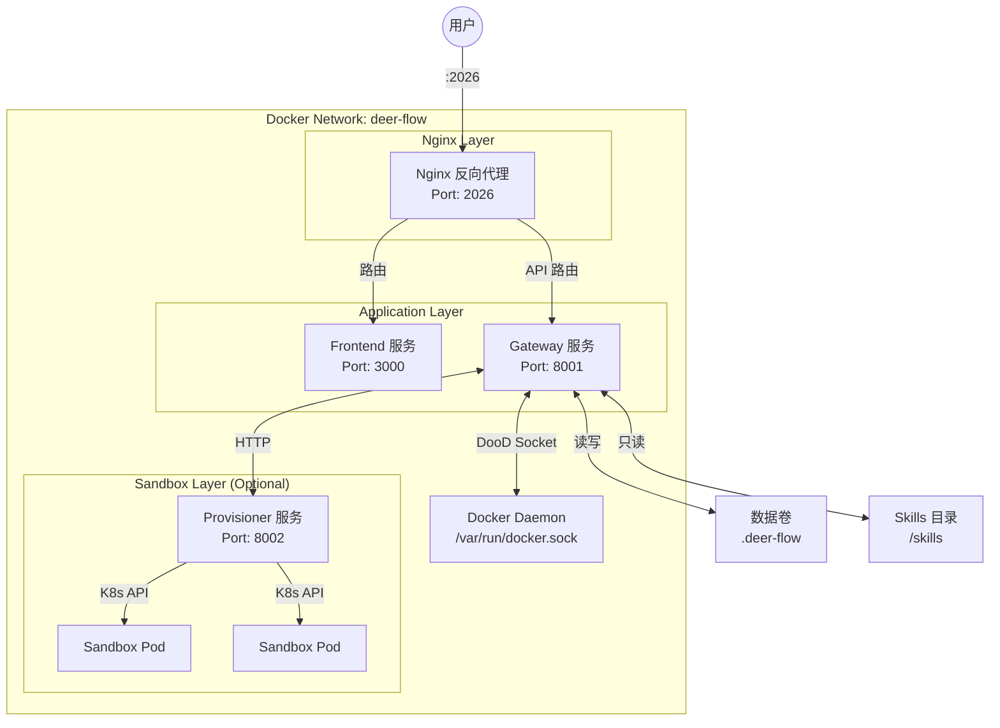
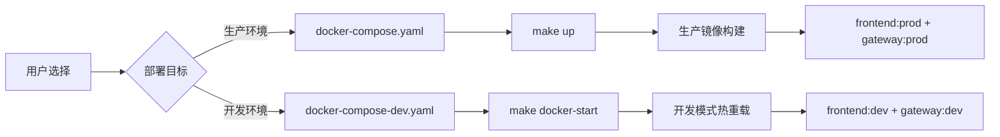
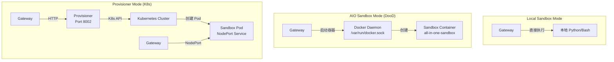

本文档详细介绍 DeerFlow 的 Docker 容器化部署方案，涵盖生产环境与开发环境的架构差异、核心服务配置、环境变量设置以及常见问题排查。通过 Docker 部署，用户可以在隔离的容器环境中快速启动完整的 DeerFlow 应用，享受一致的运行环境与便捷的运维体验。

## 架构概览

DeerFlow 的 Docker 部署采用四层微服务架构，通过 Docker Compose 实现服务编排，Nginx 作为统一的反向代理入口。整体架构包含前端服务、网关服务、沙箱服务（可选）和负载均衡层。



### 服务职责划分

| 服务 | 容器名称 | 端口 | 主要职责 |
|------|----------|------|----------|
| **Nginx** | `deer-flow-nginx` | 2026 | 反向代理、CORS 处理、SSE 流式响应支持 |
| **Frontend** | `deer-flow-frontend` | 3000 | Next.js Web 应用界面 |
| **Gateway** | `deer-flow-gateway` | 8001 | FastAPI 网关、LangGraph 运行时、沙箱管理 |
| **Provisioner** | `deer-flow-provisioner` | 8002 | Kubernetes Pod 管理（仅 Provisioner 模式） |

Sources: [docker-compose.yaml](docker/docker-compose.yaml#L1-L147), [docker-compose-dev.yaml](docker/docker-compose-dev.yaml#L1-L187)

## 部署模式对比

DeerFlow 提供两种 Docker 部署模式，分别适用于生产环境和开发场景。



### 生产模式 vs 开发模式

| 特性 | 生产模式 | 开发模式 |
|------|----------|----------|
| **Compose 文件** | `docker/docker-compose.yaml` | `docker/docker-compose-dev.yaml` |
| **启动命令** | `make up` | `make docker-start` |
| **前端构建** | 多阶段构建，预编译 Next.js | 开发服务器，源码挂载 |
| **后端构建** | 多阶段构建，移除编译器 | 保留开发工具链，支持 uv sync |
| **热重载** | ❌ 关闭 | ✅ 开启（文件挂载） |
| **日志输出** | 标准输出 | 持久化到 `logs/` 目录 |
| **沙箱模式** | 自动检测（aio/provisioner/local） | 自动检测，需配置 `DEER_FLOW_ROOT` |
| **工作进程数** | `GATEWAY_WORKERS=4`（可配置） | 单进程 + `--reload` |

Sources: [Makefile](Makefile#L130-L184), [docker-compose.yaml](docker/docker-compose.yaml#L48-L92)

## 环境变量配置

Docker 部署依赖多个环境变量来控制服务行为。这些变量可通过 `.env` 文件或 shell 环境设置。

### 核心环境变量

| 变量名 | 默认值 | 必填 | 说明 |
|--------|--------|------|------|
| `PORT` | `2026` | ❌ | Nginx 监听端口 |
| `DEER_FLOW_HOME` | `backend/.deer-flow` | ❌ | 运行时数据目录（线程、内存等） |
| `DEER_FLOW_CONFIG_PATH` | `config.yaml` | ❌ | 应用配置文件路径 |
| `DEER_FLOW_EXTENSIONS_CONFIG_PATH` | `extensions_config.json` | ❌ | 扩展配置文件路径 |
| `DEER_FLOW_DOCKER_SOCKET` | `/var/run/docker.sock` | ❌ | Docker socket 路径（DooD 模式必需） |
| `DEER_FLOW_REPO_ROOT` | — | ❌ | 仓库根目录（Skills 挂载路径） |
| `BETTER_AUTH_SECRET` | 自动生成 | ✅ | Next.js 认证密钥 |
| `GATEWAY_WORKERS` | `4` | ❌ | Gateway 工作进程数 |

### 构建优化变量

| 变量名 | 说明 |
|--------|------|
| `UV_IMAGE` | UV 镜像源（`ghcr.io/astral-sh/uv:0.7.20`），用于受限网络 |
| `UV_INDEX_URL` | PyPI 镜像源 |
| `UV_EXTRAS` | 额外依赖，如 `postgres` |
| `APT_MIRROR` | APT 镜像源（如 `mirrors.aliyun.com`） |
| `NPM_REGISTRY` | NPM/PNPM 镜像源 |
| `PNPM_STORE_PATH` | PNPM 缓存目录 |

### API 密钥配置

`.env` 文件中配置第三方 API 密钥：

```bash
# 必需：根据 config.yaml 中配置的模型提供商设置
# OPENAI_API_KEY=sk-...
# ANTHROPIC_API_KEY=sk-ant-...

# 可选：工具 API 密钥
TAVILY_API_KEY=your-tavily-api-key
JINA_API_KEY=your-jina-api-key
INFOQUEST_API_KEY=your-infoquest-api-key

# 可选：LangSmith 追踪
# LANGSMITH_TRACING=true
# LANGSMITH_API_KEY=your-langsmith-api-key
```

Sources: [docker-compose.yaml](docker/docker-compose.yaml#L8-L30), [.env.example](.env.example#L1-L48)

## 部署步骤

### 前置条件

1. **Docker 环境**：安装 Docker 20.10+ 和 Docker Compose V2
2. **配置文件**：准备 `config.yaml` 和 `extensions_config.json`
3. **API 密钥**：配置模型提供商的 API 密钥

### 生产环境部署

```bash
# 1. 克隆仓库并进入目录
cd deer-flow

# 2. 复制并编辑配置文件
cp config.example.yaml config.yaml
# 编辑 config.yaml，配置模型和 API 密钥

# 3. 启动生产环境（自动构建镜像）
make up

# 4. 查看服务状态
docker compose -p deer-flow -f docker/docker-compose.yaml ps

# 5. 查看日志
make docker-logs
```

生产环境部署会自动：
- 生成 `BETTER_AUTH_SECRET` 并持久化到 `DEER_FLOW_HOME/.better-auth-secret`
- 检测沙箱模式（aio/provisioner/local）并启动相应服务
- 创建 `deer-flow` 网络

### 开发环境部署

```bash
# 1. 设置仓库根路径（必需，用于 Provisioner 模式）
export DEER_FLOW_ROOT=/absolute/path/to/deer-flow

# 2. 初始化（预拉取沙箱镜像）
make docker-init

# 3. 启动开发环境
make docker-start

# 4. 访问应用
open http://localhost:2026
```

开发环境特性：
- 前端源码挂载到容器，支持热重载
- 后端源码挂载，支持代码修改自动重载
- 日志持久化到 `logs/` 目录

### 停止服务

```bash
# 生产环境
make down

# 开发环境
make docker-stop
```

Sources: [Makefile](Makefile#L170-L184), [scripts/deploy.sh](scripts/deploy.sh#L1-L100)

## 沙箱模式与 DooD 架构

DeerFlow 支持三种沙箱执行模式，Docker 部署中的沙箱选择直接影响容器架构。



### DooD（Docker-out-of-Docker）架构

在 AIO 沙箱模式下，Gateway 容器通过 Docker Socket 与宿主机的 Docker Daemon 通信，实现沙箱容器的动态创建与销毁。

```yaml
# docker-compose.yaml 中的 DooD 配置
gateway:
  volumes:
    # 核心：Docker Socket 挂载
    - ${DEER_FLOW_DOCKER_SOCKET}:/var/run/docker.sock
    # 宿主机路径转换（使沙箱容器能访问宿主机文件系统）
    - ${DEER_FLOW_HOST_BASE_DIR}:/app/backend/.deer-flow
    - ${DEER_FLOW_HOST_SKILLS_PATH}:/app/skills
  environment:
    # 宿主机网络访问地址
    - DEER_FLOW_SANDBOX_HOST=host.docker.internal
```

**DooD 权限要求**：
- 宿主机 Docker Socket 必须可访问（`/var/run/docker.sock`）
- 对于沙箱隔离，建议配置 Docker daemon 以非 root 用户运行

Sources: [docker-compose.yaml](docker/docker-compose.yaml#L54-L85), [backend/Dockerfile](backend/Dockerfile#L55-L65)

### 沙箱模式检测

部署脚本自动从 `config.yaml` 检测沙箱模式：

```bash
# Local 模式
sandbox:
  use: deerflow.sandbox.local:LocalSandboxProvider

# AIO 沙箱模式（DooD）
sandbox:
  use: deerflow.community.aio_sandbox:AioSandboxProvider

# Provisioner 模式（K8s）
sandbox:
  use: deerflow.community.aio_sandbox:AioSandboxProvider
  provisioner_url: http://provisioner:8002
```

Sources: [scripts/deploy.sh](scripts/deploy.sh#L145-L180), [config.example.yaml](config.example.yaml#L518-L590)

## Nginx 反向代理配置

Nginx 是 DeerFlow 部署的统一入口，负责请求路由、CORS 处理和流式响应支持。

### 路由规则

```nginx
# API 路由 → Gateway (8001)
location /api/ {
    proxy_pass http://gateway;
    # SSE 流式响应必需配置
    proxy_buffering off;
    proxy_cache off;
    proxy_set_header X-Accel-Buffering no;
}

# LangGraph 兼容路由（重写 /api/langgraph/* → /api/*）
location /api/langgraph/ {
    rewrite ^/api/langgraph/(.*) /api/$1 break;
    proxy_pass http://gateway;
}

# 前端静态资源 (Next.js)
location / {
    proxy_pass http://frontend;
}

# API 文档
location /docs { proxy_pass http://gateway; }
location /redoc { proxy_pass http://gateway; }
```

### CORS 配置

```nginx
# Nginx 集中处理 CORS，避免上游重复
proxy_hide_header 'Access-Control-Allow-Origin';
proxy_hide_header 'Access-Control-Allow-Methods';
proxy_hide_header 'Access-Control-Allow-Headers';

add_header 'Access-Control-Allow-Origin' '*' always;
add_header 'Access-Control-Allow-Methods' 'GET, POST, PUT, DELETE, PATCH, OPTIONS' always;
add_header 'Access-Control-Allow-Headers' '*' always;

# 处理 CORS 预检请求
if ($request_method = 'OPTIONS') {
    return 204;
}
```

### 长连接超时配置

沙箱执行可能需要较长时间，Nginx 配置了扩展的超时时间：

```nginx
proxy_connect_timeout 600s;
proxy_send_timeout 600s;
proxy_read_timeout 600s;
chunked_transfer_encoding on;
```

Sources: [docker/nginx/nginx.conf](docker/nginx/nginx.conf#L1-L200)

## 多阶段 Dockerfile 构建

### 后端多阶段构建

```dockerfile
# Stage 1: Builder - 编译依赖和原生扩展
FROM python:3.12-slim-bookworm AS builder
RUN apt-get install build-essential nodejs
COPY backend/ ./backend
RUN uv sync --frozen-lockfile

# Stage 2: Dev - 保留开发工具链
FROM builder AS dev
COPY --from=docker:cli /usr/local/bin/docker /usr/local/bin/docker
CMD ["uv run uvicorn app.gateway.app:app --host 0.0.0.0 --port 8001"]

# Stage 3: Runtime - 生产精简镜像
FROM python:3.12-slim-bookworm AS runtime
COPY --from=builder /app/backend ./backend
COPY --from=builder /usr/bin/node /usr/bin/node
COPY --from=docker:cli /usr/local/bin/docker /usr/local/bin/docker
CMD ["uv run --no-sync uvicorn app.gateway.app:app --host 0.0.0.0 --port 8001"]
```

### 前端多阶段构建

```dockerfile
# Base: 安装 pnpm
FROM node:22-alpine AS base
RUN corepack enable && corepack install -g pnpm@10.26.2

# Dev: 仅安装依赖
FROM base AS dev
RUN pnpm install --frozen-lockfile

# Builder: 构建生产版本
FROM base AS builder
RUN pnpm install --frozen-lockfile
RUN SKIP_ENV_VALIDATION=1 pnpm build

# Prod: 运行时镜像
FROM node:22-alpine AS prod
COPY --from=builder /app/frontend ./frontend
CMD ["pnpm start"]
```

Sources: [backend/Dockerfile](backend/Dockerfile#L1-L92), [frontend/Dockerfile](frontend/Dockerfile#L1-L51)

## 数据持久化

Docker 部署通过卷挂载实现数据持久化，确保容器重启后数据不丢失。

### 卷挂载配置

| 宿主机路径 | 容器路径 | 说明 |
|-----------|----------|------|
| `config.yaml` | `/app/backend/config.yaml:ro` | 只读配置文件 |
| `extensions_config.json` | `/app/backend/extensions_config.json:ro` | 扩展配置 |
| `skills/` | `/app/skills:ro` | 技能包（只读） |
| `DEER_FLOW_HOME` | `/app/backend/.deer-flow` | 运行时数据 |
| `/var/run/docker.sock` | `/var/run/docker.sock` | Docker Socket（DooD） |
| `~/.claude` | `/root/.claude:ro` | CLI 认证目录 |
| `~/.codex` | `/root/.codex:ro` | Codex CLI 认证目录 |

### 开发环境额外卷

```yaml
# 日志持久化
- ../logs:/app/logs

# 源码热重载
- ../frontend/src:/app/frontend/src
- ../backend/:/app/backend/

# 缓存卷
volumes:
  gateway-venv:      # 保留 .venv 避免被挂载覆盖
  gateway-uv-cache: # uv 依赖缓存
```

Sources: [docker-compose.yaml](docker/docker-compose.yaml#L54-L85), [docker-compose-dev.yaml](docker/docker-compose-dev.yaml#L85-L130)

## 常见问题排查

### 服务启动失败

```bash
# 1. 检查容器状态
docker compose -p deer-flow -f docker/docker-compose.yaml ps

# 2. 查看特定服务日志
docker compose logs gateway
docker compose logs frontend
docker compose logs nginx

# 3. 检查配置文件
docker exec deer-flow-gateway cat /app/backend/config.yaml | head -50
```

### Docker Socket 权限问题

```bash
# 检查 Socket 权限
ls -la /var/run/docker.sock

# 修复权限（宿主机执行）
sudo chmod 666 /var/run/docker.sock

# 或将用户加入 docker 组
sudo usermod -aG docker $USER
```

### 沙箱容器启动失败（AIO 模式）

```bash
# 1. 预拉取沙箱镜像
docker pull enterprise-public-cn-beijing.cr.volces.com/vefaas-public/all-in-one-sandbox:latest

# 2. 检查 Docker 可用性
docker info

# 3. 查看沙箱容器日志
docker logs deer-flow-gateway | grep -i sandbox
```

### 网络连接问题

```bash
# 1. 检查 Docker 网络
docker network inspect deer-flow_deer-flow

# 2. 测试服务连通性
docker exec deer-flow-gateway curl -f http://frontend:3000

# 3. 检查 extra_hosts 配置
docker exec deer-flow-gateway cat /etc/hosts
```

### 端口冲突

```bash
# 检查端口占用
lsof -i :2026

# 使用环境变量更改端口
export PORT=8080
make up
```

### Provisioner 模式 K8s 连接问题

```bash
# 1. 检查 kubeconfig 挂载
docker exec deer-flow-provisioner ls -la /root/.kube/

# 2. 测试 K8s API 连通性
docker exec deer-flow-provisioner curl -k https://host.docker.internal:26443/healthz

# 3. 查看 provisioner 日志
docker compose logs provisioner
```

Sources: [scripts/deploy.sh](scripts/deploy.sh#L200-L274), [docker/provisioner/README.md](docker/provisioner/README.md#L150-L200)

## 下一步

完成 Docker 部署后，建议进一步阅读：

- **[Kubernetes 沙箱配置](16-kubernetes-sha-xiang-pei-zhi)** — 了解生产级 K8s 部署方案
- **[配置指南](3-pei-zhi-zhi-nan)** — 深入配置 DeerFlow 的各项功能
- **[本地开发部署](14-ben-di-kai-fa-bu-shu)** — 本地非 Docker 开发环境配置

如需了解沙箱系统的底层实现，请参考 [沙箱系统](7-sha-xiang-xi-tong) 架构文档。