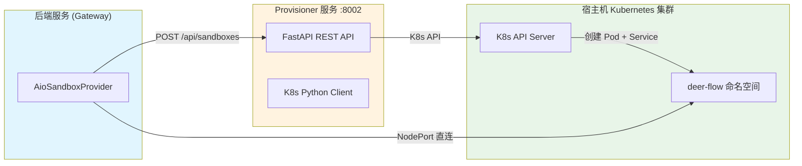
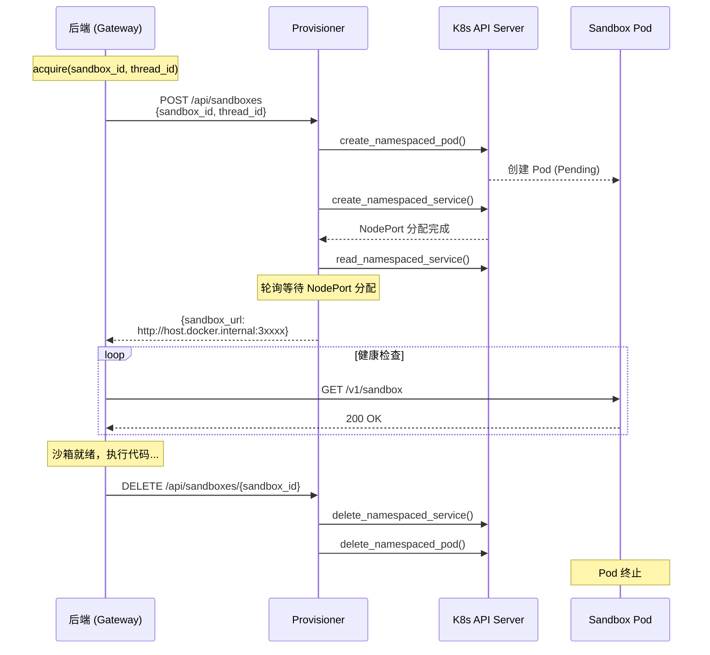

本文档介绍 DeerFlow 中 Kubernetes 沙箱模式的技术架构与配置方法。该模式通过 Provisioner 服务动态管理 Kubernetes Pod，为每个对话线程创建隔离的代码执行环境，实现生产级别的资源隔离与扩展能力。

## 技术架构

DeerFlow 的 Kubernetes 沙箱架构采用 **后端-Provisioner-集群** 三层分离设计，通过 HTTP API 实现松耦合通信：



### 核心组件职责

| 组件 | 位置 | 职责 | 技术栈 |
|------|------|------|--------|
| **AioSandboxProvider** | `backend/` | 沙箱生命周期管理（获取/释放） | Python |
| **RemoteSandboxBackend** | `backend/packages/harness/deerflow/community/aio_sandbox/remote_backend.py` | HTTP 客户端，向 Provisioner 发起请求 | `requests` 库 |
| **Provisioner** | `docker/provisioner/app.py` | Pod/Service 创建销毁，K8s API 操作 | FastAPI + `kubernetes` SDK |
| **Sandbox Pod** | K8s 集群 | 隔离的代码执行环境 | all-in-one-sandbox 镜像 |

Sources: [remote_backend.py](backend/packages/harness/deerflow/community/aio_sandbox/remote_backend.py#L1-L16)

## 工作流程

沙箱的生命周期管理遵循以下流程：



Sources: [app.py](docker/provisioner/app.py#L439-L534)

## Pod 资源配置

每个沙箱 Pod 的资源配置如下：

| 资源类型 | 请求值 (requests) | 限制值 (limits) | 说明 |
|----------|-------------------|-----------------|------|
| CPU | 100m | 1000m | 10 倍突发能力 |
| 内存 | 256Mi | 1Gi | 4 倍突发能力 |
| 临时存储 | 500Mi | 500Mi | 等量配置 |

Sources: [app.py](docker/provisioner/app.py#L353-L364)

### 健康探针配置

```python
readiness_probe:  # 就绪探针
  http_get: /v1/sandbox
  initial_delay: 5s
  period: 5s
  timeout: 3s
  failure_threshold: 3

liveness_probe:    # 存活探针
  http_get: /v1/sandbox
  initial_delay: 10s
  period: 10s
  timeout: 3s
  failure_threshold: 3
```

Sources: [app.py](docker/provisioner/app.py#L333-L352)

## 数据卷配置

沙箱 Pod 支持两种数据卷挂载方式：

### HostPath 模式（默认）

适用于本地开发环境，直接挂载宿主机目录：

```yaml
volumes:
  - name: skills
    hostPath:
      path: /skills           # 宿主机路径
      type: Directory        # 只读挂载
  - name: user-data
    hostPath:
      path: /threads/{thread_id}/user-data
      type: DirectoryOrCreate # 自动创建
```

Sources: [app.py](docker/provisioner/app.py#L248-L283)

### PVC 模式（生产推荐）

适用于生产环境，通过 PersistentVolumeClaim 挂载：

```yaml
volumes:
  - name: skills
    persistentVolumeClaim:
      claimName: deer-flow-skills-pvc
      readOnly: true
  - name: user-data
    persistentVolumeClaim:
      claimName: deer-flow-userdata-pvc
      # subPath 自动设置为 threads/{thread_id}/user-data
```

Sources: [app.py](docker/provisioner/app.py#L267-L294)

## 快速开始

### 前置条件

1. **启用 Kubernetes**：Docker Desktop 或 OrbStack 设置中开启 Kubernetes
2. **配置 kubectl**：`~/.kube/config` 指向本地集群
3. **环境变量**：`DEER_FLOW_ROOT` 设置为项目根目录绝对路径

### 配置步骤

#### 1. 配置 config.yaml

在 `config.yaml` 中启用 Provisioner 模式：

```yaml
sandbox:
  use: deerflow.community.aio_sandbox:AioSandboxProvider
  provisioner_url: http://provisioner:8002
```

Sources: [config.example.yaml](config.example.yaml#L582-L587)

#### 2. 配置 docker-compose-dev.yaml

设置 Provisioner 环境变量：

```yaml
provisioner:
  environment:
    - K8S_NAMESPACE=deer-flow
    - SANDBOX_IMAGE=enterprise-public-cn-beijing.cr.volces.com/vefaas-public/all-in-one-sandbox:latest
    - SKILLS_HOST_PATH=${DEER_FLOW_ROOT}/skills
    - THREADS_HOST_PATH=${DEER_FLOW_ROOT}/backend/.deer-flow/threads
    - KUBECONFIG_PATH=/root/.kube/config
    - NODE_HOST=host.docker.internal
    - K8S_API_SERVER=https://host.docker.internal:26443
  volumes:
    - ~/.kube/config:/root/.kube/config:ro
  extra_hosts:
    - "host.docker.internal:host-gateway"
```

Sources: [docker-compose-dev.yaml](docker/docker-compose-dev.yaml#L20-L47)

#### 3. 启动服务

```bash
# 设置环境变量
export DEER_FLOW_ROOT=/path/to/deer-flow

# 启动完整开发环境
make docker-start

# 或仅启动 provisioner
docker compose -p deer-flow-dev -f docker/docker-compose-dev.yaml up -d provisioner
```

Sources: [docker-compose-dev.yaml](docker/docker-compose-dev.yaml#L1-L13)

## 配置参数详解

### Provisioner 环境变量

| 变量名 | 默认值 | 说明 |
|--------|--------|------|
| `K8S_NAMESPACE` | `deer-flow` | Kubernetes 命名空间 |
| `SANDBOX_IMAGE` | 见示例配置 | 沙箱容器镜像 |
| `SKILLS_HOST_PATH` | — | 宿主机 skills 目录（必填） |
| `THREADS_HOST_PATH` | — | 宿主机 threads 目录（必填） |
| `SKILLS_PVC_NAME` | 空 | 使用 PVC 替代 HostPath |
| `USERDATA_PVC_NAME` | 空 | 用户数据 PVC |
| `KUBECONFIG_PATH` | `/root/.kube/config` | kubeconfig 文件路径 |
| `NODE_HOST` | `host.docker.internal` | 后端访问 NodePort 的主机 |
| `K8S_API_SERVER` | kubeconfig 中的地址 | K8s API 服务器地址 |

Sources: [app.py](docker/provisioner/app.py#L56-L74)

### K8S_API_SERVER 覆盖

当 kubeconfig 中的 API 服务器地址为 `localhost` 或 `127.0.0.1` 时，Docker 容器内无法访问。需要显式设置：

```bash
# 查看当前 API 服务器地址
kubectl config view --minify -o jsonpath='{.clusters[0].cluster.server}'

# Docker Desktop 的端口通常是 6443 或随机分配
# OrbStack 使用 26443
```

Sources: [README.md](docker/provisioner/README.md#L146-L162)

## 运维命令

### 验证集群状态

```bash
# 检查命名空间
kubectl get namespace deer-flow

# 查看所有 Pod 和 Service
kubectl get pod,svc -n deer-flow

# 查看特定沙箱
kubectl get pod,svc -n deer-flow -l sandbox-id=test-001
```

### 手动测试 API

```bash
# 健康检查
curl http://localhost:8002/health

# 创建沙箱
curl -X POST http://localhost:8002/api/sandboxes \
  -H "Content-Type: application/json" \
  -d '{"sandbox_id":"test-001","thread_id":"thread-001"}'

# 查看状态
curl http://localhost:8002/api/sandboxes/test-001

# 列表所有沙箱
curl http://localhost:8002/api/sandboxes

# 删除沙箱
curl -X DELETE http://localhost:8002/api/sandboxes/test-001
```

Sources: [README.md](docker/provisioner/README.md#L205-L229)

## 故障排查

| 症状 | 可能原因 | 解决方案 |
|------|----------|----------|
| "Kubeconfig not found" | kubeconfig 未挂载 | 检查 `~/.kube/config` 文件是否存在 |
| "Connection refused" | API 服务器地址问题 | 设置 `K8S_API_SERVER` 环境变量 |
| Pod 处于 "ContainerCreating" | 镜像拉取失败或 HostPath 无效 | `kubectl describe pod` 查看事件 |
| 无法访问沙箱 URL | NodePort 不可达 | 检查 `NODE_HOST` 配置 |

Sources: [README.md](docker/provisioner/README.md#L243-L310)

## 安全性考量

1. **数据卷隔离**：HostPath 模式直接挂载宿主机目录，生产环境建议使用 PVC
2. **资源限制**：每个 Pod 都有 CPU/内存/存储上限
3. **网络隔离**：可添加 NetworkPolicy 限制 Pod 间通信
4. **kubeconfig 权限**：仅在可信环境中运行 Provisioner
5. **镜像安全**：使用来自可信镜像仓库的 all-in-one-sandbox 镜像

Sources: [README.md](docker/provisioner/README.md#L312-L322)

## 后续步骤

完成 Kubernetes 沙箱配置后，建议继续阅读：

- [沙箱系统](7-sha-xiang-xi-tong) — 了解沙箱系统的完整设计
- [Docker 部署](15-docker-bu-shu) — 生产环境 Docker 部署指南
- [本地开发部署](14-ben-di-kai-fa-bu-shu) — 本地开发环境配置