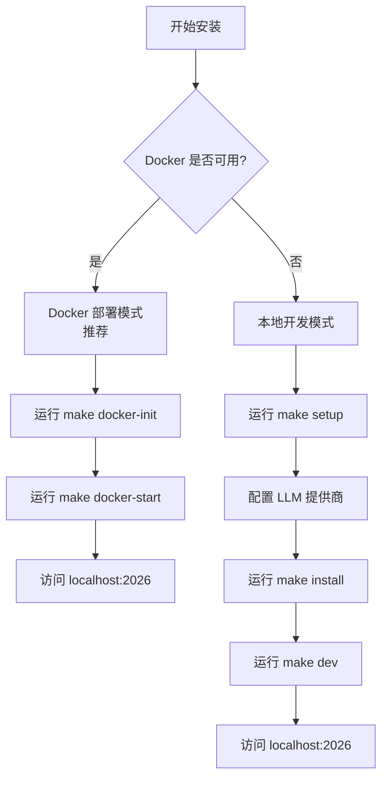

DeerFlow 是一个开源的 AI 超级代理框架，支持通过 Docker 容器化部署或本地开发两种方式进行安装。本文详细介绍两种安装路径的完整流程，帮助初学者快速搭建开发环境。

## 系统要求

在开始安装之前，请确保你的系统满足以下基本要求：

| 组件 | 最低版本 | 说明 |
|------|---------|------|
| Node.js | 22+ | 用于运行前端 Next.js 应用 |
| pnpm | 10.26.2+ | Node.js 包管理器 |
| Python | 3.12+ | 用于运行后端 Gateway |
| uv | 最新版 | Python 包管理器与虚拟环境工具 |
| nginx | 任意版本 | 反向代理服务器（仅本地开发模式必需） |
| Docker | 任意版本 | 仅容器化部署模式必需 |

可以通过运行 `make check` 命令快速检查系统是否满足上述依赖要求。该命令会依次检测 Node.js、pnpm、uv 和 nginx 的安装状态，并在发现缺失时给出具体的安装指引。

Sources: [Makefile](Makefile#L35-L36), [scripts/check.py](scripts/check.py#L1-L171)

## 安装路径选择

DeerFlow 提供两种安装路径，开发者可根据实际情况选择：



**Docker 部署模式** 是官方推荐的安装方式，适合希望快速启动、避免环境配置问题的用户。DeerFlow 在 Docker 环境下运行更加稳定，且沙箱系统（用于代码执行的安全隔离环境）的配置更加简便。

**本地开发模式** 适合需要深入定制、对各个组件工作原理有研究需求的开发者。本地模式允许修改源码后即时生效（热重载），便于调试。

Sources: [Install.md](Install.md#L1-L88), [docker/docker-compose.yaml](docker/docker-compose.yaml#L1-L147)

## 快速配置向导

无论选择哪种安装路径，首先都建议运行设置向导来完成基础配置：

```bash
make setup
```

该命令会启动一个交互式向导，引导你完成以下配置步骤：

1. **选择 LLM 提供商**：支持火山引擎（豆包）、OpenAI、DeepSeek、Kimi 等主流模型服务
2. **配置网络搜索**（可选）：支持 Tavily 等网络搜索服务
3. **配置执行环境**：选择沙箱模式（本地沙箱或容器沙箱）以及是否启用 Bash 和文件写入工具

配置完成后，向导会自动生成 `config.yaml` 配置文件和 `.env` 环境变量文件，并显示后续的启动命令。

Sources: [scripts/setup_wizard.py](scripts/setup_wizard.py#L1-L166), [scripts/wizard/steps/llm.py](scripts/wizard/steps/llm.py#L1-L50)

## Docker 部署模式

Docker 部署模式的安装流程如下：

### 步骤一：初始化沙箱镜像

```bash
make docker-init
```

此命令会从配置的镜像仓库拉取沙箱容器镜像（约 500MB+）。如果你的配置中使用的是本地沙箱模式（`LocalSandboxProvider`），此步骤会自动跳过，因为本地模式不需要额外的 Docker 镜像。

### 步骤二：启动 Docker 服务

```bash
make docker-start
```

启动后，DeerFlow 会在以下端口提供服务：

| 服务 | 地址 | 说明 |
|------|------|------|
| 应用入口 | http://localhost:2026 | Nginx 反向代理 |
| API 网关 | http://localhost:2026/api/* | FastAPI Gateway |
| 前端 | localhost:3000 | Next.js 开发服务器 |
| Gateway | localhost:8001 | REST API + Agent 运行时 |

### 查看日志和停止服务

```bash
# 查看所有服务日志
make docker-logs

# 仅查看前端日志
make docker-logs-frontend

# 仅查看 Gateway 日志
make docker-logs-gateway

# 停止所有 Docker 服务
make docker-stop
```

Sources: [scripts/docker.sh](scripts/docker.sh#L1-L358), [Makefile](Makefile#L140-L168)

## 本地开发模式

本地开发模式需要分别安装前端和后端依赖。

### 步骤一：安装依赖

```bash
make install
```

该命令会依次执行以下操作：
- 安装后端 Python 依赖（使用 `uv sync`）
- 安装前端 Node.js 依赖（使用 `pnpm install`）
- 安装 pre-commit 钩子

### 步骤二：启动开发服务

```bash
make dev
```

开发模式启用热重载功能，修改代码后会自动重新加载。该命令会依次启动：
- **Gateway**（端口 8001）：FastAPI 后端服务，支持热重载
- **Frontend**（端口 3000）：Next.js 前端开发服务器
- **Nginx**（端口 2026）：反向代理服务器

如果需要以守护进程模式运行（后台服务），可以使用：

```bash
make dev-daemon
```

### 生产模式启动

```bash
make start
```

生产模式使用预构建的前端资源，不启用热重载，性能更优。

Sources: [Makefile](Makefile#L47-L75), [scripts/serve.sh](scripts/serve.sh#L1-L262)

## 配置文件说明

DeerFlow 使用 YAML 格式的配置文件管理各种设置。

### 配置文件位置

DeerFlow 按以下顺序搜索配置文件：
1. `DEER_FLOW_CONFIG_PATH` 环境变量指定的路径
2. `backend/config.yaml`（从 backend 目录运行时）
3. `config.yaml`（项目根目录，**推荐位置**）

### 主要配置项

```yaml
# 配置版本号，运行 make config-upgrade 时会自动更新
config_version: 8

# 日志级别
log_level: info

# 模型配置
models:
  - name: doubao-seed-1.8
    display_name: Doubao-Seed-1.8
    use: deerflow.models.patched_deepseek:PatchedChatDeepSeek
    model: doubao-seed-1-8-251228
    api_base: https://ark.cn-beijing.volces.com/api/v3
    api_key: $VOLCENGINE_API_KEY
    supports_thinking: true
```

配置文件中支持使用环境变量，格式为 `$环境变量名`。API 密钥等敏感信息应放在 `.env` 文件中，避免直接写入配置文件。

### 环境变量文件

项目根目录的 `.env` 文件用于存储敏感信息（如 API 密钥），前端目录的 `frontend/.env` 用于前端配置。Docker 部署模式下，这些文件会被挂载到容器中。

Sources: [config.example.yaml](config.example.yaml#L1-L200), [frontend/.env.example](frontend/.env.example#L1-L17)

## 环境健康检查

配置完成后，可以随时运行健康检查命令验证环境状态：

```bash
make doctor
```

该命令会检查：
- Python、Node.js、pnpm、uv、nginx 是否已安装
- `config.yaml` 是否存在且版本是否最新
- 是否已配置至少一个 LLM 模型
- 模型所需的 API 密钥环境变量是否已设置
- LangChain  provider 包是否已安装

健康检查结果会显示每个检查项的状态（✓ 通过、! 警告、✗ 失败）以及修复建议。

Sources: [scripts/doctor.py](scripts/doctor.py#L1-L722)

## 推荐模型

根据 DeerFlow 官方建议，以下模型与 DeerFlow 2.0 配合使用效果最佳：

| 模型 | 提供商 | 特点 |
|------|--------|------|
| Doubao-Seed-2.0-Code | 火山引擎 | 字节跳动官方推荐，代码能力强 |
| DeepSeek V3 | DeepSeek | 支持思维链（Thinking），性能优秀 |
| Kimi K2.5 | Moonshot | 支持长上下文，响应速度快 |

详细配置示例可以在 `config.example.yaml` 文件中找到，包括火山引擎、OpenAI、Anthropic、Google Gemini、DeepSeek、Kimi 等多家服务商的配置模板。

Sources: [README.md](README.md#L1-L200)

## 常见问题

### Docker 模式下端口冲突

如果 2026 端口已被占用，可以在 `.env` 文件中设置自定义端口：

```bash
PORT=3000
```

然后重启服务即可通过新端口访问。

### 沙箱镜像拉取失败

如果 `make docker-init` 命令拉取沙箱镜像失败，可能是以下原因：
- 网络问题：检查是否能访问镜像仓库
- 代理限制：企业网络可能需要配置代理
- 本地沙箱模式：可以在 `config.yaml` 中将沙箱模式改为 `LocalSandboxProvider`，无需拉取镜像

### 配置文件加载失败

如果运行 `make dev` 时提示找不到配置文件，请确保：
- 已运行 `make setup` 或手动复制 `config.example.yaml` 为 `config.yaml`
- 配置文件位于项目根目录或 `backend/` 目录

## 下一步

完成环境安装后，建议继续阅读：

- [配置指南](3-pei-zhi-zhi-nan)：深入了解配置文件各项设置
- [快速开始](../入门指南/快速开始)：体验 DeerFlow 的核心功能