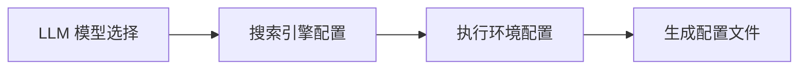
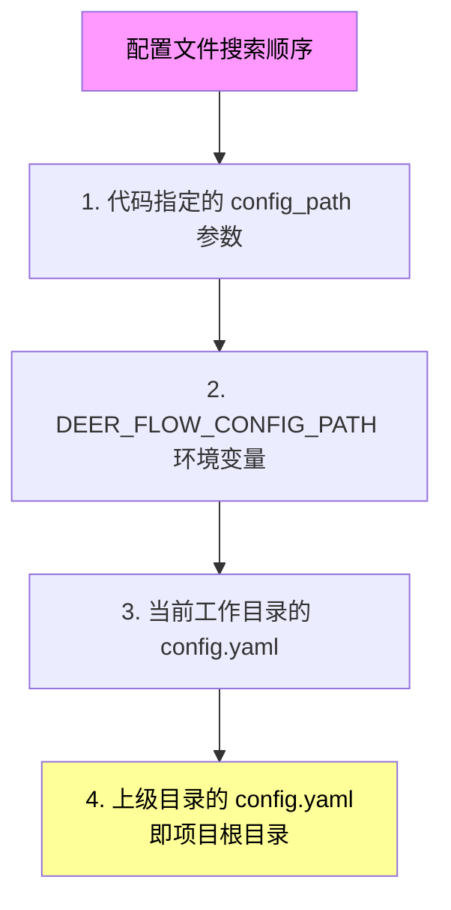
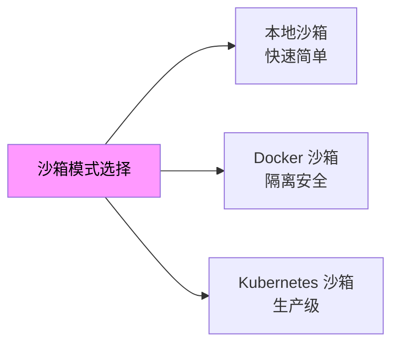
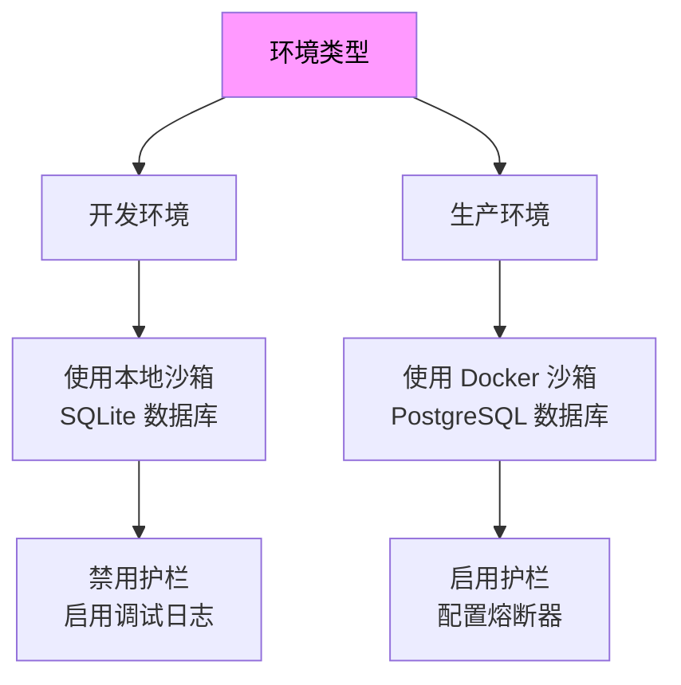

DeerFlow 的配置系统采用 YAML 格式的主配置文件（`config.yaml`）配合环境变量（`.env`）的方式，支持灵活的模型扩展、工具配置、沙箱执行环境和记忆系统等核心功能。本指南将帮助初学者理解 DeerFlow 的配置结构，快速完成环境搭建。

## 快速入门

首次使用 DeerFlow 时，推荐使用交互式配置向导自动生成配置文件。运行以下命令启动向导：

```bash
make setup
```

配置向导会依次引导您完成以下步骤：



向导完成后会自动创建三个关键配置文件：

| 文件 | 说明 |
|------|------|
| `config.yaml` | 主配置文件，包含所有配置项 |
| `.env` | 环境变量文件，存储 API 密钥等敏感信息 |
| `frontend/.env` | 前端环境变量（可选） |

Sources: [scripts/setup_wizard.py](scripts/setup_wizard.py#L21-L59)
Sources: [scripts/configure.py](scripts/configure.py#L20-L54)

## 配置文件位置与优先级

DeerFlow 按以下优先级搜索配置文件：



建议将 `config.yaml` 放置在**项目根目录**（与 `docker-compose.yaml` 同级），这样无论从哪个目录启动服务都能正确加载配置。

Sources: [backend/docs/CONFIGURATION.md](backend/docs/CONFIGURATION.md#L327-L338)

## 配置版本管理

DeerFlow 使用 `config_version` 字段追踪配置 schema 变更。当检测到本地配置版本低于示例配置时，启动时会发出警告：

```
WARNING - Your config.yaml (version 0) is outdated — the latest version is 1.
Run `make config-upgrade` to merge new fields into your config.
```

运行配置升级命令可自动合并新字段，同时保留您的现有配置值，并生成 `.bak` 备份文件：

```bash
make config-upgrade
```

Sources: [backend/docs/CONFIGURATION.md](backend/docs/CONFIGURATION.md#L5-L16)
Sources: [config.example.yaml](config.example.yaml#L13-L15)

## 模型配置

模型配置是 DeerFlow 的核心部分，定义了可供代理使用的 LLM 提供商。

### 基本模型配置

每个模型需要配置以下字段：

| 字段 | 说明 | 示例 |
|------|------|------|
| `name` | 内部标识符 | `gpt-4` |
| `display_name` | 界面显示名称 | `GPT-4` |
| `use` | LangChain 类路径 | `langchain_openai:ChatOpenAI` |
| `model` | API 模型标识 | `gpt-4` |
| `api_key` | API 密钥（支持 `$ENV_VAR` 语法） | `$OPENAI_API_KEY` |
| `max_tokens` | 单次请求最大令牌数 | `4096` |
| `temperature` | 采样温度 | `0.7` |

```yaml
models:
  - name: gpt-4
    display_name: GPT-4
    use: langchain_openai:ChatOpenAI
    model: gpt-4
    api_key: $OPENAI_API_KEY
    max_tokens: 4096
    temperature: 0.7
```

Sources: [backend/docs/CONFIGURATION.md](backend/docs/CONFIGURATION.md#L20-L33)
Sources: [config.example.yaml](config.example.yaml#L59-L69)

### 支持的模型提供商

DeerFlow 支持多种 LLM 提供商：

| 提供商 | LangChain 类 | 特点 |
|--------|-------------|------|
| OpenAI | `langchain_openai:ChatOpenAI` | 标准 API |
| Anthropic Claude | `langchain_anthropic:ChatAnthropic` | 支持 thinking |
| DeepSeek | `deerflow.models.patched_deepseek:PatchedChatDeepSeek` | 支持 thinking |
| Google Gemini | `langchain_google_genai:ChatGoogleGenerativeAI` | 原生 SDK |
| Ollama | `langchain_ollama:ChatOllama` | 本地部署 |
| vLLM | `deerflow.models.vllm_provider:VllmChatModel` | 支持 reasoning |
| Claude Code OAuth | `deerflow.models.claude_provider:ClaudeChatModel` | CLI 认证 |
| Codex CLI | `deerflow.models.openai_codex_provider:CodexChatModel` | CLI 认证 |

Sources: [backend/docs/CONFIGURATION.md](backend/docs/CONFIGURATION.md#L35-L41)
Sources: [config.example.yaml](config.example.yaml#L35-L117)

### 思维模型配置

支持 "thinking" 模式的模型（如 DeepSeek V3、Qwen3）需要额外配置：

```yaml
models:
  - name: deepseek-v3
    display_name: DeepSeek V3 (Thinking)
    use: deerflow.models.patched_deepseek:PatchedChatDeepSeek
    model: deepseek-reasoner
    api_key: $DEEPSEEK_API_KEY
    supports_thinking: true
    when_thinking_enabled:
      extra_body:
        thinking:
          type: enabled
    when_thinking_disabled:
      extra_body:
        thinking:
          type: disabled
```

**关键参数说明**：

- `supports_thinking: true` — 启用 thinking 功能
- `when_thinking_enabled` — thinking 开启时的请求配置
- `when_thinking_disabled` — thinking 关闭时的请求配置

Sources: [backend/docs/CONFIGURATION.md](backend/docs/CONFIGURATION.md#L126-L137)
Sources: [config.example.yaml](config.example.yaml#L171-L189)

### OpenAI 兼容网关配置

通过 `base_url` 参数配置第三方兼容网关：

```yaml
models:
  # Novita AI
  - name: novita-deepseek-v3.2
    display_name: Novita DeepSeek V3.2
    use: langchain_openai:ChatOpenAI
    model: deepseek/deepseek-v3.2
    api_key: $NOVITA_API_KEY
    base_url: https://api.novita.ai/openai

  # OpenRouter
  - name: openrouter-gemini-2.5-flash
    display_name: Gemini 2.5 Flash (OpenRouter)
    use: langchain_openai:ChatOpenAI
    model: google/gemini-2.5-flash-preview
    api_key: $OPENROUTER_API_KEY
    base_url: https://openrouter.ai/api/v1
```

Sources: [backend/docs/CONFIGURATION.md](backend/docs/CONFIGURATION.md#L81-L122)
Sources: [config.example.yaml](config.example.yaml#L212-L234)

## 工具配置

DeerFlow 通过工具组和工具定义实现功能扩展。

### 工具组配置

工具组用于组织和分类工具：

```yaml
tool_groups:
  - name: web          # Web 搜索和浏览
  - name: file:read    # 文件读取操作
  - name: file:write   # 文件写入操作
  - name: bash         # Shell 命令执行
```

Sources: [backend/docs/CONFIGURATION.md](backend/docs/CONFIGURATION.md#L169-L179)
Sources: [config.example.yaml](config.example.yaml#L355-L359)

### 内置工具

| 工具名称 | 功能描述 | 提供商选项 |
|----------|----------|-----------|
| `web_search` | 网络搜索 | DuckDuckGo（无需密钥）、Tavily、Exa、InfoQuest、Firecrawl |
| `web_fetch` | 网页抓取 | Jina AI（默认）、Exa、InfoQuest、Firecrawl |
| `image_search` | 图片搜索 | DuckDuckGo、InfoQuest |
| `ls` | 目录列表 | 内置 |
| `read_file` | 读取文件 | 内置 |
| `glob` | 文件模式匹配 | 内置 |
| `grep` | 文本搜索 | 内置 |
| `write_file` | 写入文件 | 内置 |
| `str_replace` | 字符串替换 | 内置 |
| `bash` | Shell 命令 | 沙箱环境 |

Sources: [backend/docs/CONFIGURATION.md](backend/docs/CONFIGURATION.md#L181-L202)
Sources: [config.example.yaml](config.example.yaml#L366-L482)

### 工具配置示例

```yaml
tools:
  # Web 搜索（默认使用 DuckDuckGo）
  - name: web_search
    group: web
    use: deerflow.community.ddg_search.tools:web_search_tool
    max_results: 5

  # Web 搜索（使用 Tavily，需要 API 密钥）
  - name: web_search
    group: web
    use: deerflow.community.tavily.tools:web_search_tool
    max_results: 5
    api_key: $TAVILY_API_KEY

  # 网页抓取（使用 Jina AI）
  - name: web_fetch
    group: web
    use: deerflow.community.jina_ai.tools:web_fetch_tool
    timeout: 10

  # 文件操作工具
  - name: read_file
    group: file:read
    use: deerflow.sandbox.tools:read_file_tool
```

Sources: [config.example.yaml](config.example.yaml#L366-L458)

## 沙箱配置

DeerFlow 支持三种沙箱执行模式，适用于不同的安全需求场景：



### 本地沙箱（默认）

在主机上直接执行命令，适合完全信任的单用户场景：

```yaml
sandbox:
  use: deerflow.sandbox.local:LocalSandboxProvider
  allow_host_bash: false  # 默认禁用主机 Bash
```

**安全提示**：`allow_host_bash` 默认关闭，因为本地沙箱不是安全的 shell 隔离边界。仅在完全信任的单用户工作流中启用。

Sources: [backend/docs/CONFIGURATION.md](backend/docs/CONFIGURATION.md#L203-L243)
Sources: [config.example.yaml](config.example.yaml#L518-L523)

### Docker 沙箱

在隔离的 Docker 容器中执行命令，提供更好的隔离和安全性：

```yaml
sandbox:
  use: deerflow.community.aio_sandbox:AioSandboxProvider
  port: 8080              # 基础端口
  auto_start: true        # 自动启动容器
  container_prefix: deer-flow-sandbox

  # 可选：挂载额外目录
  mounts:
    - host_path: /path/on/host
      container_path: /path/in/container
      read_only: false
```

Sources: [backend/docs/CONFIGURATION.md](backend/docs/CONFIGURATION.md#L245-L260)
Sources: [config.example.yaml](config.example.yaml#L539-L573)

### Kubernetes 沙箱

通过 provisioner 服务在 Kubernetes Pod 中运行沙箱，适合生产环境：

```yaml
sandbox:
  use: deerflow.community.aio_sandbox:AioSandboxProvider
  provisioner_url: http://provisioner:8002
```

详情请参阅 [Kubernetes 沙箱配置](16-kubernetes-sha-xiang-pei-zhi)。

Sources: [backend/docs/CONFIGURATION.md](backend/docs/CONFIGURATION.md#L220-L232)
Sources: [config.example.yaml](config.example.yaml#L582-L587)

## 技能系统配置

技能（Skills）是 DeerFlow 的工作流扩展机制，预定义的技能目录位于 `skills/` 下。

### 基本配置

```yaml
skills:
  # 主机上的技能目录路径（默认：../skills）
  path: ../skills

  # 容器内挂载路径（默认：/mnt/skills）
  container_path: /mnt/skills
```

Sources: [backend/docs/CONFIGURATION.md](backend/docs/CONFIGURATION.md#L264-L275)
Sources: [config.example.yaml](config.example.yaml#L674-L683)

### 可用公共技能

| 技能名称 | 功能描述 |
|----------|----------|
| `academic-paper-review` | 学术论文评审 |
| `bootstrap` | 项目初始化引导 |
| `chart-visualization` | 图表可视化 |
| `code-documentation` | 代码文档生成 |
| `data-analysis` | 数据分析 |
| `deep-research` | 深度研究 |
| `frontend-design` | 前端设计 |
| `github-deep-research` | GitHub 深度研究 |
| `image-generation` | 图片生成 |
| `ppt-generation` | PPT 生成 |
| `skill-creator` | 技能创建助手 |

Sources: [skills/public](skills/public)

## 记忆与摘要系统

### 全局记忆配置

记忆系统存储用户上下文和对话历史，提供个性化响应：

```yaml
memory:
  enabled: true
  storage_path: memory.json          # 相对路径
  debounce_seconds: 30              # 更新防抖延迟
  model_name: null                   # 使用默认模型
  max_facts: 100                     # 最大事实数量
  fact_confidence_threshold: 0.7    # 最低置信度
  injection_enabled: true           # 注入到系统提示
  max_injection_tokens: 2000        # 最大注入令牌数
```

Sources: [config.example.yaml](config.example.yaml#L768-L776)

### 摘要配置

当对话接近令牌限制时自动摘要历史：

```yaml
summarization:
  enabled: true
  model_name: null                   # 使用轻量级模型更经济

  # 触发条件（满足任一即触发）
  trigger:
    - type: tokens                  # 令牌数触发
      value: 15564
    - type: messages                # 消息数触发
      value: 50
    - type: fraction                # 模型上限比例
      value: 0.8

  # 摘要后保留上下文
  keep:
    type: messages
    value: 10                       # 保留最近 10 条消息

  trim_tokens_to_summarize: 15564   # 截断阈值

  # 保留最近加载的技能说明
  preserve_recent_skill_count: 5
  preserve_recent_skill_tokens: 25000
```

Sources: [config.example.yaml](config.example.yaml#L708-L761)

## 数据库配置

DeerFlow 支持三种数据持久化后端：

| 后端 | 适用场景 | 特点 |
|------|----------|------|
| `memory` | 开发/测试 | 无持久化，重启丢失 |
| `sqlite` | 单节点部署 | 文件存储，默认选项 |
| `postgres` | 生产多节点 | 高可用，完整查询能力 |

```yaml
# 默认 SQLite 配置
database:
  backend: sqlite
  sqlite_dir: .deer-flow/data

# PostgreSQL 配置（生产推荐）
database:
  backend: postgres
  postgres_url: $DATABASE_URL
```

Sources: [backend/docs/CONFIGURATION.md](backend/docs/CONFIGURATION.md#L813-L845)
Sources: [config.example.yaml](config.example.yaml#L836-L848)

## 即时通讯频道配置

DeerFlow 支持连接外部消息平台，所有频道使用出站连接（WebSocket 或轮询），无需公网 IP。

```yaml
channels:
  langgraph_url: http://localhost:8001/api
  gateway_url: http://localhost:8001

  # 飞书
  feishu:
    enabled: false
    app_id: $FEISHU_APP_ID
    app_secret: $FEISHU_APP_SECRET

  # Slack
  slack:
    enabled: false
    bot_token: $SLACK_BOT_TOKEN
    app_token: $SLACK_APP_TOKEN

  # Telegram
  telegram:
    enabled: false
    bot_token: $TELEGRAM_BOT_TOKEN

  # 企业微信
  wecom:
    enabled: false
    bot_id: $WECOM_BOT_ID
    bot_secret: $WECOM_BOT_SECRET

  # 钉钉
  dingtalk:
    enabled: false
    client_id: $DINGTALK_CLIENT_ID
    client_secret: $DINGTALK_CLIENT_SECRET
```

Sources: [config.example.yaml](config.example.yaml#L874-L972)

## 安全护栏配置

可选的预执行授权机制，控制工具调用：

```yaml
# 选项 1：内置白名单（无外部依赖）
guardrails:
  enabled: true
  provider:
    use: deerflow.guardrails.builtin:AllowlistProvider
    config:
      denied_tools: ["bash", "write_file"]

# 选项 2：OAP 标准提供商
guardrails:
  enabled: true
  provider:
    use: aport_guardrails.providers.generic:OAPGuardrailProvider
```

Sources: [config.example.yaml](config.example.yaml#L976-L1008)

## 环境变量参考

DeerFlow 支持使用 `$` 前缀引用环境变量。以下是常用环境变量：

| 变量名 | 说明 | 必需 |
|--------|------|------|
| `OPENAI_API_KEY` | OpenAI API 密钥 | 如使用 OpenAI 模型 |
| `ANTHROPIC_API_KEY` | Anthropic API 密钥 | 如使用 Claude 模型 |
| `DEEPSEEK_API_KEY` | DeepSeek API 密钥 | 如使用 DeepSeek 模型 |
| `GEMINI_API_KEY` | Google Gemini API 密钥 | 如使用 Gemini 模型 |
| `TAVILY_API_KEY` | Tavily 搜索 API 密钥 | 如使用 Tavily 搜索 |
| `JINA_API_KEY` | Jina AI API 密钥 | 如使用 Jina 抓取 |
| `DATABASE_URL` | PostgreSQL 连接字符串 | 如使用 PostgreSQL |
| `DEER_FLOW_CONFIG_PATH` | 自定义配置文件路径 | 可选 |
| `GATEWAY_ENABLE_DOCS` | 是否启用 API 文档 | 默认 true |
| `LANGSMITH_*` | LangSmith 追踪配置 | 可选 |

Sources: [.env.example](.env.example)
Sources: [backend/docs/CONFIGURATION.md](backend/docs/CONFIGURATION.md#L309-L325)

## 最佳实践

### 配置文件管理

- **放置在项目根目录**：确保无论从哪个目录启动都能正确加载
- **不提交到版本控制**：`config.yaml` 和 `.env` 已加入 `.gitignore`
- **使用环境变量存储密钥**：避免在配置文件中硬编码敏感信息

### 开发与生产环境



### 性能优化

| 配置项 | 推荐值 | 说明 |
|--------|--------|------|
| `subagents.timeout_seconds` | 900-1800 | 根据任务复杂度调整 |
| `summarization.trigger.tokens` | 15564 | 避免超出模型上下文 |
| `memory.max_facts` | 100 | 平衡记忆与上下文 |
| `sandbox.replicas` | 3 | 并发沙箱数量上限 |

Sources: [config.example.yaml](config.example.yaml#L556-L558)

## 故障排查

### 配置文件未找到

```
Config file not found
```

**解决方案**：

1. 确认 `config.yaml` 存在于项目根目录
2. 或设置环境变量：`export DEER_FLOW_CONFIG_PATH=/path/to/config.yaml`

### API 密钥无效

```
Invalid API key
```

**解决方案**：

1. 确认环境变量已正确设置
2. 检查配置文件中使用 `$` 前缀引用环境变量
3. 验证 API 密钥有效且未过期

### 技能加载失败

```
Skills not loading
```

**解决方案**：

1. 确认 `skills/` 目录存在且包含有效 `SKILL.md` 文件
2. 检查 `skills.path` 配置是否正确
3. Docker 部署时确认技能目录已挂载

### Docker 沙箱启动失败

```
Docker sandbox fails to start
```

**解决方案**：

1. 确认 Docker 守护进程正在运行
2. 检查端口 8080 是否被占用
3. 验证 Docker 镜像可访问

Sources: [backend/docs/CONFIGURATION.md](backend/docs/CONFIGURATION.md#L349-L369)

## 下一步

完成配置后，您可以：

1. [运行诊断工具](3-pei-zhi-zhi-nan) — 使用 `make doctor` 验证配置
2. [启动开发服务器](2-huan-jing-an-zhuang) — 使用 `make dev` 开始使用
3. [了解系统架构](4-zheng-ti-jia-gou) — 深入理解 DeerFlow 工作原理