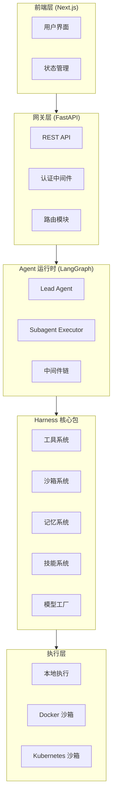
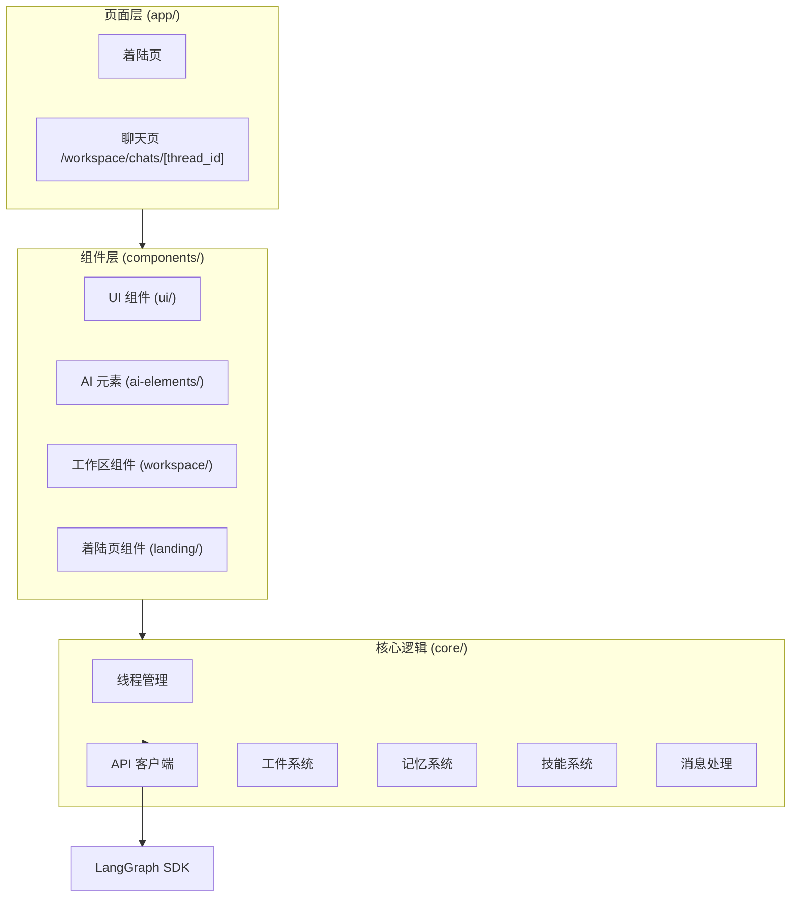

DeerFlow 是一个基于 LangGraph 构建的 AI Agent 系统，通过协调子代理、记忆系统和沙箱执行环境来完成复杂任务。本页详细描述系统的整体架构设计、各核心组件的职责以及它们之间的交互关系。

## 系统概览

DeerFlow 采用分层架构设计，将智能编排层、运行时管理层和应用接口层分离。这种设计使得系统具备良好的可扩展性和可维护性，同时支持多种接入方式（Web UI、即时通讯平台）。



前端采用 Next.js 构建，通过 LangGraph SDK 与后端网关通信。后端网关（FastAPI）负责认证、路由和会话管理，而 LangGraph Agent Runtime 则执行核心的 AI 推理逻辑。Harness 包作为可发布的核心框架，包含了工具、沙箱、记忆和技能等子系统。

Sources: [CLAUDE.md](CLAUDE.md#L1-L50)
Sources: [frontend/CLAUDE.md](frontend/CLAUDE.md#L1-L30)

## 后端架构

后端采用 **Harness / App 双层架构**，这种设计将可发布的 Agent 框架与特定应用代码分离，确保框架可以独立演进。

```mermaid
graph LR
    subgraph App["App 层 (app/*)"]
        Gateway["Gateway API"]
        Channels["IM 渠道集成"]
    end
    
    subgraph Harness["Harness 层 (deerflow/*)"]
        Agents["Agent 系统"]
        Tools["工具系统"]
        Sandbox["沙箱系统"]
        Memory["记忆系统"]
        Skills["技能系统"]
        Models["模型工厂"]
        MCP["MCP 集成"]
    end
    
    App --> Harness
    App : 导入 deerflow.*
    Harness : 不导入 app.*
```

**App 层** (`app/`) 包含未发布的应用代码，导入前缀为 `app.*`。它负责提供 FastAPI 网关 API 和即时通讯渠道集成（飞书、Slack、Telegram、钉钉等）。**Harness 层** (`packages/harness/deerflow/`) 是一个可发布为 `deerflow-harness` 的 Agent 框架包，导入前缀为 `deerflow.*`，包含构建和运行 Agent 所需的全部组件。

依赖规则明确：**App 允许导入 Harness，但 Harness 禁止导入 App**。这一边界由 `tests/test_harness_boundary.py` 测试强制执行，确保框架的独立性和可测试性。

Sources: [backend/CLAUDE.md](backend/CLAUDE.md#L20-L60)

### 网关 API 结构

网关 API 通过 FastAPI 实现，运行在端口 8001，提供 REST 接口和 LangGraph 兼容的运行时。

| 路由模块 | 职责 |
|---------|------|
| `threads` | 线程 CRUD 操作 |
| `runs` | 运行管理（创建、状态查询） |
| `thread_runs` | 线程级别的运行操作 |
| `artifacts` | 工件（文件/代码）管理 |
| `uploads` | 文件上传处理 |
| `memory` | 记忆系统读写 |
| `skills` | 技能加载与管理 |
| `mcp` | MCP 服务器集成 |
| `models` | 模型配置查询 |
| `agents` | Agent 配置管理 |
| `auth` | 认证与授权 |
| `channels` | IM 渠道管理 |
| `suggestions` | 建议生成 |
| `feedback` | 反馈收集 |

Sources: [backend/app/gateway/app.py](backend/app/gateway/app.py#L20-L35)

### LangGraph 运行时

LangGraph 运行时嵌入在网关中，核心入口点通过 `langgraph.json` 注册：

```json
{
  "graphs": {
    "lead_agent": "deerflow.agents:make_lead_agent"
  },
  "checkpointer": {
    "path": "./packages/harness/deerflow/runtime/checkpointer/async_provider.py:make_checkpointer"
  }
}
```

运行时组件包括：`RunManager` 负责运行生命周期管理，`StreamBridge` 处理流式响应，`checkpointer` 提供状态持久化，`store` 管理 LangGraph 存储。Nginx 在端口 2026 暴露统一入口点，将 `/api/langgraph/*` 请求反向代理到网关原生路由。

Sources: [backend/langgraph.json](backend/langgraph.json#L1-L18)

## Lead Agent 架构

Lead Agent 是整个系统的主控代理，负责协调所有子系统和资源完成用户任务。它通过工厂函数 `make_lead_agent()` 创建，集成模型、工具和中间件链。

```mermaid
flowchart LR
    UserInput["用户输入"]
    
    subgraph MiddlewareChain["中间件链 (18 个组件)"]
        TD["ThreadData"]
        UP["Uploads"]
        SB["Sandbox"]
        DG["DanglingToolCall"]
        LLM["LLMErrorHandling"]
        GR["Guardrail"]
        SA["SandboxAudit"]
        TE["ToolErrorHandling"]
        SM["Summarization"]
        TD2["TodoList"]
        TU["TokenUsage"]
        TI["Title"]
        ME["Memory"]
        VI["ViewImage"]
        DF["DeferredToolFilter"]
        SL["SubagentLimit"]
        LD["LoopDetection"]
        CL["Clarification"]
    end
    
    Model["LLM 模型"]
    Tools["工具系统"]
    
    UserInput --> MiddlewareChain
    MiddlewareChain --> Model
    Model --> Tools
    Tools --> MiddlewareChain
```



### 中间件链详解

Lead Agent 的中间件链由 18 个组件组成，严格按顺序执行以确保请求处理的正确性。以下是各中间件的核心功能：

| 序号 | 中间件 | 核心功能 |
|------|--------|----------|
| 1 | `ThreadDataMiddleware` | 创建线程目录结构，解析 `user_id` 隔离用户数据 |
| 2 | `UploadsMiddleware` | 跟踪并注入新上传的文件 |
| 3 | `SandboxMiddleware` | 获取沙箱实例，将 `sandbox_id` 存入状态 |
| 4 | `DanglingToolCallMiddleware` | 注入缺失的 ToolMessages（如用户中断场景） |
| 5 | `LLMErrorHandlingMiddleware` | 规范化 Provider/模型调用失败为可恢复错误 |
| 6 | `GuardrailMiddleware` | 工具调用前授权检查（可选，需配置） |
| 7 | `SandboxAuditMiddleware` | 审计沙箱操作安全日志 |
| 8 | `ToolErrorHandlingMiddleware` | 将工具异常转换为错误 ToolMessage |
| 9 | `SummarizationMiddleware` | 上下文缩减（接近 Token 限制时，可选） |
| 10 | `TodoListMiddleware` | 任务追踪工具（Plan 模式启用，可选） |
| 11 | `TokenUsageMiddleware` | 记录 Token 使用指标（启用时） |
| 12 | `TitleMiddleware` | 首轮对话后自动生成标题 |
| 13 | `MemoryMiddleware` | 异步排队对话用于记忆更新 |
| 14 | `ViewImageMiddleware` | 注入 base64 图片数据（视觉模型支持时） |
| 15 | `DeferredToolFilterMiddleware` | 隐藏延迟工具架构（工具搜索启用时） |
| 16 | `SubagentLimitMiddleware` | 截断超额并行任务调用 |
| 17 | `LoopDetectionMiddleware` | 检测并打断重复工具调用循环 |
| 18 | `ClarificationMiddleware` | 拦截澄清请求（必须最后执行） |

中间件的组装顺序经过精心设计：`ThreadDataMiddleware` 必须在 `SandboxMiddleware` 之前以确保 `thread_id` 可用；`DanglingToolCallMiddleware` 在模型看到历史之前修补缺失的 ToolMessages；`SummarizationMiddleware` 尽早缩减上下文；`TodoListMiddleware` 在 `ClarificationMiddleware` 之前允许任务管理；`ClarificationMiddleware` 必须最后执行以拦截澄清请求。

Sources: [backend/packages/harness/deerflow/agents/lead_agent/agent.py](backend/packages/harness/deerflow/agents/lead_agent/agent.py#L1-L50)
Sources: [backend/packages/harness/deerflow/agents/middlewares/tool_error_handling_middleware.py](backend/packages/harness/deerflow/agents/middlewares/tool_error_handling_middleware.py#L50-L90)

### ThreadState 数据结构

`ThreadState` 扩展了 LangChain 的 `AgentState`，定义了 Agent 运行时的状态结构：

```python
class ThreadState(AgentState):
    sandbox: NotRequired[SandboxState | None]
    thread_data: NotRequired[ThreadDataState | None]
    title: NotRequired[str | None]
    artifacts: Annotated[list[str], merge_artifacts]  # 去重合并
    todos: NotRequired[list | None]
    uploaded_files: NotRequired[list[dict] | None]
    viewed_images: Annotated[dict[str, ViewedImageData], merge_viewed_images]  # image_path -> {base64, mime_type}
```

关键字段包括：`artifacts` 使用自定义 reducer `merge_artifacts` 实现去重合并；`viewed_images` 支持特殊逻辑（空字典 `{}` 表示清除所有图片）；`thread_data` 存储工作区、上传和输出路径；`sandbox` 存储沙箱 ID。

Sources: [backend/packages/harness/deerflow/agents/thread_state.py](backend/packages/harness/deerflow/agents/thread_state.py#L1-L56)

## 沙箱系统

沙箱系统为每个线程提供隔离的执行环境，支持三种运行模式：

| 模式 | 描述 | 适用场景 |
|------|------|----------|
| `local` | 本地文件系统执行 | 开发调试 |
| `docker` | Docker 容器隔离 | 单机部署 |
| `kubernetes` | K8s 集群隔离 | 生产环境 |

虚拟路径结构：`/mnt/user-data/{workspace,uploads,outputs}` 提供统一的工作目录映射，无论底层是本地目录还是容器挂载。

沙箱工具包括：bash（Shell 命令执行）、ls（目录列表）、read_file（文件读取）、write_file（文件写入）、str_replace（代码修改）。这些工具通过沙箱中间件注入和管理。

Sources: [CLAUDE.md](CLAUDE.md#L60-L80)

## 子代理系统

子代理系统允许将复杂任务委托给后台 Agent 执行，实现任务分解和并行处理。

- **最大并发数**：3 个并行子代理
- **超时时间**：15 分钟
- **通信方式**：通过 SSE 事件流返回结果

子代理通过 `task` 工具调用创建，支持 `general-purpose` 和 `bash` 两种内置类型。执行器 `SubagentExecutor` 负责后台运行，Registry 管理可用子代理配置。

Sources: [backend/CLAUDE.md](backend/CLAUDE.md#L35-L50)

## 记忆系统

持久化记忆系统跨会话存储用户上下文、事实和历史，支持多用户隔离。

数据存储位置：`backend/.deer-flow/users/{user_id}/memory.json`

记忆更新通过 `MemoryMiddleware` 异步队列触发，记忆内容通过专门的 Prompt 模板注入到 Agent 的系统提示中。系统支持记忆过滤，只保留用户和最终 AI 响应。

Sources: [CLAUDE.md](CLAUDE.md#L50-L60)

## 技能系统

技能系统基于 Markdown + YAML frontmatter 的结构化能力模块，位于 `skills/{public,custom}/` 目录。

技能按需加载，支持自定义安装。内置技能包括：bootstrap（引导创建）、find-skills（技能搜索）、code-documentation（代码文档）等。技能加载器 `SkillsLoader` 解析 YAML 元数据并动态注入工具定义。

Sources: [CLAUDE.md](CLAUDE.md#L55-L65)

## 前端架构

前端基于 Next.js 16 App Router 构建，使用 TypeScript、React 19、Tailwind CSS 4 和 Shadcn UI。



数据流：用户输入 → 线程钩子 (`core/threads/hooks.ts`) → LangGraph SDK 流式调用 → 流事件更新线程状态（消息、工件、待办）→ 组件订阅并渲染更新。

Sources: [frontend/CLAUDE.md](frontend/CLAUDE.md#L20-L60)

## 部署架构

DeerFlow 支持多种部署模式，从开发到生产环境。

| 组件 | 端口 | 用途 |
|------|------|------|
| Nginx | 2026 | 统一入口，反向代理 |
| Gateway API | 8001 | REST API + LangGraph 运行时 |
| Frontend | 3000 | Next.js 开发服务器 |
| LangGraph Studio | 2024 | Agent 可视化（可选） |
| Provisioner | 8002 | K8s 沙箱配置（可选） |

`make dev` 命令启动完整开发环境（Gateway + Frontend + Nginx），使用 `config.yaml` 进行配置预检。生产环境通过 Docker Compose 或 Kubernetes 部署。

Sources: [CLAUDE.md](CLAUDE.md#L90-L126)

## 配置系统

主配置文件 `config.yaml` 采用 YAML 格式，支持环境变量解析（`$VAR_NAME`）。

配置优先级：显式 `config_path` 参数 > `DEER_FLOW_CONFIG_PATH` 环境变量 > `config.yaml`（当前目录）> `config.yaml`（项目根目录，推荐）。

配置版本通过 `config_version` 字段管理，启动时比较用户版本与示例版本，版本过时会发出警告。运行 `make config-upgrade` 可自动合并新增字段。

扩展配置 `extensions_config.json` 统一管理 MCP 服务器和技能状态。

Sources: [config.example.yaml](config.example.yaml#L1-L30)

## 后续阅读

建议继续阅读以下页面深入了解系统细节：

- [Lead Agent 主代理](5-lead-agent-zhu-dai-li) — 深入了解 Lead Agent 的创建过程和系统提示
- [中间件链](6-zhong-jian-jian-lian) — 中间件的设计原理和扩展方式
- [沙箱系统](7-sha-xiang-xi-tong) — 沙箱的隔离机制和工具配置
- [快速开始](2-huan-jing-an-zhang) — 快速搭建开发环境