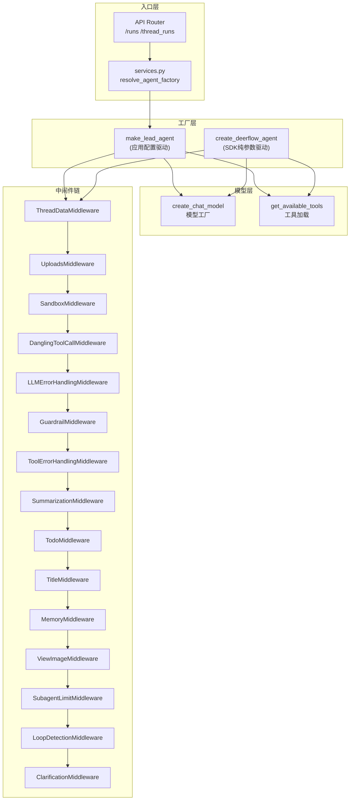
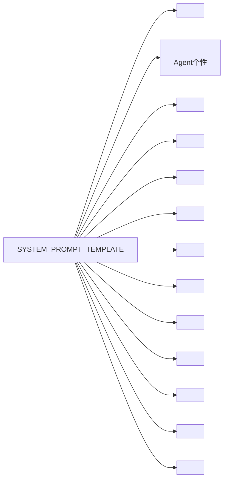

Lead Agent（主代理）是 DeerFlow 系统中的核心智能体，承担用户对话的入口角色，负责理解用户意图、编排任务执行流程、管理子代理协作，并与系统中间件链深度集成以实现自动摘要、标题生成、记忆管理、循环检测等高级功能。

Sources: [agent.py](backend/packages/harness/deerflow/agents/lead_agent/agent.py#L1-L411)

## 架构概览

DeerFlow 采用双层代理工厂模式：应用层使用 `make_lead_agent` 基于全局配置构建 Lead Agent，而 SDK 层提供 `create_deerflow_agent` 用于纯 Python 参数实例化。两种模式共享相同的中间件链核心逻辑。



Sources: [agent.py](backend/packages/harness/deerflow/agents/lead_agent/agent.py#L244-L314), [services.py](backend/app/gateway/services.py#L101-L112), [factory.py](backend/packages/harness/deerflow/agents/factory.py#L61-L147)

## 核心入口：`make_lead_agent`

`make_lead_agent` 是应用层主代理工厂函数，从 `RunnableConfig` 中读取运行时参数，解析模型、工具、技能和中间件配置：

```python
def make_lead_agent(config: RunnableConfig, app_config: AppConfig | None = None):
    cfg = _get_runtime_config(config)
    resolved_app_config = app_config or get_app_config()

    # 从配置中解析运行时参数
    thinking_enabled = cfg.get("thinking_enabled", True)
    reasoning_effort = cfg.get("reasoning_effort", None)
    requested_model_name: str | None = cfg.get("model_name") or cfg.get("model")
    is_plan_mode = cfg.get("is_plan_mode", False)
    subagent_enabled = cfg.get("subagent_enabled", False)
    max_concurrent_subagents = cfg.get("max_concurrent_subagents", 3)
    agent_name = validate_agent_name(cfg.get("agent_name"))

    # 模型解析：请求 → Agent配置 → 全局默认
    model_name = _resolve_model_name(requested_model_name or agent_model_name, app_config=resolved_app_config)

    return create_agent(
        model=create_chat_model(name=model_name, thinking_enabled=thinking_enabled, ...),
        tools=get_available_tools(model_name=model_name, ...),
        middleware=_build_middlewares(config, model_name=model_name, ...),
        system_prompt=apply_prompt_template(...),
        state_schema=ThreadState,
    )
```

关键配置解析逻辑：

| 参数 | 来源 | 默认值 | 说明 |
|------|------|--------|------|
| `model_name` | `configurable.model_name` 或 `configurable.model` | 全局第一个模型 | 请求的模型名称 |
| `agent_name` | `configurable.agent_name` | `None` | 自定义代理名称 |
| `thinking_enabled` | `configurable.thinking_enabled` | `True` | 是否启用推理模式 |
| `is_plan_mode` | `configurable.is_plan_mode` | `False` | 是否启用 TodoList 任务管理 |
| `subagent_enabled` | `configurable.subagent_enabled` | `False` | 是否启用子代理并行执行 |
| `max_concurrent_subagents` | `configurable.max_concurrent_subagents` | `3` | 每轮最大子代理调用数 |

Sources: [agent.py](backend/packages/harness/deerflow/agents/lead_agent/agent.py#L317-L410)

## 模型解析机制

模型名称采用三级解析策略，确保系统在任意配置状态下都能找到有效模型：

```python
def _resolve_model_name(requested_model_name: str | None = None, *, app_config: AppConfig | None = None) -> str:
    app_config = app_config or get_app_config()
    default_model_name = app_config.models[0].name if app_config.models else None
    
    if requested_model_name and app_config.get_model_config(requested_model_name):
        return requested_model_name  # 命中配置

    if requested_model_name and requested_model_name != default_model_name:
        logger.warning(f"Model '{requested_model_name}' not found; fallback to '{default_model_name}'")
    return default_model_name  # 回退到默认
```

对于不支持 thinking 的模型，系统会自动降级：

```python
if thinking_enabled and not model_config.supports_thinking:
    logger.warning(f"Thinking mode not supported by '{model_name}'; fallback to non-thinking.")
    thinking_enabled = False
```

Sources: [agent.py](backend/packages/harness/deerflow/agents/lead_agent/agent.py#L38-L50)

## 系统提示词模板

`apply_prompt_template` 动态组装完整的系统提示词，包含角色定义、技能系统、子代理编排、工作目录等核心区块：



关键配置点：

- **技能系统**：通过 `get_skills_prompt_section` 动态加载已启用的技能列表，支持技能自进化（Skill Self-Evolution）
- **记忆上下文**：`_get_memory_context` 从记忆系统读取历史交互信息注入提示词
- **子代理编排**：当 `subagent_enabled=True` 时注入 `<subagent_system>` 块，说明分解-委托-综合模式
- **ACP代理**：`_build_acp_section` 在配置 ACP 代理时添加工作空间说明

Sources: [prompt.py](backend/packages/harness/deerflow/agents/lead_agent/prompt.py#L341-L530), [prompt.py](backend/packages/harness/deerflow/agents/lead_agent/prompt.py#L533-L564)

## 中间件链设计

中间件链采用**严格顺序设计**，每个位置都有明确的功能职责：

| 顺序 | 中间件 | 功能职责 |
|------|--------|----------|
| 0-2 | ThreadDataMiddleware → UploadsMiddleware → SandboxMiddleware | 沙箱基础设施初始化 |
| 3 | DanglingToolCallMiddleware | 修补缺失的 ToolMessage |
| 4 | GuardrailMiddleware | 内容安全过滤 |
| 5 | LLMErrorHandlingMiddleware | LLM 调用错误处理 |
| 6 | ToolErrorHandlingMiddleware | 工具执行错误处理 |
| 7 | SummarizationMiddleware | 消息历史摘要压缩 |
| 8 | TodoMiddleware | 任务列表管理（plan_mode） |
| 9 | TitleMiddleware | 自动生成对话标题 |
| 10 | MemoryMiddleware | 对话记忆异步更新 |
| 11 | ViewImageMiddleware | 图片查看支持 |
| 12 | DeferredToolFilterMiddleware | 延迟加载工具过滤 |
| 13 | SubagentLimitMiddleware | 子代理并发限制 |
| 14 | LoopDetectionMiddleware | 循环调用检测 |
| 15 | ClarificationMiddleware | **始终置于最后**，拦截澄清请求 |

**ClarificationMiddleware** 拦截 `ask_clarification` 工具调用，执行时中断流程并返回 `Command(goto=END)`，等待用户响应后继续：

```python
def _handle_clarification(self, request: ToolCallRequest) -> Command:
    formatted_message = self._format_clarification_message(args)
    tool_message = ToolMessage(id=..., content=formatted_message, ...)
    return Command(update={"messages": [tool_message]}, goto=END)
```

Sources: [agent.py](backend/packages/harness/deerflow/agents/lead_agent/agent.py#L234-L243), [tool_error_handling_middleware.py](backend/packages/harness/deerflow/agents/middlewares/tool_error_handling_middleware.py#L70-L126), [clarification_middleware.py](backend/packages/harness/deerflow/agents/middlewares/clarification_middleware.py#L117-L156)

## 状态架构

Lead Agent 使用 `ThreadState` 作为状态架构，扩展 LangChain 的 `AgentState`：

```python
class ThreadState(AgentState):
    sandbox: NotRequired[SandboxState | None]           # 沙箱信息
    thread_data: NotRequired[ThreadDataState | None]  # 工作目录信息
    title: NotRequired[str | None]                    # 对话标题
    artifacts: Annotated[list[str], merge_artifacts]  # 工件列表（自动去重合并）
    todos: NotRequired[list | None]                   # 任务列表
    uploaded_files: NotRequired[list[dict] | None]    # 上传文件元数据
    viewed_images: Annotated[dict[str, ViewedImageData], merge_viewed_images]  # 查看过的图片
```

Sources: [thread_state.py](backend/packages/harness/deerflow/agents/thread_state.py#L48-L56)

## 自定义代理支持

DeerFlow 支持通过 `agents/<name>/` 目录创建自定义代理实例：

```
agents/
├── my-agent/
│   ├── config.yaml    # name, description, model, tool_groups, skills
│   └── SOUL.md        # 代理个性定义
└── another-agent/
    └── ...
```

`AgentConfig` 模型定义：

| 字段 | 类型 | 说明 |
|------|------|------|
| `name` | `str` | 代理名称（hyphen-case） |
| `description` | `str` | 描述信息 |
| `model` | `str \| None` | 模型覆盖 |
| `tool_groups` | `list[str] \| None` | 工具组白名单 |
| `skills` | `list[str] \| None` | 技能白名单（`None`=全部, `[]`=无） |

运行时通过 `configurable.agent_name` 注入，Lead Agent 自动加载对应的 SOUL.md 和配置：

```python
agent_config = load_agent_config(agent_name) if not is_bootstrap else None
system_prompt=apply_prompt_template(
    agent_name=agent_name,
    available_skills=set(agent_config.skills) if agent_config and agent_config.skills is not None else None,
    ...
)
```

Sources: [agents_config.py](backend/packages/harness/deerflow/config/agents_config.py#L29-L84), [agents.py](backend/app/gateway/routers/agents.py#L183-L245)

## SDK 层工厂：`create_deerflow_agent`

`create_deerflow_agent` 提供配置无关的纯 Python API，支持两种使用模式：

```python
# 模式1：声明式特性标志
from deerflow.agents.factory import create_deerflow_agent
from deerflow.agents.features import RuntimeFeatures

feat = RuntimeFeatures(sandbox=True, memory=True, auto_title=True)
agent = create_deerflow_agent(model, features=feat)

# 模式2：中间件全权接管
agent = create_deerflow_agent(model, middleware=[custom_mw1, custom_mw2])

# 模式3：额外中间件注入（支持@Next/@Prev定位）
from deerflow.agents.features import Next, Prev
@Next(ClarificationMiddleware)
class MyMiddleware(AgentMiddleware):
    ...
agent = create_deerflow_agent(model, extra_middleware=[MyMiddleware()])
```

`RuntimeFeatures` 声明式特性支持：

| 特性 | 启用值 | 说明 |
|------|--------|------|
| `sandbox` | `True` / `False` / `AgentMiddleware` | 沙箱执行环境 |
| `memory` | `True` / `False` / `AgentMiddleware` | 记忆管理 |
| `subagent` | `True` / `False` / `AgentMiddleware` | 子代理并行执行 |
| `vision` | `True` / `False` / `AgentMiddleware` | 图片查看 |
| `auto_title` | `True` / `False` / `AgentMiddleware` | 自动标题生成 |
| `summarization` | `AgentMiddleware实例` | 消息摘要 |
| `guardrail` | `AgentMiddleware实例` | 内容安全 |

Sources: [factory.py](backend/packages/harness/deerflow/agents/factory.py#L61-L147), [features.py](backend/packages/harness/deerflow/agents/features.py#L14-L34)

## 关键中间件详解

### LoopDetectionMiddleware

循环检测中间件采用双层检测策略：

1. **哈希检测**：对工具调用集合（名称+参数）进行 MD5 哈希，在滑动窗口内追踪
2. **频率检测**：对同一工具类型的累计调用次数进行追踪

```python
class LoopDetectionMiddleware:
    def __init__(self, warn_threshold=3, hard_limit=5, 
                 tool_freq_warn=30, tool_freq_hard_limit=50):
        ...
```

行为阈值：

| 阈值类型 | 默认值 | 触发动作 |
|----------|--------|----------|
| 警告阈值 | 3次相同调用 | 注入警告消息 |
| 硬性限制 | 5次相同调用 | 剥离所有 tool_calls，强制输出文本 |
| 工具频率警告 | 30次同类工具 | 注入频率警告消息 |
| 工具频率限制 | 50次同类工具 | 强制停止 |

Sources: [loop_detection_middleware.py](backend/packages/harness/deerflow/agents/middlewares/loop_detection_middleware.py#L140-L182)

### MemoryMiddleware

记忆中间件在每次 Agent 执行后异步更新记忆：

```python
class MemoryMiddleware(AgentMiddleware[MemoryMiddlewareState]):
    @override
    def after_agent(self, state: MemoryMiddlewareState, runtime: Runtime) -> dict | None:
        # 1. 过滤消息：仅保留用户输入和最终助手响应
        filtered_messages = filter_messages_for_memory(messages)
        
        # 2. 检测修正信号（correction）和强化信号（reinforcement）
        correction_detected = detect_correction(filtered_messages)
        
        # 3. 异步入队，debouncing 批量更新
        queue.add(thread_id=thread_id, messages=filtered_messages, ...)
```

支持按代理隔离记忆存储（通过 `agent_name` 参数）。

Sources: [memory_middleware.py](backend/packages/harness/deerflow/agents/middlewares/memory_middleware.py#L46-L100)

## 运行时配置注入

LangGraph >= 0.6.0 引入了 `context` 作为首选运行时数据传递方式。系统自动适配：

```python
def build_run_config(thread_id: str, request_config: dict, ..., assistant_id: str | None = None):
    config: dict[str, Any] = {"recursion_limit": 100}
    
    if "context" in request_config:
        # LangGraph >= 0.6.0 路径
        config["context"] = dict(request_config["context"])
    else:
        # 旧版本路径
        config["configurable"] = {"thread_id": thread_id}
        config["configurable"].update(request_config.get("configurable", {}))
    
    # 自定义代理注入
    if assistant_id and assistant_id != "lead_agent":
        target = config.get("context") or config.get("configurable") or {}
        target["agent_name"] = normalized  # 注入代理名
```

Sources: [services.py](backend/app/gateway/services.py#L115-L183)

## 元数据追踪

每次 Agent 创建时注入运行元数据，用于 LangSmith 追踪：

```python
config["metadata"].update({
    "agent_name": agent_name or "default",
    "model_name": model_name or "default",
    "thinking_enabled": thinking_enabled,
    "reasoning_effort": reasoning_effort,
    "is_plan_mode": is_plan_mode,
    "subagent_enabled": subagent_enabled,
    "tool_groups": agent_config.tool_groups if agent_config else None,
    "available_skills": agent_config.skills if agent_config else None,
})
```