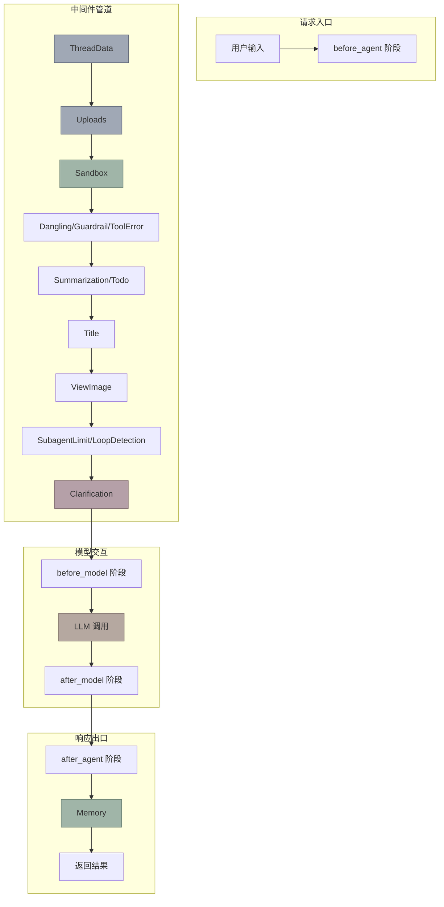
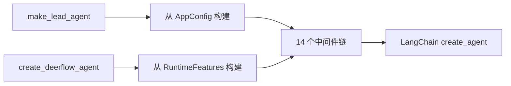

中间件链是 DeerFlow 代理架构的核心编排机制，通过 LangChain 的 `create_agent` 原语将 14 个中间件有机组合，形成从请求预处理到响应后处理的完整管道。这些中间件分别负责沙箱管理、上下文压缩、循环检测、图像处理等横切关注点，使核心代理逻辑保持简洁。

## 架构概览

DeerFlow 的中间件系统构建在 LangChain 的 `AgentMiddleware` 抽象之上，每个中间件可以实现以下钩子方法：`before_agent`（代理执行前）、`before_model`（模型调用前）、`after_model`（模型调用后）、`after_agent`（代理执行后）、`wrap_tool_call`（工具调用包装）、`wrap_model_call`（模型调用包装）。



## 中间件清单

完整的主代理中间件链包含 14 个组件，按其激活阶段分类如下：

| # | 中间件 | 激活钩子 | 功能描述 | 来源 |
|---|--------|---------|---------|------|
| 0 | ThreadDataMiddleware | before_agent | 创建线程数据目录（workspace/uploads/outputs） | sandbox |
| 1 | UploadsMiddleware | before_agent | 扫描并注册用户上传文件 | sandbox |
| 2 | SandboxMiddleware | before_agent + after_agent | 获取/释放沙箱环境 | sandbox |
| 3 | DanglingToolCallMiddleware | wrap_model_call | 修复中断的 tool call 悬空问题 | 始终开启 |
| 4 | GuardrailMiddleware | wrap_tool_call + after_agent | 内容安全护栏检查 | guardrail 配置 |
| 5 | ToolErrorHandlingMiddleware | wrap_tool_call | 工具异常转换为错误消息 | 始终开启 |
| 6 | SummarizationMiddleware | before_model | 上下文压缩以控制 token 消耗 | summarization 配置 |
| 7 | TodoMiddleware | after_model | 复杂任务的待办事项管理 | plan_mode 参数 |
| 8 | TitleMiddleware | after_model | 自动生成会话标题 | auto_title 配置 |
| 9 | MemoryMiddleware | after_agent | 对话记忆入队异步更新 | memory 配置 |
| 10 | ViewImageMiddleware | before_model | 将查看的图片注入为 LLM 可读消息 | vision 配置 |
| 11 | SubagentLimitMiddleware | after_model | 截断超额并行 task 工具调用 | subagent 配置 |
| 12 | LoopDetectionMiddleware | after_model | 检测并打破重复工具调用循环 | 始终开启 |
| 13 | ClarificationMiddleware | wrap_tool_call + after_model | 拦截澄清请求并中断执行 | 始终开启 |

Sources: [middleware-execution-flow.md](backend/docs/middleware-execution-flow.md#L1-L50)
Sources: [factory.py](backend/packages/harness/deerflow/agents/factory.py#L147-L270)

## 执行时序

LangChain `create_agent` 定义了明确的执行顺序规则：`before_*` 钩子按列表正序执行（0 → N），`after_*` 钩子按列表反序执行（N → 0）。这一设计意味着列表末尾的中间件，其 `after_model` 会最先执行。

```mermaid
sequenceDiagram
    participant User
    participant TD as ThreadDataMiddleware
    participant UL as UploadsMiddleware
    participant SB as SandboxMiddleware
    participant VI as ViewImageMiddleware
    participant MODEL
    participant CL as ClarificationMiddleware
    participant LD as LoopDetectionMiddleware
    participant MEM as MemoryMiddleware

    User->>TD: invoke
    activate TD
    Note right of TD: before_agent 创建目录

    TD->>UL: before_agent
    activate UL
    Note right of UL: before_agent 扫描上传文件

    UL->>SB: before_agent
    activate SB
    Note right of SB: before_agent 获取沙箱

    SB->>VI: before_model
    activate VI
    Note right of VI: before_model 注入图片数据

    VI->>MODEL: messages + tools
    activate MODEL
    MODEL-->>CL: AI response
    deactivate MODEL

    activate CL
    Note right of CL: after_model 拦截 ask_clarification
    CL-->>LD: after_model
    deactivate CL

    activate LD
    Note right of LD: after_model 检测循环
    LD-->>SB: done
    deactivate LD

    Note right of SB: after_agent 释放沙箱
    SB-->>MEM: after_agent
    deactivate SB

    MEM-->>User: response
    deactivate MEM
```

这种执行顺序有重要的设计含义：ClarificationMiddleware 位于列表末尾，因此它的 `after_model` 在反序执行时最先被调用，能够第一时间拦截模型输出的澄清请求并通过 `Command(goto=END)` 中断后续流程。

Sources: [middleware-execution-flow.md](backend/docs/middleware-execution-flow.md#L51-L92)

## 洋葱模型与管道模式

DeerFlow 的中间件链并非严格的洋葱模型，而是更接近管道路由。这两种模式有本质区别：

| 特征 | 洋葱模型（Koa/Express） | DeerFlow 实际 |
|------|------------------------|-------------|
| 每个中间件 | before + after 对称嵌套 | 大多只用一个钩子 |
| 激活跨度 | 嵌套（外层长、内层短） | 不嵌套（串行执行） |
| 反序意义 | 清理与初始化配对 | 仅影响 after_model 执行优先级 |
| 典型例子 | Auth：校验 token / 清理上下文 | ThreadData：只创建目录，无清理逻辑 |

14 个中间件中只有 SandboxMiddleware 具有对称的 `before_agent` + `after_agent` 行为（获取/释放沙箱），其余都是单向的。ClarificationMiddleware 的特殊位置确保它能在其他 `after_model` 处理之前优先看到模型输出。

Sources: [middleware-execution-flow.md](backend/docs/middleware-execution-flow.md#L190-L240)

## 核心中间件详解

### SandboxMiddleware：唯一对称中间件

SandboxMiddleware 是链中唯一同时使用 `before_agent` 和 `after_agent` 的组件。默认启用 `lazy_init=True`，沙箱在实际工具调用时才获取，避免空运行的资源浪费。当 `lazy_init=False` 时，代理首次调用即获取沙箱。

```python
class SandboxMiddleware(AgentMiddleware[SandboxMiddlewareState]):
    def __init__(self, lazy_init: bool = True):
        self._lazy_init = lazy_init

    def before_agent(self, state: SandboxMiddlewareState, runtime: Runtime) -> dict | None:
        if self._lazy_init:
            return super().before_agent(state, runtime)  # 延迟到工具调用
        # 立即获取沙箱
        sandbox_id = self._acquire_sandbox(thread_id)
        return {"sandbox": {"sandbox_id": sandbox_id}}

    def after_agent(self, state: SandboxMiddlewareState, runtime: Runtime) -> dict | None:
        # 释放沙箱
        get_sandbox_provider().release(sandbox_id)
```

Sources: [middleware.py](backend/packages/harness/deerflow/sandbox/middleware.py#L1-L84)

### ClarificationMiddleware：位置决定优先级

ClarificationMiddleware 必须位于列表末尾，其 `wrap_tool_call` 拦截 `ask_clarification` 工具调用，当用户需要澄清时返回 `Command(goto=END)` 中断执行。列表末尾位置确保它在 `after_model` 反序执行时最先看到模型输出。

```python
class ClarificationMiddleware(AgentMiddleware[ClarificationMiddlewareState]):
    def wrap_tool_call(self, request: ToolCallRequest, handler) -> ToolMessage | Command:
        if request.tool_call.get("name") != "ask_clarification":
            return handler(request)  # 非澄清调用，正常执行
        return self._handle_clarification(request)  # 中断执行，展示问题
```

Sources: [clarification_middleware.py](backend/packages/harness/deerflow/agents/middlewares/clarification_middleware.py#L1-L200)

### LoopDetectionMiddleware：安全防护

LoopDetectionMiddleware 检测重复工具调用模式，防止代理陷入无限循环。它维护一个 LRU 滑动窗口，通过 MD5 哈希追踪工具调用序列。相同调用超过阈值时注入警告消息，超硬限制时剥离所有 tool_calls。

```python
class LoopDetectionMiddleware(AgentMiddleware[AgentState]):
    def __init__(self, warn_threshold: int = 3, hard_limit: int = 5, ...):
        self.warn_threshold = warn_threshold
        self.hard_limit = hard_limit
        self._history: OrderedDict[str, list[str]] = OrderedDict()  # LRU 追踪
        self._tool_freq: dict[str, dict[str, int]] = defaultdict(lambda: defaultdict(int))  # 工具频率
```

Sources: [loop_detection_middleware.py](backend/packages/harness/deerflow/agents/middlewares/loop_detection_middleware.py#L1-L100)

### SummarizationMiddleware：上下文压缩

DeerFlow 的 SummarizationMiddleware 在 `before_model` 阶段检查上下文长度，当超过阈值时将早期消息压缩为摘要，同时保留最近的技能加载信息。

```python
class DeerFlowSummarizationMiddleware(SummarizationMiddleware):
    def before_model(self, state: AgentState, runtime: Runtime) -> dict | None:
        total_tokens = self.token_counter(messages)
        if not self._should_summarize(messages, total_tokens):
            return None
        # 分区并保留技能相关信息
        messages_to_summarize, preserved = self._partition_with_skill_rescue(messages, cutoff)
        summary = self._create_summary(messages_to_summarize)
```

Sources: [summarization_middleware.py](backend/packages/harness/deerflow/agents/middlewares/summarization_middleware.py#L1-L200)

## 链构建机制

中间件链在两个入口点构建：`make_lead_agent` 面向应用层，`create_deerflow_agent` 面向 SDK 用户。两者共享相同的中间件列表结构，但配置来源不同。



`RuntimeFeatures` 提供声明式特性开关，支持三种配置方式：`True` 使用内置默认实现、`False` 禁用、`AgentMiddleware` 实例使用自定义实现。额外中间件可通过 `@Next`/`@Prev` 装饰器声明位置约束。

Sources: [features.py](backend/packages/harness/deerflow/agents/features.py#L1-L63)
Sources: [factory.py](backend/packages/harness/deerflow/agents/factory.py#L1-L100)

## 子代理中间件

子代理运行时使用精简的中间件集合，仅包含 4 个核心组件：

| 中间件 | 用途 |
|--------|------|
| ThreadDataMiddleware | 线程目录管理 |
| SandboxMiddleware | 沙箱环境管理 |
| GuardrailMiddleware | 内容安全护栏 |
| ToolErrorHandlingMiddleware | 工具错误处理 |

这种精简设计确保子代理专注于任务执行，避免主代理所需的高级功能（如标题生成、记忆更新）。

Sources: [tool_error_handling_middleware.py](backend/packages/harness/deerflow/agents/middlewares/tool_error_handling_middleware.py#L100-L147)

## 设计决策总结

DeerFlow 的中间件链设计体现了几个关键决策：**位置即语义**——列表顺序直接影响 `after_*` 钩子的执行优先级；**非对称优先**——大多数中间件单向工作，降低了复杂性；**延迟初始化**——通过 `lazy_init` 参数优化空运行性能；**分层配置**——特性开关与具体实现分离，便于扩展。

继续阅读 [Lead Agent 主代理](5-lead-agent-zhu-dai-li) 了解代理如何整合中间件链，或探索 [沙箱系统](7-sha-xiang-xi-tong) 深入理解沙箱中间件的运行环境。