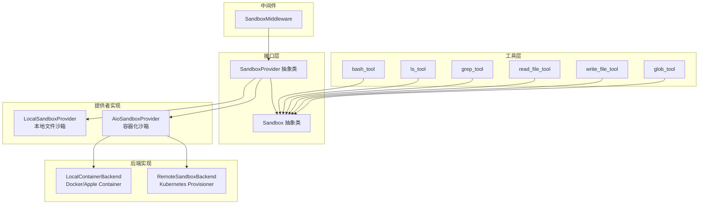
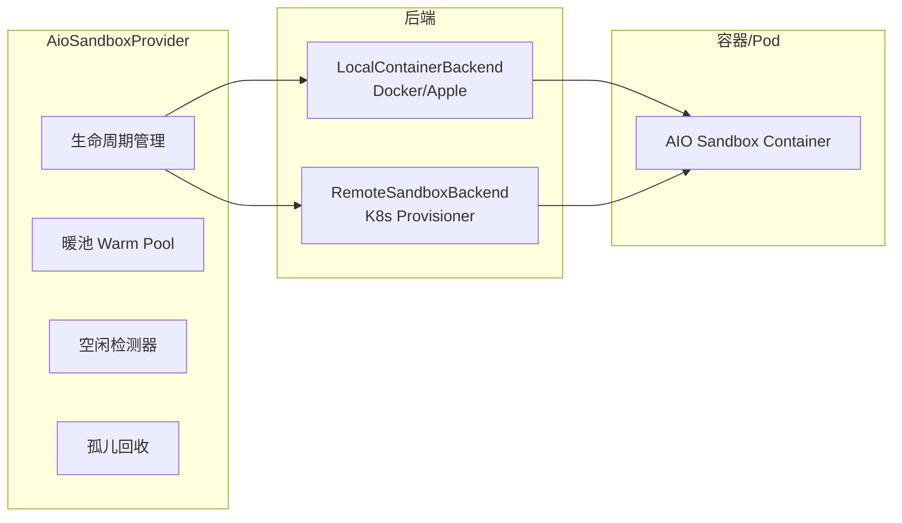
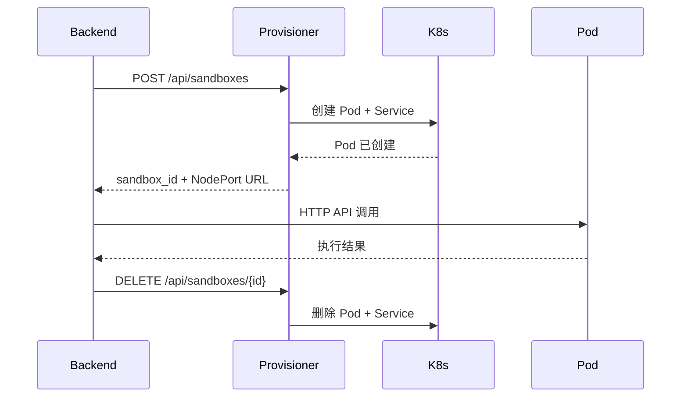
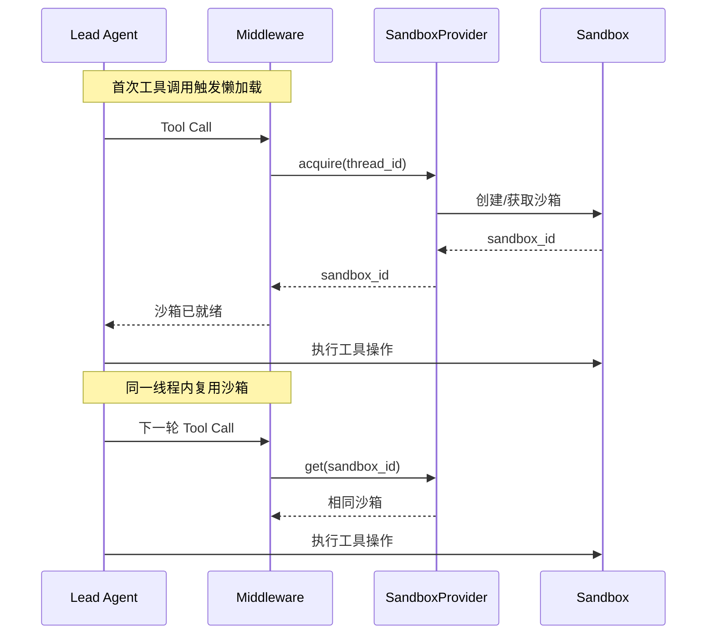

沙箱系统是 DeerFlow 的核心组件之一，为 AI 代理提供安全的文件操作和命令执行环境。本页详细介绍沙箱的架构设计、提供者实现、安全机制以及配置方式，帮助开发者理解并正确使用沙箱功能。

## 架构概览

DeerFlow 沙箱系统采用**抽象层 + 提供者模式**的经典设计，核心由三个层次的组件构成：



**核心设计原则**：
- **沙箱隔离**：通过抽象接口确保不同提供者之间的行为一致性
- **生命周期管理**：中间件自动管理沙箱的获取与释放
- **安全优先**：多层路径验证防止目录遍历等安全威胁
- **路径映射**：虚拟路径与实际路径的双向转换对上层透明

Sources: [sandbox.py](backend/packages/harness/deerflow/sandbox/sandbox.py#L1-L94) | [sandbox_provider.py](backend/packages/harness/deerflow/sandbox/sandbox_provider.py#L1-L99) | [middleware.py](backend/packages/harness/deerflow/sandbox/middleware.py#L1-L84)

## 核心抽象接口

### Sandbox 接口

`Sandbox` 抽象类定义了所有沙箱实现必须提供的基本操作：

| 方法 | 功能描述 |
|------|----------|
| `execute_command(command: str) -> str` | 在沙箱中执行 bash 命令 |
| `read_file(path: str) -> str` | 读取沙箱内文件内容 |
| `write_file(path: str, content: str, append: bool)` | 写入或追加文件内容 |
| `list_dir(path: str, max_depth: int) -> list[str]` | 列出目录内容（支持深度遍历）|
| `glob(path: str, pattern: str, ...) -> tuple[list, bool]` | 基于 glob 模式搜索文件 |
| `grep(path: str, pattern: str, ...) -> tuple[list[GrepMatch], bool]` | 在文件中搜索匹配行 |
| `update_file(path: str, content: bytes)` | 以二进制模式更新文件 |

Sources: [sandbox.py](backend/packages/harness/deerflow/sandbox/sandbox.py#L1-L94)

### SandboxProvider 接口

`SandboxProvider` 负责沙箱实例的生命周期管理：

| 方法 | 功能描述 |
|------|----------|
| `acquire(thread_id: str \| None) -> str` | 获取沙箱实例，返回沙箱 ID |
| `get(sandbox_id: str) -> Sandbox \| None` | 根据 ID 获取沙箱实例 |
| `release(sandbox_id: str)` | 释放沙箱实例 |

提供者还维护一个全局单例，支持通过 `get_sandbox_provider()` 获取当前配置的提供者实例：

```python
def get_sandbox_provider() -> SandboxProvider:
    global _default_sandbox_provider
    if _default_sandbox_provider is None:
        config = get_app_config()
        cls = resolve_class(config.sandbox.use, SandboxProvider)
        _default_sandbox_provider = cls(**kwargs)
    return _default_sandbox_provider
```

Sources: [sandbox_provider.py](backend/packages/harness/deerflow/sandbox/sandbox_provider.py#L44-L61)

## 本地沙箱实现

本地沙箱（`LocalSandboxProvider`）直接操作宿主机的文件系统，适用于开发环境和完全可信的本地工作流。

### 路径映射机制

本地沙箱通过 `PathMapping` 实现容器路径到本地路径的映射：

```python
@dataclass(frozen=True)
class PathMapping:
    container_path: str   # 容器内虚拟路径
    local_path: str      # 宿主机实际路径
    read_only: bool = False  # 是否只读
```

**默认映射规则**：
- `/mnt/skills/` → skills 目录（只读）
- 自定义挂载点（可在 `config.yaml` 中配置）

Sources: [local_sandbox.py](backend/packages/harness/deerflow/sandbox/local/local_sandbox.py#L14-L26) | [local_sandbox_provider.py](backend/packages/harness/deerflow/sandbox/local/local_sandbox_provider.py#L1-122)

### 路径解析与安全验证

本地沙箱实现了严格的路径安全验证，防止路径遍历攻击：

```python
def _reject_path_traversal(path: str) -> None:
    """Reject paths that contain '..' segments to prevent directory traversal."""
    normalised = path.replace("\\", "/")
    for segment in normalised.split("/"):
        if segment == "..":
            raise PermissionError("Access denied: path traversal detected")
```

**关键安全特性**：
- 路径遍历检测（`..` 段拒绝）
- 只读路径保护（skills 目录、只读挂载点）
- 路径边界验证（确保解析后路径不逃逸到挂载目录外）

Sources: [tools.py](backend/packages/harness/deerflow/sandbox/tools.py#L545-L560)

### 虚拟路径系统

代理通过虚拟路径访问不同类型的数据：

| 虚拟路径 | 用途 | 读写权限 |
|----------|------|----------|
| `/mnt/user-data/` | 用户数据目录 | 读写 |
| `/mnt/skills/` | 技能定义目录 | 只读 |
| `/mnt/acp-workspace/` | ACP 工作空间 | 只读（bash） |
| `/mnt/workspace/` | 线程工作目录 | 读写 |
| `/mnt/uploads/` | 上传文件目录 | 读写 |
| `/mnt/outputs/` | 输出文件目录 | 读写 |

Sources: [tools.py](backend/packages/harness/deerflow/sandbox/tools.py#L1-200)

## 容器化沙箱实现

容器化沙箱（`AioSandboxProvider`）通过 Docker/Apple Container 或 Kubernetes Pod 为每个线程提供隔离的执行环境。

### 架构组件



### 核心特性

**1. 容器生命周期管理**
- 根据 `thread_id` 自动创建/分配容器
- 支持 `idle_timeout` 自动回收空闲容器
- 支持 `replicas` 控制最大并发容器数

**2. 暖池（Warm Pool）机制**
```python
# 预释放但仍运行的容器，可快速重新获取
self._warm_pool: dict[str, tuple[SandboxInfo, float]] = {}
```
- 已释放但仍在运行的容器进入暖池
- 新请求优先从暖池获取（无冷启动延迟）
- 容量满时回收最旧的容器

**3. 孤儿容器回收**
```python
def _reconcile_orphans(self) -> None:
    """Reconcile orphaned containers left by previous process lifecycles."""
```

Sources: [aio_sandbox_provider.py](backend/packages/harness/deerflow/community/aio_sandbox/aio_sandbox_provider.py#L1-708)

### 后端实现

**LocalContainerBackend**：管理本地 Docker 或 Apple Container 容器
- macOS 自动优先使用 Apple Container
- 自动分配可用端口
- 支持卷挂载和环境变量注入

**RemoteSandboxBackend**：通过 Provisioner 服务动态创建 Kubernetes Pod
- 适用于生产环境的高隔离需求
- 通过 NodePort 直接访问沙箱服务

Sources: [local_backend.py](backend/packages/harness/deerflow/community/aio_sandbox/local_backend.py#L1-620) | [docker/provisioner/app.py](docker/provisioner/app.py#L1-583)

## Kubernetes 沙箱配置

对于需要 Kubernetes 部署的生产环境，DeerFlow 提供了 Provisioner 服务来动态管理沙箱 Pod。

### 架构设计



### API 端点

| 方法 | 路径 | 功能 |
|------|------|------|
| POST | `/api/sandboxes` | 创建沙箱 Pod + Service |
| DELETE | `/api/sandboxes/{sandbox_id}` | 销毁沙箱 |
| GET | `/api/sandboxes/{sandbox_id}` | 获取状态和 URL |
| GET | `/api/sandboxes` | 列出所有沙箱 |
| GET | `/health` | 健康检查 |

### 环境变量配置

| 变量 | 默认值 | 说明 |
|------|--------|------|
| `K8S_NAMESPACE` | `deer-flow` | Kubernetes 命名空间 |
| `SANDBOX_IMAGE` | `all-in-one-sandbox:latest` | 沙箱容器镜像 |
| `KUBECONFIG_PATH` | `/root/.kube/config` | kubeconfig 文件路径 |
| `NODE_HOST` | `host.docker.internal` | 后端访问 Pod 的主机 |

Sources: [docker/provisioner/app.py](docker/provisioner/app.py#L1-583)

## 安全机制

### 命令执行安全

对于本地沙箱，bash 命令执行有严格的路径限制：

```python
# 允许的系统路径前缀
_LOCAL_BASH_SYSTEM_PATH_PREFIXES = (
    "/bin/",
    "/usr/bin/",
    "/sbin/",
    "/opt/homebrew/bin/",
    "/dev/",
)

# 危险路径检测
def _validate_local_bash_root_path_args(command_name, tokens, start_index):
    if command_name not in _LOCAL_BASH_ROOT_PATH_COMMANDS:
        return
    # 禁止使用 / 作为文件操作的绝对路径
    if token == "/" and not _is_non_file_url_token(token):
        raise PermissionError("Unsafe absolute paths in command: /")
```

### 路径验证流程

```
用户请求路径
     │
     ▼
┌─────────────┐
│ 路径遍历检测 │ ──拒绝──► 异常
└─────────────┘
     │
     ▼
┌─────────────┐
│ 虚拟路径解析 │ ──映射──► 实际路径
└─────────────┘
     │
     ▼
┌─────────────┐
│ 边界验证    │ ──逃逸──► 异常
└─────────────┘
     │
     ▼
┌─────────────┐
│ 只读检查    │ ──只读──► 异常
└─────────────┘
     │
     ▼
  执行操作
```

### Host Bash 限制

本地沙箱默认禁用宿主 bash 执行，需要显式配置：

```yaml
sandbox:
  use: deerflow.sandbox.local:LocalSandboxProvider
  allow_host_bash: true  # 仅在完全可信的环境启用
```

Sources: [security.py](backend/packages/harness/deerflow/sandbox/security.py#L1-46) | [tools.py](backend/packages/harness/deerflow/sandbox/tools.py#L700-900)

## 沙箱工具

DeerFlow 提供了一组 LangChain 工具供代理使用：

### bash 工具

执行 Linux 命令，主要用于运行 Python 代码和安装依赖：

```python
@tool("bash", parse_docstring=True)
def bash_tool(runtime, description: str, command: str) -> str:
    """Execute a bash command in a Linux environment.
    
    - Use `python` to run Python code.
    - Prefer a thread-local virtual environment in `/mnt/user-data/workspace/.venv`.
    - Use `python -m pip` to install Python packages.
    """
```

### 文件操作工具

| 工具 | 功能 | 关键参数 |
|------|------|----------|
| `read_file` | 读取文件内容 | `path`, `start_line`, `end_line` |
| `write_file` | 写入文件内容 | `path`, `content`, `append` |
| `glob` | 搜索匹配文件 | `path`, `pattern`, `max_results` |
| `grep` | 搜索文件内容 | `path`, `pattern`, `literal`, `case_sensitive` |
| `ls` | 列出目录内容 | `path`, `max_depth` |

### 输出截断机制

为防止过大输出影响系统性能，工具实现了智能截断：

| 工具 | 截断策略 | 默认限制 |
|------|----------|----------|
| `bash` | 中间截断（保留首尾）| 20,000 字符 |
| `read_file` | 头部截断 | 50,000 字符 |
| `ls` | 头部截断 | 20,000 字符 |
| `glob` | 结果数量限制 | 200 条 |
| `grep` | 匹配行数限制 | 100 条 |

Sources: [tools.py](backend/packages/harness/deerflow/sandbox/tools.py#L1050-1583)

## 配置参考

### 配置参数表

| 参数 | 类型 | 默认值 | 说明 |
|------|------|--------|------|
| `use` | string | **必需** | 提供者类路径 |
| `allow_host_bash` | bool | `false` | 本地沙箱是否允许宿主机 bash |
| `image` | string | `all-in-one-sandbox:latest` | 容器镜像 |
| `port` | int | `8080` | 容器基础端口 |
| `replicas` | int | `3` | 最大并发容器数 |
| `container_prefix` | string | `deer-flow-sandbox` | 容器名称前缀 |
| `idle_timeout` | int | `600` | 空闲超时（秒），0 为禁用 |
| `mounts` | list | `[]` | 挂载点配置 |
| `environment` | dict | `{}` | 环境变量 |
| `provisioner_url` | string | `""` | Provisioner 服务地址 |

### 完整配置示例

```yaml
# 本地沙箱配置
sandbox:
  use: deerflow.sandbox.local:LocalSandboxProvider
  allow_host_bash: false
  mounts:
    - host_path: /home/user/project
      container_path: /mnt/project
      read_only: true

# AIO 容器沙箱配置
sandbox:
  use: deerflow.community.aio_sandbox:AioSandboxProvider
  image: all-in-one-sandbox:latest
  port: 8080
  replicas: 3
  idle_timeout: 600
  mounts:
    - host_path: /data/shared
      container_path: /home/shared
      read_only: false
  environment:
    NODE_ENV: production
    API_KEY: $MY_API_KEY

# Kubernetes 配置
sandbox:
  use: deerflow.community.aio_sandbox:AioSandboxProvider
  provisioner_url: http://provisioner:8002
```

Sources: [sandbox_config.py](backend/packages/harness/deerflow/config/sandbox_config.py#L1-84) | [config.example.yaml](config.example.yaml#L518-L600)

## 中间件集成

`SandboxMiddleware` 负责在 LangGraph 代理执行流程中自动管理沙箱生命周期：



**生命周期特点**：
- **懒加载**：默认在首次工具调用时才获取沙箱
- **线程隔离**：每个线程拥有独立的沙箱实例
- **复用优化**：同一线程内多次调用复用沙箱
- **优雅清理**：应用关闭时通过 `shutdown_sandbox_provider()` 统一释放

Sources: [middleware.py](backend/packages/harness/deerflow/sandbox/middleware.py#L1-84)

## 相关文档

- [中间件链](6-zhong-jian-jian-lian) - 了解沙箱中间件在整体中间件链中的位置
- [Lead Agent 主代理](5-lead-agent-zhu-dai-li) - 了解代理如何调用沙箱工具
- [Docker 部署](15-docker-bu-shu) - 生产环境的沙箱部署配置
- [Kubernetes 沙箱配置](16-kubernetes-sha-xiang-pei-zhi) - K8s 环境下的高级配置