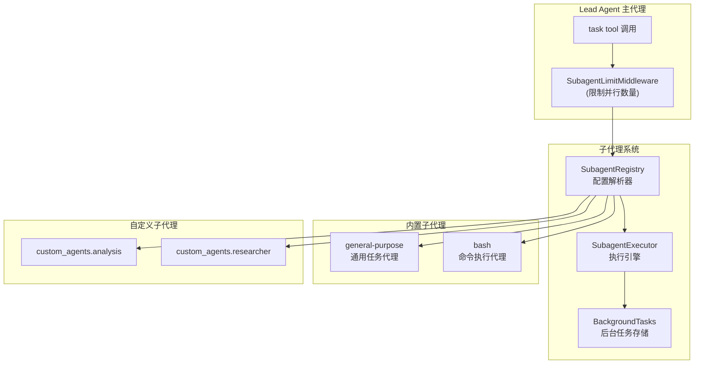
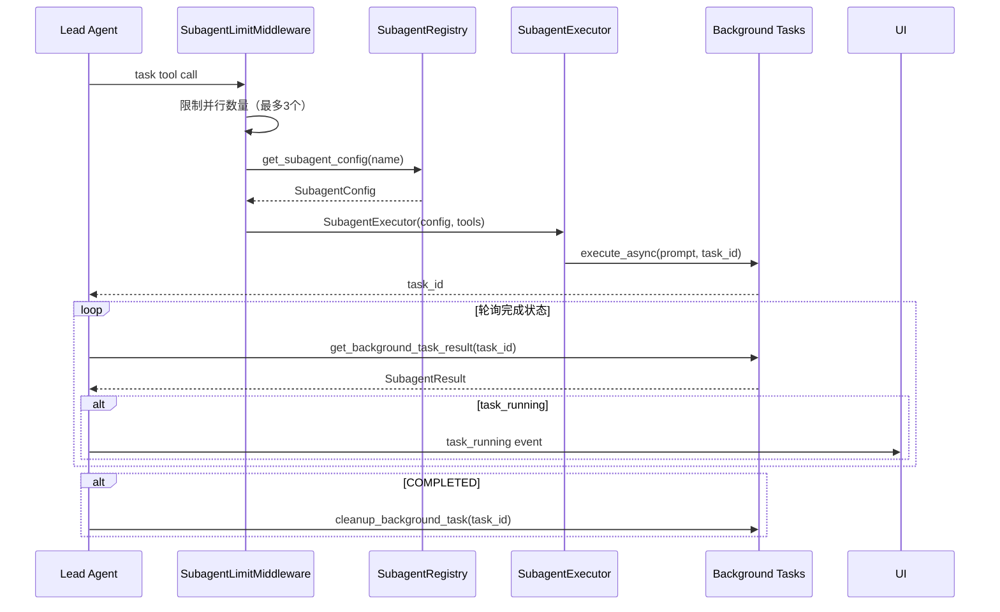

子代理系统是 DeerFlow 架构中实现任务委托与并行执行的核心模块。它允许 Lead Agent（主代理）将复杂的多步骤任务委托给独立的子代理实例，这些子代理在隔离的执行环境中运行，并通过后台任务机制实现并行处理与结果聚合。

## 系统架构

子代理系统由以下几个核心组件构成，它们协同工作以实现安全的任务委托：



**执行流程说明**：当主代理调用 `task` 工具时，请求首先经过 `SubagentLimitMiddleware` 限制并发数量，然后通过 `SubagentRegistry` 解析子代理配置，最后由 `SubagentExecutor` 在后台线程池中执行任务。

Sources: [executor.py](backend/packages/harness/deerflow/subagents/executor.py#L1-L15)
Sources: [subagent_limit_middleware.py](backend/packages/harness/deerflow/agents/middlewares/subagent_limit_middleware.py#L1-L30)

## 核心组件

### SubagentConfig 配置结构

`SubagentConfig` 是子代理的核心配置类，定义了每个子代理的行为特征：

```python
@dataclass
class SubagentConfig:
    name: str                    # 子代理唯一标识符
    description: str             # 何时使用此子代理的描述
    system_prompt: str           # 指导子代理行为的系统提示
    tools: list[str] | None      # 工具白名单，None 表示继承所有工具
    disallowed_tools: list[str]  # 默认禁用 ["task", "ask_clarification", "present_files"]
    skills: list[str] | None     # 技能白名单，None 表示继承所有已启用的技能
    model: str = "inherit"       # 使用父代理的模型
    max_turns: int = 50          # 最大执行轮数
    timeout_seconds: int = 900   # 超时时间（15分钟）
```

这个配置结构体现了子代理设计的关键原则：**工具隔离**（防止任务嵌套）、**技能控制**（按需加载）、**资源限制**（超时和轮数上限）。

Sources: [config.py](backend/packages/harness/deerflow/subagents/config.py#L1-L32)

### SubagentExecutor 执行引擎

`SubagentExecutor` 负责创建和管理子代理的执行实例。它的核心职责包括：

1. **工具过滤**：根据配置移除禁止的工具，防止任务嵌套
2. **模型解析**：支持从父代理继承模型或指定特定模型
3. **技能加载**：将技能作为对话项（而非系统提示）注入，遵循 Codex 模式
4. **沙箱状态传递**：继承父代理的沙箱环境和线程数据

```python
class SubagentExecutor:
    def __init__(
        self,
        config: SubagentConfig,
        tools: list[BaseTool],
        app_config: AppConfig | None = None,
        parent_model: str | None = None,
        sandbox_state: SandboxState | None = None,
        thread_data: ThreadDataState | None = None,
        thread_id: str | None = None,
        trace_id: str | None = None,
    ):
```

执行引擎使用**三线程池架构**来管理异步任务：
- `_scheduler_pool`：负责调度后台任务提交
- `_execution_pool`：负责实际的任务执行
- `_isolated_loop_pool`：在已运行的事件循环中隔离执行

Sources: [executor.py](backend/packages/harness/deerflow/subagents/executor.py#L57-L120)

### 技能加载机制

子代理的技能加载遵循 Codex 的设计模式：技能内容作为对话项（developer message）注入，而非追加到系统提示。这种方式的优势在于：

- 技能内容不占用系统提示的上下文空间
- 模型可以更清晰地分离技能指导与任务指令
- 支持细粒度的技能白名单控制

```python
async def _load_skill_messages(self) -> list[SystemMessage]:
    """根据 config.skills 加载技能内容作为对话项"""
    # skills=None: 加载所有已启用的技能
    # skills=[]: 不加载任何技能
    # skills=["skill-a", "skill-b"]: 仅加载指定的技能
```

Sources: [executor.py](backend/packages/harness/deerflow/subagents/executor.py#L197-L249)

## 内置子代理

DeerFlow 提供了两个内置子代理类型：

### general-purpose 通用任务代理

适用于复杂的多步骤任务，需要探索和操作结合的场景。

| 属性 | 值 |
|------|-----|
| 工具 | 继承父代理所有工具 |
| 禁用工具 | task, ask_clarification, present_files |
| 最大轮数 | 100 |
| 默认超时 | 900秒 |

```python
GENERAL_PURPOSE_CONFIG = SubagentConfig(
    name="general-purpose",
    description="A capable agent for complex, multi-step tasks...",
    system_prompt="""You are a general-purpose subagent...
    <working_directory>
    - User uploads: `/mnt/user-data/uploads`
    - User workspace: `/mnt/user-data/workspace`
    - Output files: `/mnt/user-data/outputs`
    """,
    tools=None,
    disallowed_tools=["task", "ask_clarification", "present_files"],
    model="inherit",
    max_turns=100,
)
```

Sources: [general_purpose.py](backend/packages/harness/deerflow/subagents/builtins/general_purpose.py#L1-L51)

### bash 命令执行代理

专门用于执行命令行操作，适用于 git、npm、docker 等终端操作。

| 属性 | 值 |
|------|-----|
| 工具 | bash, ls, read_file, write_file, str_replace（沙箱工具） |
| 禁用工具 | task, ask_clarification, present_files |
| 最大轮数 | 60 |
| 默认超时 | 900秒 |

**安全限制**：当主机 bash 被禁用时（如使用 `LocalSandboxProvider`），bash 子代理不会暴露给主代理。

Sources: [bash_agent.py](backend/packages/harness/deerflow/subagents/builtins/bash_agent.py#L1-L51)
Sources: [registry.py](backend/packages/harness/deerflow/subagents/registry.py#L125-L140)

## 配置系统

子代理配置通过 `config.yaml` 的 `subagents` 节进行管理，支持全局默认值、代理覆盖和自定义子代理。

### 配置层次结构

```yaml
subagents:
  # 全局默认超时（适用于所有子代理）
  timeout_seconds: 900          # 默认 15 分钟

  # 全局最大轮数覆盖（可选）
  max_turns: 120

  # 单个代理配置覆盖
  agents:
    general-purpose:
      timeout_seconds: 1800     # 复杂任务延长到 30 分钟
      max_turns: 160
      model: qwen3:32b          # 指定专用模型
      skills:                   # 技能白名单
        - web-search
        - data-analysis

    bash:
      timeout_seconds: 300      # 快速命令执行
      skills: []                # 不加载任何技能

  # 自定义子代理类型
  custom_agents:
    analysis:
      description: "数据分析专家"
      system_prompt: |
        You are a data analysis subagent...
      tools: ["bash", "read_file", "write_file"]
      skills: ["data-analysis"]
      timeout_seconds: 600
```

配置解析遵循以下优先级：
1. **代理级别覆盖**（最高优先级）
2. **全局默认值**
3. **内置默认值**（最低优先级）

Sources: [subagents_config.py](backend/packages/harness/deerflow/config/subagents_config.py#L1-L188)

### 模型继承机制

子代理可以配置使用父代理的模型或指定专用模型：

```python
def _get_model_name(config: SubagentConfig, parent_model: str | None) -> str | None:
    if config.model == "inherit":
        return parent_model  # 继承父代理模型
    return config.model      # 使用配置的专用模型
```

在配置中使用 `model: inherit` 可让子代理自动使用主代理的模型，这对于保持响应一致性非常重要。

## 执行流程与状态管理

### 后台任务状态

每个后台任务都有对应的 `SubagentResult`，跟踪执行状态：

```python
class SubagentStatus(Enum):
    PENDING = "pending"     # 任务已提交，等待执行
    RUNNING = "running"     # 正在执行
    COMPLETED = "completed" # 成功完成
    FAILED = "failed"      # 执行失败
    CANCELLED = "cancelled"# 被用户取消
    TIMED_OUT = "timed_out"# 执行超时
```

### 任务执行流程



Sources: [executor.py](backend/packages/harness/deerflow/subagents/executor.py#L550-L595)
Sources: [task_tool.py](backend/packages/harness/deerflow/tools/builtins/task_tool.py#L140-L200)

### 并行限制与超时处理

`MAX_CONCURRENT_SUBAGENTS` 默认为 3，可通过配置调整（范围 2-4）。当 LLM 在单次响应中生成超过限制的 `task` 调用时，`SubagentLimitMiddleware` 会自动截断多余的调用。

```python
MAX_CONCURRENT_SUBAGENTS = 3

class SubagentLimitMiddleware(AgentMiddleware[AgentState]):
    def _truncate_task_calls(self, state: AgentState) -> dict | None:
        # 保留前 max_concurrent 个 task 调用
        # 丢弃超出限制的调用
```

超时处理采用双层机制：
1. **执行超时**：通过 `execution_future.result(timeout=...)` 实现
2. **轮询超时**：轮询次数 = `(timeout_seconds + 60) // 5`

Sources: [subagent_limit_middleware.py](backend/packages/harness/deerflow/agents/middlewares/subagent_limit_middleware.py#L1-L76)

## 安全模型

子代理系统实现了多层安全防护：

### 1. 工具隔离

```python
# task_tool.py
tools = get_available_tools(
    model_name=parent_model,
    groups=parent_tool_groups,
    subagent_enabled=False  # 禁用子代理工具，防止嵌套
)
```

所有子代理默认禁用以下工具：`task`、`ask_clarification`、`present_files`。这确保子代理无法进一步委托任务，形成安全的执行边界。

### 2. Bash 限制

当 `LocalSandboxProvider` 启用时，bash 子代理不会暴露给主代理：

```python
def get_available_subagent_names() -> list[str]:
    names = get_subagent_names()
    if not is_host_bash_allowed():
        names = [name for name in names if name != "bash"]
    return names
```

### 3. 协作式取消

长时间运行的子代理通过 `cancel_event` 支持协作式取消，而非强制终止线程：

```python
# 检查取消标志（位于 astream 迭代边界）
if result.cancel_event.is_set():
    result.status = SubagentStatus.CANCELLED
    return result
```

Sources: [task_tool.py](backend/packages/harness/deerflow/tools/builtins/task_tool.py#L120-L135)
Sources: [registry.py](backend/packages/harness/deerflow/subagents/registry.py#L125-L140)
Sources: [executor.py](backend/packages/harness/deerflow/subagents/executor.py#L320-L340)

## 配置示例

### 基础使用

```yaml
subagents:
  timeout_seconds: 900  # 默认 15 分钟超时
```

### 复杂任务配置

```yaml
subagents:
  timeout_seconds: 1800
  agents:
    general-purpose:
      timeout_seconds: 3600  # 复杂分析任务 1 小时
      max_turns: 200
      skills:
        - data-analysis
        - chart-visualization
    bash:
      timeout_seconds: 300   # 快速构建操作 5 分钟
      max_turns: 40
```

### 自定义子代理

```yaml
subagents:
  custom_agents:
    researcher:
      description: "专门的研究助手，用于深度信息检索"
      system_prompt: |
        You are a research subagent...
        Focus on:
        - Comprehensive information gathering
        - Source evaluation and citation
        - Structured report generation
      tools:
        - bash
        - read_file
        - web_search
      skills:
        - deep-research
      timeout_seconds: 1800
      max_turns: 100
```

Sources: [config.example.yaml](config.example.yaml#L850-L920)

## 与外部系统的集成

### 记忆系统集成

子代理执行完成后，结果会通过 `task_completed` 事件返回给主代理，最终由主代理决定如何处理这些结果（包括存储到记忆系统）。

### 技能系统集成

子代理通过 `config.skills` 控制技能加载：
- `None`：继承所有已启用的技能
- `[]`：不加载任何技能
- `["skill-a"]`：仅加载指定的技能

父代理可以通过 `available_skills` 元数据限制子代理可用的技能范围，实现技能隔离。

Sources: [task_tool.py](backend/packages/harness/deerflow/tools/builtins/task_tool.py#L100-L115)

## 相关文档

- [Lead Agent 主代理](5-lead-agent-zhu-dai-li) — 了解主代理如何调用子代理
- [中间件链](6-zhong-jian-jian-lian) — 了解 SubagentLimitMiddleware 的实现
- [沙箱系统](7-sha-xiang-xi-tong) — 了解子代理执行的隔离环境
- [技能系统](10-ji-neng-xi-tong) — 了解技能的加载和管理
- [配置指南](3-pei-zhi-zhi-nan) — 完整的配置参考