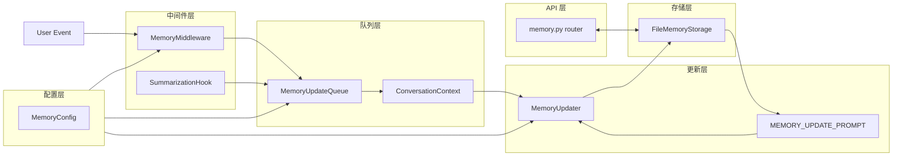
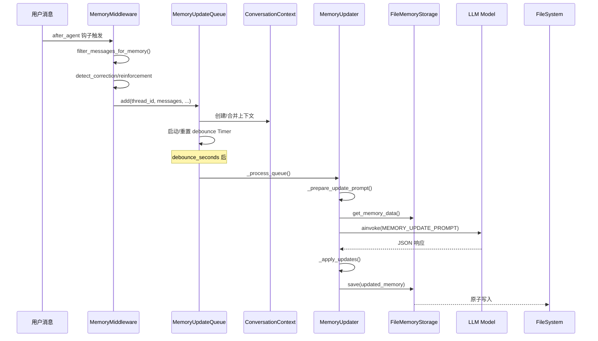

DeerFlow 的记忆系统是一个持久化的用户上下文管理框架，通过 LLM 自动从对话中提取关键信息，为后续对话提供个性化上下文注入。该系统采用分层架构，支持多用户隔离、异步批量更新和智能 token 预算管理。

## 系统架构概览

记忆系统由存储层、更新层、队列层和中间件层四部分组成，通过异步队列机制实现对话与记忆更新的解耦。



### 核心模块职责

| 模块 | 文件位置 | 核心职责 |
|------|---------|---------|
| **存储层** | `storage.py` | JSON 文件持久化、缓存管理、多用户隔离 |
| **更新层** | `updater.py` | LLM 调用、响应解析、记忆更新应用 |
| **队列层** | `queue.py` | 消息去重、延迟批处理、防抖机制 |
| **中间件层** | `memory_middleware.py` | LangChain 钩子集成、信号检测 |
| **消息处理** | `message_processing.py` | 消息过滤、上传剥离、纠正/强化检测 |
| **提示模板** | `prompt.py` | 更新提示词生成、注入格式化、token 计数 |

Sources: [storage.py](backend/packages/harness/deerflow/agents/memory/storage.py#L1-L232), [updater.py](backend/packages/harness/deerflow/agents/memory/updater.py#L1-L574), [queue.py](backend/packages/harness/deerflow/agents/memory/queue.py#L1-L278)

## 记忆数据结构

记忆数据采用 JSON 格式存储，包含用户上下文、历史记录和事实三个主要部分。

```json
{
  "version": "1.0",
  "lastUpdated": "2026-03-28T10:30:00Z",
  "user": {
    "workContext": { "summary": "...", "updatedAt": "..." },
    "personalContext": { "summary": "...", "updatedAt": "..." },
    "topOfMind": { "summary": "...", "updatedAt": "..." }
  },
  "history": {
    "recentMonths": { "summary": "...", "updatedAt": "..." },
    "earlierContext": { "summary": "...", "updatedAt": "..." },
    "longTermBackground": { "summary": "...", "updatedAt": "..." }
  },
  "facts": [
    {
      "id": "fact_abc123",
      "content": "User prefers TypeScript over JavaScript",
      "category": "preference",
      "confidence": 0.95,
      "createdAt": "2026-03-28T09:50:00Z",
      "source": "thread_xyz",
      "sourceError": "optional - only for correction category"
    }
  ]
}
```

### 用户上下文（User Context）

用户上下文分为三个维度，分别捕获不同类型的信息：

- **workContext**：工作角色、主要项目、技术栈（2-3 句话）
- **personalContext**：语言偏好、沟通风格、个人兴趣（1-2 句话）
- **topOfMind**：当前多个关注点和优先级（3-5 句话），最频繁更新的区域

### 历史记录（History）

历史记录按时间维度组织，提供对话的时序背景：

- **recentMonths**：最近 1-3 个月的详细活动摘要（4-6 句话或段落）
- **earlierContext**：3-12 个月前的历史模式（3-5 句话）
- **longTermBackground**：长期背景和基础信息（2-4 句话）

### 事实（Facts）

事实是用户偏好、知识和约束的原子化存储单元，支持六种分类：

| 分类 | 说明 | 置信度范围 |
|------|------|-----------|
| `preference` | 用户偏好和风格倾向 | 0.7-1.0 |
| `knowledge` | 专业知识和技能领域 | 0.7-1.0 |
| `context` | 背景信息（职位、项目、地点） | 0.8-1.0 |
| `behavior` | 行为模式和沟通习惯 | 0.6-0.8 |
| `goal` | 目标和学习计划 | 0.7-1.0 |
| `correction` | 错误修正和正确方法 | 0.95-1.0 |

Sources: [memory-settings-sample.json](backend/docs/memory-settings-sample.json#L1-L115), [prompt.py](backend/packages/harness/deerflow/agents/memory/prompt.py#L1-L364)

## 异步更新机制

记忆更新通过防抖队列实现异步处理，避免每次对话都触发 LLM 调用。

### 更新流程



### 防抖队列设计

`MemoryUpdateQueue` 维护一个线程安全的待处理队列，通过 `threading.Timer` 实现防抖延迟。

```python
@dataclass
class ConversationContext:
    thread_id: str
    messages: list[Any]
    timestamp: datetime
    agent_name: str | None = None
    user_id: str | None = None
    correction_detected: bool = False
    reinforcement_detected: bool = False
```

关键特性：
- **消息合并**：同一线程 ID 的多次更新会合并为一次
- **信号保留**：correction 和 reinforcement 信号在合并时取并集
- **立即处理**：`add_nowait()` 支持消息摘要前触发立即处理

Sources: [queue.py](backend/packages/harness/deerflow/agents/memory/queue.py#L1-L278), [memory_middleware.py](backend/packages/harness/deerflow/agents/middlewares/memory_middleware.py#L1-L105)

## 消息过滤与信号检测

消息处理层负责从完整对话中提取记忆更新所需的关键内容。

### 消息过滤规则

`filter_messages_for_memory()` 函数保留用户输入和助手的最终回复，过滤工具调用中间结果：

```python
def filter_messages_for_memory(messages: list[Any]) -> list[Any]:
    """Keep only user inputs and final assistant responses for memory updates."""
    # 1. 保留用户消息
    # 2. 剥离 <uploaded_files> 标签内容
    # 3. 保留没有 tool_calls 的助手消息
    # 4. 跳过因空上传消息而跟随的空助手回复
```

### 纠正与强化检测

系统通过正则模式检测对话中的用户反馈信号：

```python
_CORRECTION_PATTERNS = (
    re.compile(r"\bthat(?:'s| is) (?:wrong|incorrect)\b", re.IGNORECASE),
    re.compile(r"不对"), re.compile(r"你理解错了"), ...
)

_REINFORCEMENT_PATTERNS = (
    re.compile(r"\bperfect(?:[.!?]|$)"),
    re.compile(r"对[,，]?\s*就是这样"), ...
)
```

检测到的信号会：
1. 触发更快的记忆更新（`add_nowait`）
2. 在提示词中添加特殊指令，提升相关事实的置信度

Sources: [message_processing.py](backend/packages/harness/deerflow/agents/memory/message_processing.py#L1-L110)

## 提示词与注入

### 更新提示词

`MEMORY_UPDATE_PROMPT` 指导 LLM 分析对话并更新记忆结构，包含详细的结构化指导：

```python
MEMORY_UPDATE_PROMPT = """You are a memory management system...

Instructions:
1. Analyze the conversation for important information
2. Extract relevant facts, preferences, and context
3. Update memory sections following detailed length guidelines

Before extracting facts:
1. Error/Retry Detection: Did agent encounter errors?
2. User Correction Detection: Did user correct the agent?
3. Project Constraint Discovery: Any constraints discovered?
"""
```

### 注入格式化

`format_memory_for_injection()` 将记忆数据格式化为系统提示词注入格式：

```python
def format_memory_for_injection(memory_data: dict[str, Any], max_tokens: int = 2000) -> str:
    """Format memory for injection respecting token budget."""
    # 1. 格式化 User Context
    # 2. 格式化 History
    # 3. 按置信度排序 Facts，逐步添加直到 token 预算耗尽
    # 4. 使用 tiktoken 精确计数
```

注入格式示例：
```
User Context:
- Work: Core contributor, DeerFlow project (16k+ stars)
- Personal: Bilingual capabilities (Chinese/English)
- Current Focus: Building memory API and search functionality

History:
- Recent: Memory system improvements and testing
- Earlier: Initial implementation patterns
- Background: Open source contribution experience

Facts:
- [preference | 0.95] User prefers Chinese for collaboration
- [knowledge | 0.90] User works with LangGraph and Python
```

Sources: [prompt.py](backend/packages/harness/deerflow/agents/memory/prompt.py#L1-L364), [test_memory_prompt_injection.py](backend/tests/test_memory_prompt_injection.py#L1-L176)

## 存储与用户隔离

### 文件存储实现

`FileMemoryStorage` 提供线程安全的 JSON 文件存储，带有修改时间检测的智能缓存：

```python
class FileMemoryStorage(MemoryStorage):
    def __init__(self):
        # 缓存结构: {(user_id, agent_name): (memory_data, file_mtime)}
        self._memory_cache: dict[tuple[str | None, str | None], tuple[dict[str, Any], float | None]]
        self._cache_lock = threading.Lock()
    
    def load(self, ...):
        # 检查文件 mtime，未变化则返回缓存
        # 变化则重新加载并更新缓存
```

### 用户隔离机制

存储路径支持多层级隔离：

| 配置 | 路径 | 作用域 |
|------|------|--------|
| 默认 | `{base_dir}/users/{user_id}/memory.json` | 单用户 |
| 相对路径 | `{base_dir}/{storage_path}` | 共享 |
| 绝对路径 | `{storage_path}` | 共享（跨版本迁移） |

Sources: [storage.py](backend/packages/harness/deerflow/agents/memory/storage.py#L1-L232), [memory_config.py](backend/packages/harness/deerflow/config/memory_config.py#L1-L84)

## 配置参数

记忆系统通过 `MemoryConfig` 模型配置：

| 参数 | 默认值 | 说明 |
|------|--------|------|
| `enabled` | `true` | 是否启用记忆机制 |
| `storage_path` | `""` | 存储路径（空=默认路径） |
| `debounce_seconds` | `30` | 更新防抖延迟（秒） |
| `model_name` | `null` | 更新用模型（null=默认） |
| `max_facts` | `100` | 最大事实数量 |
| `fact_confidence_threshold` | `0.7` | 事实存储置信度阈值 |
| `injection_enabled` | `true` | 是否注入到系统提示词 |
| `max_injection_tokens` | `2000` | 注入最大 token 数 |

Sources: [memory_config.py](backend/packages/harness/deerflow/config/memory_config.py#L1-L84)

## REST API 端点

记忆系统提供完整的 CRUD API，所有端点都自动使用当前用户 ID 进行隔离：

| 方法 | 端点 | 说明 |
|------|------|------|
| `GET` | `/api/memory` | 获取完整记忆数据 |
| `POST` | `/api/memory/reload` | 强制重新加载文件 |
| `DELETE` | `/api/memory` | 清空所有记忆数据 |
| `POST` | `/api/memory/facts` | 创建新事实 |
| `PATCH` | `/api/memory/facts/{id}` | 更新指定事实 |
| `DELETE` | `/api/memory/facts/{id}` | 删除指定事实 |
| `GET` | `/api/memory/export` | 导出 JSON |
| `POST` | `/api/memory/import` | 导入 JSON |
| `GET` | `/api/memory/config` | 获取配置 |
| `GET` | `/api/memory/status` | 获取配置+数据 |

Sources: [memory.py](backend/app/gateway/routers/memory.py#L1-L357)

## 智能特性

### 上传文件过滤

系统自动从记忆中剥离文件上传相关内容，避免持久化会话特定信息：

```python
_UPLOAD_SENTENCE_RE = re.compile(
    r"[^.!?]*\b(?:upload(?:ed|ing)?...|<uploaded_files>)"
)
```

### 事实去重

更新时通过内容去重避免重复存储相同事实：

```python
def _fact_content_key(content: Any) -> str | None:
    return content.strip().casefold()  # 大小写不敏感

# 新事实内容已存在则跳过
```

### 置信度边界处理

非有限值（NaN、inf）会回退到默认值而非错误地映射到边界：

```python
def _coerce_confidence(value: Any, default: float = 0.0) -> float:
    if not math.isfinite(confidence):
        return max(0.0, min(1.0, default))
    return max(0.0, min(1.0, confidence))
```

Sources: [updater.py](backend/packages/harness/deerflow/agents/memory/updater.py#L1-L574)

## 测试覆盖

记忆系统拥有完善的单元测试覆盖：

| 测试文件 | 覆盖范围 |
|----------|---------|
| `test_memory_storage.py` | 存储读写、缓存一致性、线程安全 |
| `test_memory_queue.py` | 队列防抖、信号合并、立即处理 |
| `test_memory_prompt_injection.py` | 格式化输出、token 预算、置信度排序 |